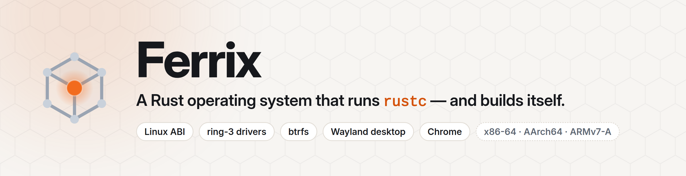
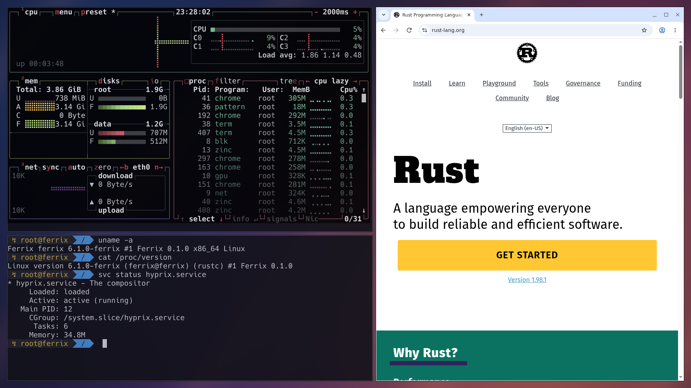
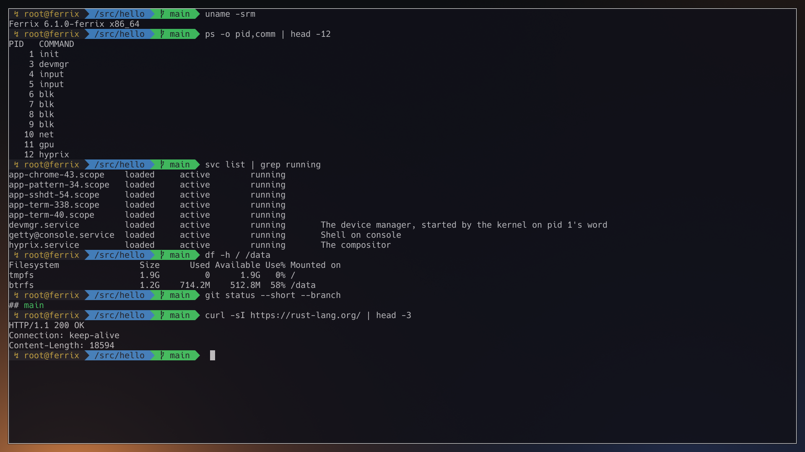
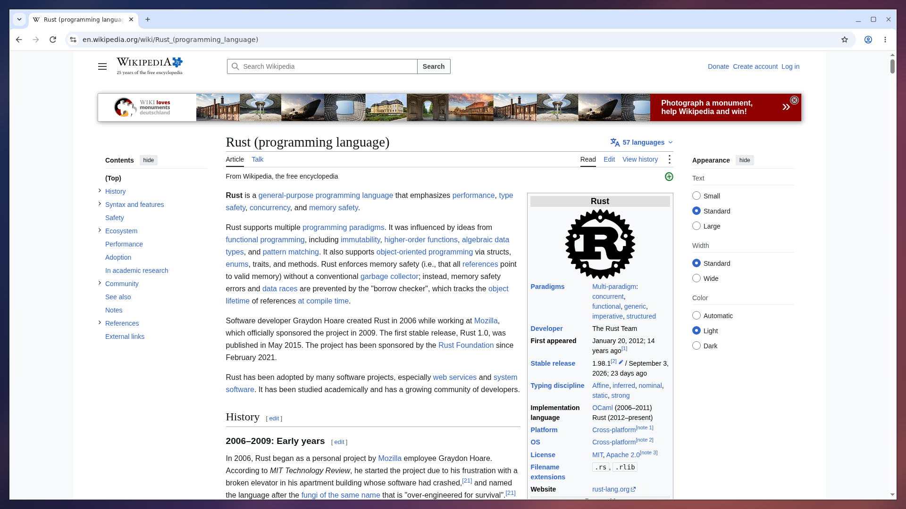
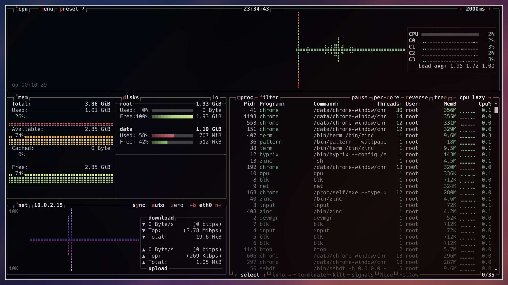

<p align="center">
  <picture>
    <source media="(prefers-color-scheme: dark)" srcset="docs/brand/banner-dark.png">
    
  </picture>
</p>

# Ferrix

**Linux apps without Linux.**

Ferrix is an experimental operating system with its own Rust kernel. It runs
several unmodified Linux programs, including Chrome, `git`, `curl` and `rustc`.
The disk, network, graphics and input drivers live in separate processes, so
Ferrix can restart a driver that crashes.

It has a desktop you can boot today. It is still a research project, with
important pieces such as authentication and process isolation unfinished.

[Boot Ferrix](#boot-ferrix) · [See what works](#what-works) ·
[Read the technical guide](GUIDE.md) · [Visit the website](https://setzero.github.io/ferrix/)



<table>
  <tr>
    <td width="33%"></td>
    <td width="33%"></td>
    <td width="33%"></td>
  </tr>
  <tr>
    <td>zinc at a shell prompt, with the drivers listed and <code>curl</code> fetching a page.</td>
    <td>Chrome browsing Wikipedia on Ferrix.</td>
    <td><code>btop</code> showing the browser, compositor and drivers.</td>
  </tr>
</table>

*Captured on x86-64 under KVM. [How the screenshots were made](docs/brand/screenshots/CAPTIONS.md).*

## What works

- **Linux programs:** Chrome, `rustc`, `git`, `curl` and other tested binaries
  run without patches. Ferrix implements the Linux system calls they need. It
  also has its own C library, ferrousli, for native userland programs.
- **A desktop:** The hyprix Wayland compositor tiles windows and starts with a
  terminal running the zinc shell. Chrome can play video with sound.
- **Drivers outside the kernel:** Disk, network, graphics, input and console
  drivers run as processes. On x86-64 and AArch64, an IOMMU limits their device
  access. Ferrix can restart them after a crash.
- **Persistent storage and networking:** The root filesystem is btrfs. Inside
  Ferrix, `git` can clone a repository and `curl` can fetch over HTTPS.
- **Three architectures:** Boot tests cover x86-64, AArch64 and ARMv7-A.
  Ferrix has also booted on an STM32MP157D-DK1 board and a Pixel 7.

[The roadmap](docs/roadmap/where-it-stands.md) tracks what is done and what is
still being built. Ferrix is not ready as an everyday operating system.

## Boot Ferrix

Install Rust and QEMU, then:

```sh
git clone https://github.com/SetZero/ferrix.git
cd ferrix
cargo xtask run --arch x86_64
```

That opens a serial console. For the desktop, run `cargo xtask run-compositor`.
The [technical guide](GUIDE.md#getting-started) covers firmware requirements,
other architectures, Windows, graphics options and the extra downloads needed
for Chrome and the Rust toolchain. Quit QEMU with `Ctrl-A`, then `x`.

## Check the claims

The boot test starts Ferrix on all three architectures:

```sh
cargo xtask test-boot --arch all
```

Other tests compile a program with an unmodified `rustc` inside Ferrix and boot
an x86-64 image built inside Ferrix. The [guide](GUIDE.md#proof-you-can-run)
has the commands and serial output. These tests demonstrate specific working
paths; they are not a claim that every Linux app works.

## How the project is built

Claude sessions write most of the code in separate worktrees. A human owner
sets priorities, and changes have to pass their tests before landing. The
[working rules](docs/CONVENTIONS.md) include mistakes the project has made
and what changed afterward. Human contributions are welcome; see
[CONTRIBUTING.md](CONTRIBUTING.md).

Ferrix is MIT licensed. [Explore the code and component docs](GUIDE.md#layout),
[follow releases](docs/RELEASES.md), or [open an issue](https://github.com/SetZero/ferrix/issues).
