# Ferrix — architecture, from the model

_Generated from docs/sysml/. Every element carries the maturity keyword the model gives it._

> Generated from docs/sysml/ by scripts/gen-arch-doc.py. Do not edit: change the model and regenerate with \`cargo xtask model-doc\`.

## Contents

- [About this document](#about-this-document)
- [Requirements](#requirements)
  - [The goal](#the-goal)
  - [Design rules](#design-rules)
  - [Promises deliberately not made](#promises-deliberately-not-made)
- [Structure](#structure)
  - [The machine](#the-machine)
  - [Interfaces between the big pieces](#interfaces-between-the-big-pieces)
  - [The loader](#the-loader)
  - [The kernel](#the-kernel)
- [The architecture facade](#the-architecture-facade)
  - [x86_64](#x8664)
  - [aarch64](#aarch64)
  - [armv7a](#armv7a)
  - [What the facade exports](#what-the-facade-exports)
  - [Drivers shared by the Arm pair](#drivers-shared-by-the-arm-pair)
- [Boot](#boot)
  - [The hand-off](#the-hand-off)
  - [Address layouts](#address-layouts)
  - [The loader's sequence](#the-loaders-sequence)
  - [The kernel's bring-up](#the-kernels-bring-up)
  - [The self-checks each boot runs](#the-self-checks-each-boot-runs)
  - [Traps](#traps)
- [Subsystems](#subsystems)
  - [Memory](#memory)
  - [Processors, time and scheduling](#processors-time-and-scheduling)
  - [Kernel objects and the two ABIs](#kernel-objects-and-the-two-abis)
  - [Isolation](#isolation)
  - [Devices and drivers](#devices-and-drivers)
  - [Storage](#storage)
- [The workspace](#the-workspace)
  - [Dependency edges](#dependency-edges)
- [Roadmap](#roadmap)
  - [S0 — Stage 0 foundation](#s0-stage-0-foundation)
  - [S1 — Stage 1 boot](#s1-stage-1-boot)
  - [S2 — Stage 2 memory](#s2-stage-2-memory)
  - [S3 — Stage 3 traps interrupts time](#s3-stage-3-traps-interrupts-time)
  - [S4 — Stage 4 SMP](#s4-stage-4-smp)
  - [SA — ARMv7-A port](#sa-armv7-a-port)
  - [S5 — Stage 5 scheduler](#s5-stage-5-scheduler)
  - [S6 — Stage 6 user mode](#s6-stage-6-user-mode)
  - [S7 — Stage 7 Linux ABI](#s7-stage-7-linux-abi)
  - [S8 — Stage 8 VFS](#s8-stage-8-vfs)
  - [S9 — Stage 9 native ABI](#s9-stage-9-native-abi)
  - [S10 — Stage 10 userspace drivers](#s10-stage-10-userspace-drivers)
  - [S11 — Stage 11 btrfs read](#s11-stage-11-btrfs-read)
  - [SN — Stage networking](#sn-stage-networking)
  - [SD — Stage dynamic linking](#sd-stage-dynamic-linking)
  - [S12 — Stage 12 btrfs write](#s12-stage-12-btrfs-write)
  - [S13 — Stage 13 isolation](#s13-stage-13-isolation)
  - [S14 — Stage 14 real time](#s14-stage-14-real-time)
  - [S15 — Stage 15 userland](#s15-stage-15-userland)
  - [S16 — Stage 16 rustc](#s16-stage-16-rustc)
  - [S17 — Stage 17 display and input](#s17-stage-17-display-and-input)
  - [S18 — Stage 18 compositor](#s18-stage-18-compositor)
  - [S19 — Stage 19 hyprland fidelity](#s19-stage-19-hyprland-fidelity)
  - [S21 — Stage 21 bare metal gpu](#s21-stage-21-bare-metal-gpu)
  - [S22 — Stage 22 steam](#s22-stage-22-steam)
  - [S20 — Stage 20 self hosting](#s20-stage-20-self-hosting)
  - [Ordering](#ordering)
- [Assurance](#assurance)
  - [The assembly budget](#the-assembly-budget)
  - [What each layer's tests can reach](#what-each-layers-tests-can-reach)
  - [Verification later stages owe](#verification-later-stages-owe)
  - [The boot tests](#the-boot-tests)
- [Traceability](#traceability)
  - [Satisfied by](#satisfied-by)
  - [Allocated to](#allocated-to)
  - [Verified by](#verified-by)
  - [Coverage](#coverage)
- [Deferred register](#deferred-register)
- [Index by stage](#index-by-stage)
- [Figures](#figures)

## About this document

This is generated from the SysML v2 model in `docs/sysml/`, which is itself an index over the prose. The prose is the source of truth: `docs/ARCHITECTURE.md` says what is being built and `docs/ROADMAP.md` in what order. What the model adds, and what this document is therefore able to state without a human keeping count, is that every element carries a maturity keyword — so nothing here confuses what runs today with what the roadmap still owes.

| Package | File | What it holds |
| --- | --- | --- |
| `FerrixLifecycle` | `00-lifecycle.sysml` | Every other package marks its elements with one of the keywords defined here, so a reader can tell what runs today from what docs/ROADMAP.md still owes. The model is one model; the keywords are the seam between "current" and "future". |
| `FerrixRequirements` | `01-requirements.sysml` | docs/ARCHITECTURE.md §0 read as a specification, plus the design rules the rest of the model has to satisfy and the promises it deliberately does not make. Ids in angle brackets are stable; the roadmap and assurance packages cite them. |
| `FerrixStructure` | `02-structure.sysml` | The shape of the system (docs/ARCHITECTURE.md §1), the workspace it is built from (§9), the architecture facade, and the three architectures behind it. Subsystem internals live in the packages that follow; this one says what exists and how it is connected. |
| `FerrixBoot` | `03-boot.sysml` | The hand-off ABI, the two address layouts, the loader's sequence, the kernel's bring-up with every stage's self-check to stage 12, and the trap path. All of this runs today on all three architectures. |
| `FerrixMemory` | `04-memory.sysml` | docs/ARCHITECTURE.md §4. The physical allocator, the heap, the page-table arithmetic and the kernel arena since stage 2; VMOs, process address spaces, demand paging and copy-on-write since stage 6, file mappings since stage 8. Reclaim is stage 13's and not built. |
| `FerrixScheduling` | `05-scheduling.sysml` | Stages 3 to 5 run today: interrupts, a clock, every processor online, IPIs, TLB shootdown, grace periods, fair locks, and tasks scheduled by EEVDF in one Throughput domain. Stage 14's real-time domains are designed here (docs/ARCHITECTURE.md §5) and not yet written. |
| `FerrixObjects` | `06-objects.sysml` | docs/ARCHITECTURE.md §2 and §3. The constants for the Linux half are in libs/linux-abi and for the native half in libs/native-abi. The objects a handle can name exist in kernel/src/object; processes and threads in kernel/src/syscall. No handle names an address space or a thread yet. |
| `FerrixIsolation` | `07-isolation.sysml` | docs/ARCHITECTURE.md §6: namespaces, cgroups v2, seccomp, credentials. Stage 13, designed in from the start so that no global table has to be found later. Only the credentials exist, since stage 7; namespaces, cgroups and seccomp are not built, and unshare and setns answer as a Linux built without namespaces does. |
| `FerrixDrivers` | `08-drivers.sysml` | docs/ARCHITECTURE.md §7. The kernel enumerates buses because that needs ACPI or a device tree and privileged access; it does not drive devices. Everything from the device node outward is stage 10, which is done: the drivers are processes devmgr starts. What it still owes is named on the part that owes it. |
| `FerrixStorage` | `09-storage.sysml` | docs/ARCHITECTURE.md §8. Block core, VFS, the small in-kernel filesystems and btrfs in three stages. What exists today is marked on each part. |
| `FerrixRoadmap` | `10-roadmap.sysml` | docs/ROADMAP.md as requirements: one per stage, each with its exit criterion, its status, the boot test that verifies it, and the part of the system that satisfies or will satisfy it. Each stage's status keyword says whether it is done; docs/ROADMAP.md's "Where it stands" is the prose this follows. |
| `FerrixAssurance` | `11-assurance.sysml` | docs/RELIABILITY.md and docs/ASSEMBLY.md: the quality gates, what each one verifies, and what the tests can actually reach. The gates cargo xtask check runs are in CI. Of the xtask boot gates, CI runs test-boot and test-rustc; the ones that need a binary the repository does not carry, a disk judged on the host or a screendump run in the landing gates of docs/BACKLOG.md instead (docs/ROADMAP.md, Continuously). |
| `FerrixViews` | `12-views.sysml` | How to read the one model as two: what runs today, and what the roadmap still owes. The filters key on the lifecycle keywords every element carries. |

13 files, 16 packages, 1630 elements, 194 relations. Model digest `edfe65ee8a1b2c97`.

| Maturity | Elements | Meaning |
| --- | ---: | --- |
| `#implemented` | 260 | The code exists and the QEMU boot test exercises it on every architecture it applies to. |
| `#inProgress` | 7 | The owning stage has started; part of the element runs. |
| `#writtenAhead` | 3 | A libs/ crate exists and passes its host tests, but nothing in kernel/ calls it yet. |
| `#planned` | 41 | Only the design exists, in docs/ARCHITECTURE.md. Nothing stands in for it. |
| `@deferred` | 20 | Work a finished stage explicitly left behind, carrying the reason that stage gave. |

An element carries its own keyword or none; a keyword is never inherited from a parent, so a `#planned` field inside an `#implemented` part still reads as planned.

## Requirements

### The goal

The acceptance test: a statically linked musl `rustc` compiles `hello.rs` on Ferrix, the binary it produced runs, and CI proves both. Not "has a shell", not "draws a window". Hosting a compiler is the hardest thing a general-purpose OS is routinely asked to do and the only goal that forces every subsystem to be real.

| Id | Requirement | What it forces |
| --- | --- | --- |
| `G.1` | Kernel threads | rustc needs clone(CLONE_THREAD\|CLONE_VM\|CLONE_SETTLS), the futex family, set_tid_address and robust lists. Forces: 1:1 kernel threads, a real futex, per-thread TLS registers. |
| `G.2` | Address space scale | mmap/mprotect/munmap with MAP_FIXED and MAP_NORESERVE over 2 to 8 GiB of address space. Forces: demand paging, a VMA tree, lazy anonymous memory, overcommit. |
| `G.3` | Signal delivery | A SIGSEGV handler on an alternate stack. Forces: real signal delivery, sigaltstack, rt_sigreturn. |
| `G.4` | Process spawn | fork/execve/wait4 to run the linker. Forces: copy-on-write fork, an ELF loader, process groups, exit status plumbing. |
| `G.5` | Syscall surface | openat, getdents64, statx, renameat2, pread64, about 150 syscalls in total. Forces: a VFS with inode and dentry caches. |
| `G.6` | Procfs | /proc/self/maps, /proc/self/exe, /proc/self/fd. Forces: a procfs backed by the real VM and fd table. |
| `G.7` | Durable filesystem | A writable filesystem with room for a ~2 GiB sysroot. Forces: a block stack and an on-disk filesystem that survives a crash. |
| `G.8` | Memory pressure | rustc will exhaust memory on a small machine, so reclaim is a correctness requirement: an OOM kill scoped by Job and cgroup, never a livelock. |

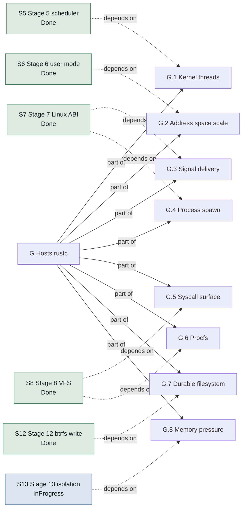

**Figure 1 — Hosts rustc.** The goal's parts, and the roadmap stage each one waits for. A part with no stage pointing at it is one nothing on the roadmap has claimed yet. [SVG](diagrams/goal-decomposition.svg) Source: `01-requirements.sysml`.

> **Self hosting** — `G+` — Stage 20: build Ferrix on Ferrix. The image the Ferrix-hosted compiler produces boots and passes every boot test.

### Design rules

Decisions that shape every subsystem. They are requirements because the assurance package verifies most of them with a script or a build failure rather than a review.

| Id | Rule | Why |
| --- | --- | --- |
| `P.1` | Linux is the native ABI | Syscall 0 is `read`. The Linux syscall ABI is the native interface, not a compatibility layer, so the static-musl world is the userland from the first day there is one, and POSIX conformance is inherited rather than reimplemented. The alternative — a native target with its own std — needs LLVM built for it, which drags a C++ runtime into the tree. |
| `P.2` | Monolithic core capability seams | A syscall is a function call, not four IPC hops. Device drivers run as user processes holding capabilities, so a driver fault is a process fault. The line is drawn at devices: filesystems and the page cache stay in the kernel because rustc touches them on every path. |
| `P.3` | One in kernel device | The one in-kernel device is a serial port writer, for early boot and panic output when no userspace exists. Named as an exception so that it stays one. |
| `P.4` | Nothing stubbed | Nothing is stubbed that a later stage has to unpick: no fixed-size process table, no in-memory-only filesystem, no cooperative scheduler. |
| `P.5` | Pure functions in libs | Anything expressible as a pure function of bytes goes to `libs/`, and gets a fuzz target and a Miri run, before the kernel calls it. That is the only code cargo test, Miri and the fuzzers can reach. |
| `P.6` | One arch facade | Generic code never names an architecture and #\[cfg(target_arch)\] appears nowhere outside arch/. Enforced by scripts/check-crate-layering.sh, because a facade maintained by convention is a facade for about six weeks. |
| `P.7` | Assembly only where the machine defines it | No assembly at boot on any architecture. What exists is confined to constructs the machine defines before a Rust function could run, listed in scripts/asm-allowlist.json with an argument each, under an absolute line cap. |
| `P.8` | One layout per address width | The 64-bit pair share identical layout constants; ARMv7-A has a 32-bit layout that is argued rather than merely different. Both are checked at compile time on every build. |
| `P.9` | Namespaces designed in | All eight namespaces from the start: every global table is reached through the task's NsSet from the first line, so nobody has to find those tables years later. |
| `P.10` | IOMMU is not optional | A userspace driver without an IOMMU can write any physical address, which is worse than an in-kernel driver. Where no IOMMU exists, drivers run in a degraded trusted mode and the kernel says so loudly at boot. |
| `P.11` | Every stage ends in something that runs | A stage's exit criterion is a QEMU boot that demonstrates the new capability and stays in CI forever after. |
| `P.12` | Unsafe is expensive | unsafe is not forbidden, it is made expensive: a SAFETY comment on every block, one unsafe operation per block, a Safety section on every unsafe fn, and a script in CI so a softened clippy lint cannot retire the rule. |
| `P.13` | No reachable panic | panic!, unreachable!, unwrap, expect and unchecked indexing are denied in production code; every exemption is an #\[expect\] whose reason begins AUDIT:. A reachable panic is an unrecoverable machine. A fatal condition in the kernel is fatal!, which names the catalog entry that explains it and panics from inside the macro; a bare panic! is denied there as everywhere. |
| `P.14` | Overflow checks in release | Overflow checks stay on in release. A wrapped frame number is a write to the wrong physical page whose symptom appears elsewhere; a panic that names the line is strictly better. |
| `P.15` | Proved on every boot | The kernel proves its invariants on every boot rather than asserting them: the memory map is checked, the direct map is checked to alias physical memory, the allocators are required to give every frame back. |
| `P.16` | One author per commit | docs/CONVENTIONS.md: a commit names one author. No Co-authored-by trailer, no Generated-with line, no tool signature, whoever or whatever made the change; a message is a subject, a blank line, and a body that argues the why. This overrides any agent's default attribution instruction. |
| `P.17` | A gate needs no arming | A control that only runs once a clone has been configured is not a control. Two hooks behind one un-committable core.hooksPath switch were one control with two names, and neither fired while eight trailer-carrying commits were written. Every rule has a check in CI that needs no local setup and cannot be skipped with --no-verify; hooks are the convenience, CI is the guarantee. |

### Promises deliberately not made

- **`N.1` **No certified WCET**** — HardRt promises EDF with admission control, bounded kernel critical sections on the RT path, preallocated pools there, and interrupts that cannot steal unaccounted time. It does not promise a certified worst-case execution time for the whole kernel; no OS that also hosts LLVM can.
- **`N.2` **No raid56**** — btrfs is single-device to begin with and RAID 5/6 is out of scope; it is where btrfs itself is weakest.
- **`N.3` **No aml**** — libs/acpi reads the fixed tables only. There is no AML interpreter and there will be none.

## Structure

An operating system written in Rust for x86-64, AArch64 and ARMv7-A, whose acceptance test is that it compiles Rust.

```text
loader : Loader
  uefi : UefiBindings
  services : Services
  load : ImageLoading
  arch : LoaderArch
kernel : Kernel
  arch : ArchLayer
    x86 : X86_64Arch
      gdt : Gdt
      idt : Idt
      lapic : LocalApic
      ioapics : IoApic
      clock : X86Clock
      serial : Serial16550
      trampoline : ApTrampoline
      shootdown : TlbShootdown
      tscDeadline : TscDeadlineTimer  [deferred]
      x2apic : X2ApicMode  [deferred]
      vtd : IommuDriver  [implemented]
      amdVi : IommuDriver  [deferred]
    arm64 : AArch64Arch
      vectors : VbarEl1Table
      gic : Gicv2Front
      timer : GenericTimer
      serial : Pl011Console
      psci : PsciCpuOn
      el2Drop : El2ToEl1
      gicv3 : Gicv3  [deferred]
      parking : PsciParkingProtocol  [deferred]
      smmu : IommuDriver  [implemented]
    arm32 : Armv7aArch
      vectors : Armv7aVectorTable
      gic : Gicv2FromFdt
      timer : GenericTimerCp15
      serial : ConsoleChoice
      coherency : ActlrReport
      psci : PsciCpuOn
      boardDeferred : Ed1Ev1Boards  [deferred]
      highRam : RamAbove2GiB  [deferred]
      thumb2 : Thumb2  [deferred]
      vfp : Vfp  [deferred]
      smmu : IommuDriver  [deferred]
  printer : Console  [implemented]
  early : EarlyMemory  [implemented]
  trap : TrapDispatch  [implemented]
  mm : PhysicalMemory  [implemented]
    frames : FrameAllocator
    heap : KernelHeap
      objectSlabs : ObjectSlab  [planned]
    tables : KernelPageTables
      mapper : Mapper
    perCpuCaches : PerCpuFrameCache  [deferred]
  vmap : VmapArena  [implemented]
    ranges : VmaMap
  mmio : MmioWindows  [implemented]
  irq : IrqTable  [implemented]
  timer : Timer  [implemented]
  smp : Smp  [implemented]
    topology : PerCpu
      stack : KernelStack
      runqueue : Runqueue  [implemented]
  acpi : AcpiAccess  [implemented]
  fdt : FdtAccess  [implemented]
  tasks : Tasks  [implemented]
    tasks : Task
      stack : KernelStack
      cpu : PerCpu
      addressSpace : FerrixMemory::ProcessAddressSpace
    waitQueues : WaitQueue
  sched : Scheduler  [implemented]
    domains : SchedulingDomain
      cpus : PerCpu
    fair : EevdfClass
    idle : IdleClass
    loadBalancing : LoadBalancing  [implemented]
    fifoRr : FifoRrClass  [planned]
    edf : EdfClass  [planned]
  vm : VirtualMemory  [implemented]
    vmos : Vmo
    spaces : ProcessAddressSpace
      tables : Mapper
      vmas : VmaMap
      vmos : Vmo
    reclaim : Reclaim  [planned]
      activeList : LruList
      inactiveList : LruList
    elfLoader : UserElfLoader
  syscalls : LinuxSyscallLayer  [implemented]
  native : NativeAbi  [implemented]
  futex : Futex  [implemented]
  signals : Signals  [implemented]
  ipc : PosixIpc  [implemented]
  vfs : Vfs  [implemented]
    inodes : Inode
      pages : Vmo
    dentries : Dentry
      inode : Inode
    mounts : Mount
  pageCache : PageCache  [implemented]
    vmos : Vmo
  filesystems : Filesystems  [implemented]
    tmpfs : Tmpfs
    devfs : Devfs
    procfs : Procfs
    sysfs : Sysfs  [planned]
    cgroupfs : Cgroupfs  [planned]
    btrfs : Btrfs
      parsing : BtrfsParsing
      read : BtrfsRead
      write : BtrfsWrite
      subvolumes : BtrfsSubvolumes  [planned]
    initramfs : InitramfsUnpack
  blockCore : BlockCore  [implemented]
    queues : RequestQueue
    ioScheduler : IoScheduler
  netCore : NetCore  [implemented]
  namespaces : Namespaces  [planned]
    every : Namespace
      parent : Namespace
  cgroups : Cgroups  [planned]
    root : Cgroup
  seccomp : Seccomp  [planned]
    interpreter : ClassicBpfInterpreter
  devices : DeviceEnumeration  [implemented]
    nodes : DeviceNode
  iommu : IommuDomains  [implemented]
    domains : IommuDomain
      device : DeviceNode
initramfs : Initramfs  [implemented]
  devmgr : UserBinary
  virtioBlk : UserBinary
  virtioGpu : UserBinary
  virtioNet : UserBinary
  virtioInput : UserBinary
  vport : UserBinary
  init : UserBinary
userland : Userland  [in progress]
  init : UserProcess  [planned]
  shell : UserProcess  [implemented]
  devmgr : UserProcess  [implemented]
  drivers : DriverProcess  [implemented]
    job : Job
      processes : Process
      children : Job
    ioMappings : IoMapping
      domain : FerrixDrivers::IommuDomain
    interrupts : Interrupt
    eventPort : Port
    dmaBuffers : Vmo
    channel : Channel
    ring : SharedRing
      memory : Vmo
  rustc : UserProcess  [implemented]
```

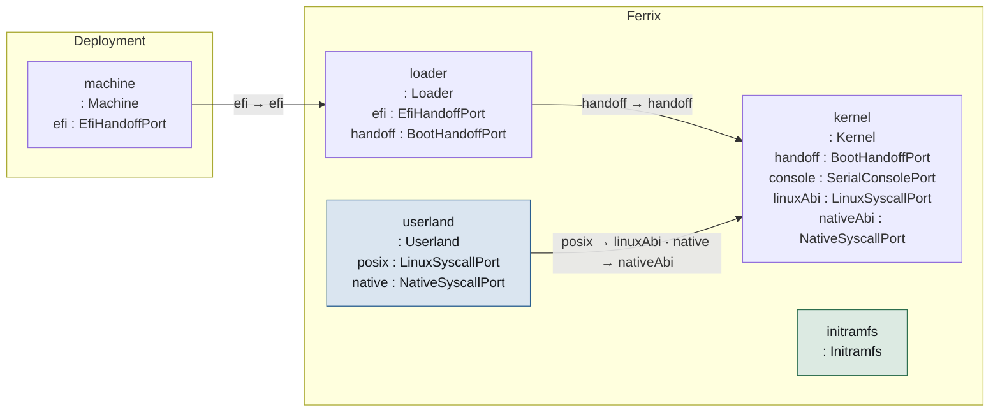

**Figure 2 — The pieces and the ports between them.** Each box lists the ports it declares; each line is a `connect` statement, labelled with the two ports it joins. [SVG](diagrams/interfaces.svg) Source: `02-structure.sysml`.

### The machine

The system context. Ferrix targets QEMU's q35 and virt machines in CI and the STM32MP157 on the ARMv7-A side.

| Feature | Type | Multiplicity | Note |
| --- | --- | --- | --- |
| `firmware` | `FirmwareKind` |  |  |
| `description` | `MachineDescription` |  |  |
| `cpus` | `Cpu` | `1..*` |  |
| `ramBytes` | `Natural` |  |  |
| `devices` | `Device` | `0..*` |  |
| `iommu` | `Iommu` | `0..1` |  |
| `efi` | `EfiHandoffPort` |  |  |

### Interfaces between the big pieces

- **`EfiHandoffPort`** — extern "efiapi" fn efi_main(image, system_table). On ARMv7-A the calling convention lowers to AAPCS on the musleabi target, so the signature is the same on all three.
- **`BootHandoffPort`** — The loader and the kernel are two programs linked for different targets that meet at exactly one struct, declared once in libs/bootinfo. A mismatch is a type error rather than a triple fault.
- **`LinuxSyscallPort`** — Syscall numbers 0.., each architecture's table as Linux defines it (the EABI table on ARMv7-A). A compatibility obligation: no opinions live here. libs/linux-abi holds the numbers, errnos and repr(C) layouts.
- **`NativeSyscallPort`** — Syscall numbers from 0x1000, capability-handle based. Where the design opinions live; what devmgr and drivers speak. A process may use both ports.
- **`SerialConsolePort`** — Early boot and panic output. The boot test reads this stream and waits for the marker FERRIX-BOOT-OK.

### The loader

boot/: the UEFI loader. Reads the kernel from the volume it was booted from, copies it to its link address, builds the address space, takes the memory map, leaves boot services, installs the new tables and jumps. Only the last step is assembly, because the return address of a Rust call would be in the address space just replaced. One program for three architectures: boot/src/arch has one file per machine and no second loader.

| Feature | Type | Maturity | Stage | Note |
| --- | --- | --- | ---: | --- |
| `efi` | `~EfiHandoffPort` | — | — |  |
| `handoff` | `~BootHandoffPort` | — | — |  |
| `uefi` | `UefiBindings` | — | — | boot/src/uefi: the handful of protocols and tables used — simple file system, loaded image, graphics output, and the ACPI and device-tree configuration tables. |
| `services` | `Services` | — | — | boot/src/services.rs: allocation, memory map, and the one call after which firmware is gone: ExitBootServices. |
| `load` | `ImageLoading` | — | — | boot/src/load.rs: ELF parse via libs/elf, placement, page tables via libs/paging, the identity plan for the switch. |
| `arch` | `LoaderArch` | — | — |  |

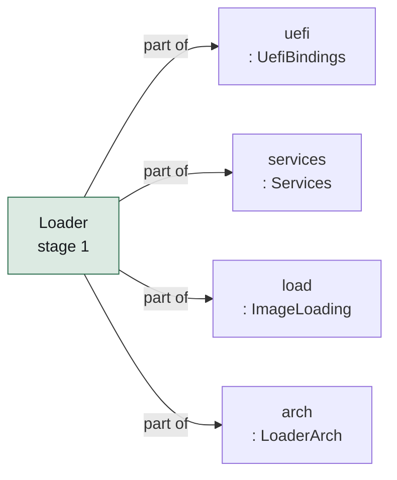

**Figure 3 — Loader and its parts.** The parts `Loader` is made of, coloured by the lifecycle keyword each carries. [SVG](diagrams/ferrix-structure-loader.svg) Source: `02-structure.sysml`.

### The kernel

kernel/: monolithic core, capability seams, userspace device drivers. Entered from the loader with the MMU on, three mappings in place and nothing else: no vectors, no allocator, no other CPU running.

| Feature | Type | Maturity | Stage | Note |
| --- | --- | --- | ---: | --- |
| `handoff` | `BootHandoffPort` | — | — |  |
| `console` | `SerialConsolePort` | — | — |  |
| `linuxAbi` | `LinuxSyscallPort` | `#implemented` | — |  |
| `nativeAbi` | `NativeSyscallPort` | `#implemented` | — |  |
| `arch` | `ArchLayer` | — | — |  |
| `printer` | `Console` | `#implemented` | — | kernel/src/console.rs: println over the arch console, behind a lock that a panicking CPU waits a bounded time for, so a fault while printing still produces its FERRIX-PANIC line. |
| `early` | `EarlyMemory` | `#implemented` | — |  |
| `trap` | `TrapDispatch` | `#implemented` | — |  |
| `mm` | `PhysicalMemory` | `#implemented` | — |  |
| `vmap` | `VmapArena` | `#implemented` | — |  |
| `mmio` | `MmioWindows` | `#implemented` | — |  |
| `irq` | `IrqTable` | `#implemented` | — |  |
| `timer` | `Timer` | `#implemented` | — |  |
| `smp` | `Smp` | `#implemented` | — |  |
| `acpi` | `AcpiAccess` | `#implemented` | — |  |
| `fdt` | `FdtAccess` | `#implemented` | — |  |
| `tasks` | `Tasks` | `#implemented` | — |  |
| `sched` | `Scheduler` | `#implemented` | — |  |
| `vm` | `VirtualMemory` | `#implemented` | — |  |
| `syscalls` | `LinuxSyscallLayer` | `#implemented` | — |  |
| `native` | `NativeAbi` | `#implemented` | — |  |
| `futex` | `Futex` | `#implemented` | — |  |
| `signals` | `Signals` | `#implemented` | — |  |
| `ipc` | `PosixIpc` | `#implemented` | — |  |
| `vfs` | `Vfs` | `#implemented` | — |  |
| `pageCache` | `PageCache` | `#implemented` | — |  |
| `filesystems` | `Filesystems` | `#implemented` | — |  |
| `blockCore` | `BlockCore` | `#implemented` | — |  |
| `netCore` | `NetCore` | `#implemented` | — |  |
| `namespaces` | `Namespaces` | `#planned` | — |  |
| `cgroups` | `Cgroups` | `#planned` | — |  |
| `seccomp` | `Seccomp` | `#planned` | — |  |
| `devices` | `DeviceEnumeration` | `#implemented` | — |  |
| `iommu` | `IommuDomains` | `#implemented` | — |  |

```mermaid
flowchart LR
  n0_FerrixStructure_Kernel["Kernel"]
  n1_FerrixStructure_Kernel_arch["arch<br>: ArchLayer"]
  n2_FerrixStructure_Kernel_printer["printer<br>: Console"]
  n3_FerrixStructure_Kernel_early["early<br>: EarlyMemory"]
  n4_FerrixStructure_Kernel_trap["trap<br>: TrapDispatch"]
  n5_FerrixStructure_Kernel_mm["mm<br>: PhysicalMemory"]
  n6_FerrixStructure_Kernel_vmap["vmap<br>: VmapArena"]
  n7_FerrixStructure_Kernel_mmio["mmio<br>: MmioWindows"]
  n8_FerrixStructure_Kernel_irq["irq<br>: IrqTable"]
  n9_FerrixStructure_Kernel_timer["timer<br>: Timer"]
  n10_FerrixStructure_Kernel_smp["smp<br>: Smp"]
  n11_FerrixStructure_Kernel_acpi["acpi<br>: AcpiAccess"]
  n12_FerrixStructure_Kernel_fdt["fdt<br>: FdtAccess"]
  n13_FerrixStructure_Kernel_tasks["tasks<br>: Tasks"]
  n14_FerrixStructure_Kernel_sched["sched<br>: Scheduler"]
  n15_FerrixStructure_Kernel_vm["vm<br>: VirtualMemory"]
  n16_FerrixStructure_Kernel_syscalls["syscalls<br>: LinuxSyscallLayer"]
  n17_FerrixStructure_Kernel_native["native<br>: NativeAbi"]
  n18_FerrixStructure_Kernel_futex["futex<br>: Futex"]
  n19_FerrixStructure_Kernel_signals["signals<br>: Signals"]
  n20_FerrixStructure_Kernel_ipc["ipc<br>: PosixIpc"]
  n21_FerrixStructure_Kernel_vfs["vfs<br>: Vfs"]
  n22_FerrixStructure_Kernel_pageCache["pageCache<br>: PageCache"]
  n23_FerrixStructure_Kernel_filesystems["filesystems<br>: Filesystems"]
  n24_FerrixStructure_Kernel_blockCore["blockCore<br>: BlockCore"]
  n25_FerrixStructure_Kernel_netCore["netCore<br>: NetCore"]
  n26_FerrixStructure_Kernel_namespaces["namespaces<br>: Namespaces"]
  n27_FerrixStructure_Kernel_cgroups["cgroups<br>: Cgroups"]
  n28_FerrixStructure_Kernel_seccomp["seccomp<br>: Seccomp"]
  n29_FerrixStructure_Kernel_devices["devices<br>: DeviceEnumeration"]
  n30_FerrixStructure_Kernel_iommu["iommu<br>: IommuDomains"]
  n0_FerrixStructure_Kernel -- "part of" --> n1_FerrixStructure_Kernel_arch
  n0_FerrixStructure_Kernel -- "part of" --> n2_FerrixStructure_Kernel_printer
  n0_FerrixStructure_Kernel -- "part of" --> n3_FerrixStructure_Kernel_early
  n0_FerrixStructure_Kernel -- "part of" --> n4_FerrixStructure_Kernel_trap
  n0_FerrixStructure_Kernel -- "part of" --> n5_FerrixStructure_Kernel_mm
  n0_FerrixStructure_Kernel -- "part of" --> n6_FerrixStructure_Kernel_vmap
  n0_FerrixStructure_Kernel -- "part of" --> n7_FerrixStructure_Kernel_mmio
  n0_FerrixStructure_Kernel -- "part of" --> n8_FerrixStructure_Kernel_irq
  n0_FerrixStructure_Kernel -- "part of" --> n9_FerrixStructure_Kernel_timer
  n0_FerrixStructure_Kernel -- "part of" --> n10_FerrixStructure_Kernel_smp
  n0_FerrixStructure_Kernel -- "part of" --> n11_FerrixStructure_Kernel_acpi
  n0_FerrixStructure_Kernel -- "part of" --> n12_FerrixStructure_Kernel_fdt
  n0_FerrixStructure_Kernel -- "part of" --> n13_FerrixStructure_Kernel_tasks
  n0_FerrixStructure_Kernel -- "part of" --> n14_FerrixStructure_Kernel_sched
  n0_FerrixStructure_Kernel -- "part of" --> n15_FerrixStructure_Kernel_vm
  n0_FerrixStructure_Kernel -- "part of" --> n16_FerrixStructure_Kernel_syscalls
  n0_FerrixStructure_Kernel -- "part of" --> n17_FerrixStructure_Kernel_native
  n0_FerrixStructure_Kernel -- "part of" --> n18_FerrixStructure_Kernel_futex
  n0_FerrixStructure_Kernel -- "part of" --> n19_FerrixStructure_Kernel_signals
  n0_FerrixStructure_Kernel -- "part of" --> n20_FerrixStructure_Kernel_ipc
  n0_FerrixStructure_Kernel -- "part of" --> n21_FerrixStructure_Kernel_vfs
  n0_FerrixStructure_Kernel -- "part of" --> n22_FerrixStructure_Kernel_pageCache
  n0_FerrixStructure_Kernel -- "part of" --> n23_FerrixStructure_Kernel_filesystems
  n0_FerrixStructure_Kernel -- "part of" --> n24_FerrixStructure_Kernel_blockCore
  n0_FerrixStructure_Kernel -- "part of" --> n25_FerrixStructure_Kernel_netCore
  n0_FerrixStructure_Kernel -- "part of" --> n26_FerrixStructure_Kernel_namespaces
  n0_FerrixStructure_Kernel -- "part of" --> n27_FerrixStructure_Kernel_cgroups
  n0_FerrixStructure_Kernel -- "part of" --> n28_FerrixStructure_Kernel_seccomp
  n0_FerrixStructure_Kernel -- "part of" --> n29_FerrixStructure_Kernel_devices
  n0_FerrixStructure_Kernel -- "part of" --> n30_FerrixStructure_Kernel_iommu
  classDef implemented fill:#dceae2,stroke:#2c6e4e,color:#16191d
  classDef planned fill:#e4e7ea,stroke:#6a737e,color:#16191d
  class n2_FerrixStructure_Kernel_printer,n3_FerrixStructure_Kernel_early,n4_FerrixStructure_Kernel_trap,n5_FerrixStructure_Kernel_mm,n6_FerrixStructure_Kernel_vmap,n7_FerrixStructure_Kernel_mmio,n8_FerrixStructure_Kernel_irq,n9_FerrixStructure_Kernel_timer,n10_FerrixStructure_Kernel_smp,n11_FerrixStructure_Kernel_acpi,n12_FerrixStructure_Kernel_fdt,n13_FerrixStructure_Kernel_tasks,n14_FerrixStructure_Kernel_sched,n15_FerrixStructure_Kernel_vm,n16_FerrixStructure_Kernel_syscalls,n17_FerrixStructure_Kernel_native,n18_FerrixStructure_Kernel_futex,n19_FerrixStructure_Kernel_signals,n20_FerrixStructure_Kernel_ipc,n21_FerrixStructure_Kernel_vfs,n22_FerrixStructure_Kernel_pageCache,n23_FerrixStructure_Kernel_filesystems,n24_FerrixStructure_Kernel_blockCore,n25_FerrixStructure_Kernel_netCore,n29_FerrixStructure_Kernel_devices,n30_FerrixStructure_Kernel_iommu implemented
  class n26_FerrixStructure_Kernel_namespaces,n27_FerrixStructure_Kernel_cgroups,n28_FerrixStructure_Kernel_seccomp planned
```

**Figure 4 — Kernel and its parts.** The parts `Kernel` is made of, coloured by the lifecycle keyword each carries. [SVG](diagrams/ferrix-structure-kernel.svg) Source: `02-structure.sysml`.

> **Lock order** — mm.rs: TABLES serialises every walk and change of the kernel page tables and is taken before FRAMES (a mapping may need a frame for a table) and before HEAP (an unmap records what it released). Never the other way round. Stage 5 adds a run queue's lock outside the heap's and the frame allocator's, with nothing ever taken outside it.

## The architecture facade

kernel/src/arch/mod.rs: the one module generic code reaches the CPU through. Each architecture exports the same set of names; the facade re-exports whichever one the build is for. Adding an architecture is a third cfg branch, not a second facade.

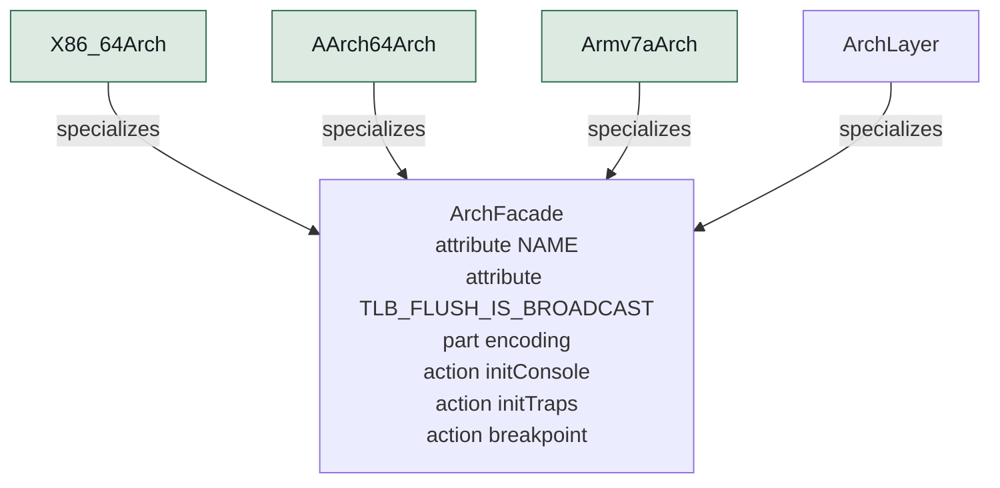

**Figure 5 — Arch facade and its subtypes.** 4 definitions specialize `ArchFacade`; the hollow arrow points at what they have in common. [SVG](diagrams/ferrix-structure-arch-facade.svg) Source: `02-structure.sysml`.

| Target | Definition | Maturity | TLB flush broadcasts | Notes |
| --- | --- | --- | --- | --- |
| `x86_64` | `X86_64Arch` | `#implemented` | false | kernel/src/arch/x86_64. |
| `aarch64` | `AArch64Arch` | `#implemented` | true | kernel/src/arch/aarch64. |
| `armv7a` | `Armv7aArch` | `#implemented` | true | kernel/src/arch/armv7a: the Cortex-A7 of the STM32MP157, run on QEMU virt under U-Boot. |

Exactly one is compiled in, chosen by the build target.

### x86_64

kernel/src/arch/x86_64. Target x86_64-unknown-none, kernel code model, no red zone, soft float. Machine description: ACPI.

| Part | Type | Maturity | Note |
| --- | --- | --- | --- |
| `gdt` | `Gdt` | — | Per processor, with its TSS: a TSS cannot be shared because loading one marks its descriptor busy. |
| `idt` | `Idt` | — | 256 gates, every one naming the kernel code selector; the double-fault gate on an IST stack of its own. |
| `lapic` | `LocalApic` | — | Mapped from the MADT, enabled, task priority dropped. |
| `ioapics` | `IoApic` | — | Every I/O APIC firmware described is mapped and every input masked at boot; the inputs the kernel uses are routed one at a time, which is the 16550's receive interrupt, found from the MADT. |
| `clock` | `X86Clock` | — | HPET main counter, whose period firmware states in femtoseconds. |
| `serial` | `Serial16550` | — | COM1 through port I/O. The one in-kernel device. |
| `trampoline` | `ApTrampoline` | — | Real mode to long mode in one step, on a root table below 1 MiB sharing the kernel's upper half. |
| `shootdown` | `TlbShootdown` | — |  |
| `tscDeadline` | `TscDeadlineTimer` | `@deferred` | Replaces the LAPIC countdown with a comparator against the TSC; the calibration exists. Waits for a tickless scheduler to want it. |
| `x2apic` | `X2ApicMode` | `@deferred` | APIC IDs above 255 are refused with a message; QEMU's are 0 to 3. |
| `vtd` | `IommuDriver` | `#implemented` | kernel/src/iommu/vtd.rs: legacy mode, checked against QEMU's intel_iommu.c -- a root table per unit, a context table per bus, a second-level table per domain -- programmed before PCI enumeration, so a function behind it reaches only what its domain maps. |
| `amdVi` | `IommuDriver` | `@deferred` | Nothing reads an IVRS table or drives an AMD IOMMU, so on such a machine DMA would not be translated. Left after stage 10's exit: none of it was on the path to rustc. |

### aarch64

kernel/src/arch/aarch64. Target aarch64-unknown-none-softfloat. Machine description: ACPI (MADT, FADT for the PSCI conduit, GTDT for the timer interrupt).

| Part | Type | Maturity | Note |
| --- | --- | --- | --- |
| `vectors` | `VbarEl1Table` | — | Sixteen entries at fixed 128-byte offsets; the layout is the interface. |
| `gic` | `Gicv2Front` | — | aarch64/gic.rs: the MADT walk alone — distributor and CPU interface addresses, the check that every core's interface is the same banked address, the version check — then a call into the shared gicv2 driver. |
| `timer` | `GenericTimer` | — | The architected virtual timer, CNTV_CVAL_EL0, because a kernel at EL1 is below any hypervisor present. |
| `serial` | `Pl011Console` | — | Still aarch64's own copy with a hard-coded address; moving it onto the shared pl011 driver is the open half of docs/arm32.md decision 6. |
| `psci` | `PsciCpuOn` | — | Secondaries start with the MMU off at a physical address and enter through an identity map of the entry sequence alone, in a tree of their own, loading every parameter before the MMU goes on. |
| `el2Drop` | `El2ToEl1` | — | Firmware may hand off at EL2; lowering is an eret into a constructed context. |
| `gicv3` | `Gicv3` | `@deferred` | gic::init refuses anything that is not a GICv2; QEMU virt gives GICv2 unless asked, so this needs a second boot-test configuration as much as code. |
| `parking` | `PsciParkingProtocol` | `@deferred` | For firmware without PSCI. Refused, not guessed at. |
| `smmu` | `IommuDriver` | `#implemented` | kernel/src/iommu/smmuv3.rs: every SMMUv3 the IORT describes, checked against QEMU's smmuv3.c -- a linear stream table aborting until a domain is attached, stage 2 per stream, the command queue polled and the event queue on -- with the GICv2m doorbell mapped… |

### armv7a

kernel/src/arch/armv7a: the Cortex-A7 of the STM32MP157, run on QEMU virt under U-Boot. Target armv7a-none-eabi with LPAE. Machine description: device tree only. Joined after stage 3 without a second loader, a second facade or a line of bootstrap assembly; docs/arm32.md is the plan it followed.

| Part | Type | Maturity | Note |
| --- | --- | --- | --- |
| `vectors` | `Armv7aVectorTable` | — | Eight one-instruction entries at VBAR. |
| `gic` | `Gicv2FromFdt` | — | Distributor and CPU interface from the device tree, then the shared gicv2 driver. |
| `timer` | `GenericTimerCp15` | — | The same counter as AArch64's, reached through cp15; the interrupt number comes from the device tree. |
| `serial` | `ConsoleChoice` | — | armv7a/console.rs chooses between the ports the device tree describes, in priority order: `console=pl011|stm32` from /chosen/bootargs (U-Boot sets it without reflashing, for a board whose tree is exactly what is in question), then stdout-path, then the first… |
| `coherency` | `ActlrReport` | — | Every core reads ACTLR.SMP once it is in Rust and the boot log says how many had it set. |
| `psci` | `PsciCpuOn` | — | Conduit from the device tree: hvc on QEMU, not the smc the plan first guessed. |
| `boardDeferred` | `Ed1Ev1Boards` | `@deferred` | The ED1 and EV1 have 1 GiB, whose identity range lands on the direct map; Layout::plan_identity_map refuses rather than guesses, so they need a trampoline page not yet written. |
| `highRam` | `RamAbove2GiB` | `@deferred` | RAM beyond the 1.25 GiB direct map: a machine with it boots and reports the excess unused. RAM above the 2 GiB split, which the board's DDR at 3 GiB needs, works since 9ae0180f. |
| `thumb2` | `Thumb2` | `@deferred` | ARM code generation only, as docs/arm32.md argues. |
| `vfp` | `Vfp` | `@deferred` | Soft float; a UEFI application may not assume firmware enabled the VFP. |
| `smmu` | `IommuDriver` | `@deferred` | The device tree's SMMUv3 is found and left alone: U-Boot's virtio-pci driver resets when a device offers VIRTIO_F_ACCESS_PLATFORM, so the machine's virtio devices would bypass it anyway, and stage 10's exit runs ARMv7-A in degraded trusted mode, as decided. |

### What the facade exports

Every architecture supplies each of these; generic kernel code reaches the CPU through nothing else.

| Operation | Maturity | Stage | Note |
| --- | --- | ---: | --- |
| `initConsole` | — | — |  |
| `initTraps` | — | — |  |
| `breakpoint` | — | — |  |
| `advancePastBreakpoint` | — | — |  |
| `classify` | — | — |  |
| `reportTrap` | — | — |  |
| `initInterrupts` | — | — |  |
| `enableInterrupts` | — | — |  |
| `disableInterrupts` | — | — |  |
| `serviceInterrupts` | — | — |  |
| `timerArm` | — | — |  |
| `timerDisarm` | — | — |  |
| `counterNow` | — | — |  |
| `counterHz` | — | — |  |
| `waitForInterrupt` | — | — |  |
| `waitForWork` | — | — |  |
| `flushTlb` | — | — |  |
| `dropIdentityMap` | — | — |  |
| `identityRoot` | — | — |  |
| `prepareUserRoot` | — | 6 | Make a freshly allocated user root usable. x86-64 keeps both halves in one root, so it shares the kernel's top-level slots into it — shared, not copied, so a later kernel mapping appears in every space without walking any. |
| `installUserRoot` | — | 6 | Translate this processor's user half through a given root. x86-64 is one CR3 write, whose own side effect is to drop every non-global entry while the kernel's global ones — set because the loader enables CR4.PGE — survive. |
| `uninstallUserRoot` | — | 6 | Stop translating user addresses, which is the state a kernel thread runs in. x86-64 goes back to the kernel's own root; the Arm pair set EPD0 and invalidate, because EPD0 governs walks and not the TLB. |
| `describeCpus` | — | — |  |
| `hardwareId` | — | — |  |
| `cpuLocal` | — | — |  |
| `setCpuLocal` | — | — |  |
| `sendIpiToOthers` | — | — |  |
| `halt` | — | — |  |
| `shutdown` | — | — |  |
| `prepareStack` | — | — | Lay out a fresh task's stack so that the first switch into it "returns" into its entry function. |
| `switchTo` | — | — | The context switch, arch/\<machine>/switch.rs: saves the callee-saved set and the stack pointer, and returns onto a stack that belongs to another task, which Rust cannot say. |
| `enterUser` | `#implemented` | 6 | enter_user: the ring-3 / EL0 / USR transition, from the program's own task, never returning. |
| `systemCall` | `#implemented` | 6 | The Arm half of system call entry: svc arrives through the trap vector as Trap::SystemCall, so the architecture reads the number and arguments from the saved registers, handles exit and exit_group with leave_user before dispatch, and writes the result back.… |
| `syscallEntry` | `#implemented` | 6 | x86-64: SYSCALL leaves the return address in rcx and does not switch the stack, so entry swaps to the kernel stack through swapgs before anything can be pushed (kernel/src/arch/x86_64/syscall.rs). |

### Drivers shared by the Arm pair

Register-level drivers under arch/ shared by the two Arm architectures, gated by cfg(any(aarch64, arm)) inside the arch directory where the layering check permits it.

- **`gicv2` : `Gicv2`** — kernel/src/arch/gicv2.rs: distributor (machine-wide) and CPU interface (per core). 0..16 software-generated, 16..32 private peripheral, 32.. shared. IPIs through GICD_SGIR. Private interrupts' enable bits are banked per core, so the driver records what the boot core enabled and init_this_cpu replays the whole set on every other core — the timer included, which is what stage 5 found missing.
- **`pl011` : `Pl011`** — kernel/src/arch/pl011.rs. Used by ARMv7-A today.
- **`stm32Usart` : `Stm32Usart`** — kernel/src/arch/stm32_usart.rs: the board's own UART.

## Boot

The hand-off ABI, the two address layouts, the loader's sequence, the kernel's bring-up with every stage's self-check to stage 12, and the trap path. All of this runs today on all three architectures.

### The hand-off

Version 4. Every type is repr(C); the kernel refuses to start if the magic or version disagree. Addresses are u64 on every width so the layout is one layout. The kernel validates it once through BootInfo::validate into a BootView whose accessors are safe.

| Field | Type | Value | Note |
| --- | --- | --- | --- |
| `magic` | `String` | `FERRIXBI` |  |
| `version` | `Natural` | `4` |  |
| `arch` | `Arch` |  |  |
| `regions` | `MemRegion` |  | Sorted, non-overlapping, describing the loader's own allocations — without which the frame allocator would hand out the frames holding its own page tables. |
| `physmapBase` | `Natural` |  |  |
| `physmapPhys` | `Natural` |  | The direct map begins at the lowest RAM address rather than at zero: a gibibyte in on QEMU's Arm machines. |
| `physmapLen` | `Natural` |  |  |
| `kernelPhys` | `Natural` |  |  |
| `kernelVirt` | `Natural` |  |  |
| `kernelLen` | `Natural` |  |  |
| `rootTablePhys` | `Natural` |  |  |
| `ttbr0Phys` | `Natural` |  |  |
| `loaderAliasPhys` | `Natural` |  |  |
| `loaderAliasLen` | `Natural` |  |  |
| `bootStackTop` | `Natural` |  |  |
| `bootStackSize` | `Natural` | `65536` |  |
| `framebuffer` | `Framebuffer` |  |  |
| `initrdPhys` | `Natural` |  |  |
| `initrdLen` | `Natural` |  |  |
| `rsdp` | `Natural` |  |  |
| `dtb` | `Natural` |  |  |
| `dtbLen` | `Natural` |  | The device tree is copied into memory of its own kind, DeviceTree, so it outlives the reclaim of firmware's copy; stage 10 enumerates devices from the same bytes. |
| `uefiSystemTable` | `Natural` |  |  |
| `cmdline` | `String` |  | key=value options and bare flags, one grammar (option_in, flag_in) whether the loader filled this in or the kernel read /chosen/bootargs from the device tree, which is where the Arm boards carry it. |

### Address layouts

libs/bootinfo::Layout. Both instances are checked for overlap at compile time on every build, whichever one the build uses.

#### Layout64 — 64-bit

Shared by x86-64 and AArch64: four-level tables over 48-bit addresses. x86-64 needs the image in the top 2 GiB for the kernel code model; AArch64 uses it anyway, because one layout is one set of bugs instead of two.

| Range | Base | Limit | Purpose |
| --- | --- | --- | --- |
| `image` | `0xFFFF_FFFF_8000_0000` | `0xFFFF_FFFF_FFFF_FFFF` | the kernel image |
| `physmap` | `0xFFFF_8000_0000_0000` | `0xFFFF_FEFF_FFFF_FFFF` | direct map of all physical RAM |
| `vmap` | `0xFFFF_FF00_0000_0000` | `0xFFFF_FFEF_FFFF_FFFF` | kernel vmap: MMIO, guard-paged stacks |
| `user` | `0x0000_0000_0000_0000` | `0x0000_7FFF_FFFF_FFFF` | user |

vmap reserved for fixed windows: `0x1_0000_0000`

#### Layout32 — 32-bit

ARMv7-A: a 2/2 split, TTBR0 translating the lower half and TTBR1 the upper, three-level LPAE tables. The user half is the larger because a 32-bit process wants it; the direct map gets what the vmap area and the image leave, and its size is the ceiling on RAM the kernel can use.

| Range | Base | Limit | Purpose |
| --- | --- | --- | --- |
| `image` | `0xF000_0000` | `0xFFFF_FFFF` | the kernel image |
| `physmap` | `0xA000_0000` | `0xEFFF_FFFF` | direct map of RAM, 1.25 GiB |
| `vmap` | `0x8000_0000` | `0x9FFF_FFFF` | kernel vmap |
| `user` | `0x0000_0000` | `0x7FFF_FFFF` | user |

vmap reserved for fixed windows: `0x0400_0000`

### The loader's sequence

Firmware calls efi_main in 64-bit mode (SVC mode on ARMv7-A) with a stack and the MMU on. Only enterKernel is assembly.

1. `initFirmwareConsole` — Firmware's con_out, until console::shutdown just before ExitBootServices.
2. `prepareCpu`
3. `stageKernel` — Read /FERRIX/KERNEL.ELF from the volume the loader came from, parse it with libs/elf, copy the segments to their link address. Malformed segments are refused here rather than discovered by the MMU. /FERRIX/INITRD.IMG, when the volume has one, is read into memory of its own kind, Initrd, which nothing reclaims; absent is not an error.
4. `allocateBootAreas` — Boot stack (64 KiB), boot info (64 KiB, around 2700 regions of room), memory map buffer.
5. `buildAddressSpace` — libs/paging Mapper: the image at its link address, the direct map from the lowest RAM address, and an identity plan for the loader's own code so the instruction after the switch is fetchable. The loader also maps itself where the kernel can reach it, so the kernel can drop the map rather than abandon a table.
6. `writeBootInfo`
7. `leaveFirmware` — Fetch the memory map one last time and call ExitBootServices. Past this line firmware is gone: no allocation, no console, no protocols.
8. `recordMemoryMap` — Translate UEFI descriptors into MemRegion\[\] behind the boot info, tagging the loader's own allocations.
9. `cleanDcache` — The Arm architectures turn the MMU off in the middle of the switch, so anything dirty in a cache would vanish. No-op on x86-64.
10. `enterKernel` — Install the new tables and jump to \_start with the boot info pointer in the direct map.


**Figure 6 — Loader sequence.** 12 steps, as `LoaderSequence` orders them. [SVG](diagrams/ferrix-boot-loader-sequence.svg) Source: `03-boot.sysml`.

### The kernel's bring-up

kmain. Every stage's exit criterion runs here on every boot, and each failure panics with its own message so the boot test fails with a reason rather than a timeout. The marker at the end reads FERRIX-BOOT-OK stages 1-12. Stages 1 to 5 are broken down into their checks below; from stage 6 on each step names the check function in kernel/src/main.rs, in the order kmain calls them, which is not the stages' order.

1. `validateHandoff` — Magic, version, arch and layout constants. No console yet, so a mismatch halts silently: there is no valid way to make one.
2. `initConsole`
3. `reportHandoff`
4. `stage1SelfCheck`
5. `installTraps` — Before anything can fault: until this runs the CPU still points at firmware's handlers, which stopped existing at ExitBootServices.
6. `initPhysicalMemory` — mm::init: carve the per-frame array from the largest usable region inside the direct map, hand every usable frame to the buddy, start the heap.
7. `initVmapArena`
8. `stage2SelfCheck`
9. `stage3TrapCheck`
10. `initInterrupts` — arch::init_interrupts: controller and clocks, reported as "clock" and "irqs" lines.
11. `initTimer`
12. `enableInterrupts`
13. `stage3TimerCheck`
14. `stage4Processors`
15. `stage5Scheduler` — After stage 4 because it needs every processor it will schedule on, before finishMemory because the task stacks it takes and gives back are mappings the sweep has to see settled.
16. `stage6MemoryObjects` — check_user_memory: the memory objects a process is built from, and a processor translating through one of them. A reservation costs nothing until it is touched, and every frame an object was given comes back when it is dropped — the leak that would otherwise kill the machine an hour into a rustc build. Before finishMemory, whose reclaim would move the frame count under it.
17. `stage8RootFilesystem` — check_filesystems: the root built from the initramfs and required to be what the build wrote, then tmpfs over VMO pages and a page source, pipes, a shared file mapping, devfs, procfs and /proc/stat. Before stage 7's checks, which open files.
18. `stage7Syscalls` — check_syscalls: every number through dispatch, getpid answering this architecture's own number, the user copy layer, and then programs in user mode -- turns on one processor, a kill, fork, execve, futex, signals, threads -- with a forking program's frames required back once it is reaped.
19. `stage6ReverseMap` — check_reverse_map: a shared object's page decommitted, replaced and held under two processes on two processors, which must never reach a frame the object gave back. After stage 7's check, because it needs programs that run.
20. `entryPaths` — check_entry_paths: a trap flag a program set, which SYSCALL must mask, then the exceptions nothing masks, which must find the kernel's GS wherever they land. The Arm pair take every exception on a stack a program cannot set, and say so.
21. `stage8PathCalls` — check_path_calls: the calls that take a path, by number, against the real namespace under /tmp.
22. `stage9NativeObjects` — check_native_objects: the native ABI's objects driven through their handlers by two processes the check builds, before any program can make a native call.
23. `stage10Devices` — iommu::bring_up programs the units firmware describes; check_pci finds every PCI function, sizes its BARs and walks its capabilities; check_devices publishes the device nodes, requiring each to hand out exactly the apertures and vectors it has; check_iommu reports which unit each function's DMA arrives at.
24. `stage9DeviceObjects` — check_device_objects: I/O mappings and interrupts minted from the nodes just published.
25. `stage10Drivers` — check_block_ring: the block ring's control plane driven from a process, then devmgr started with every device and driver image, and sectors read through the disks its drivers serve.
26. `stage11BtrfsRead` — check_btrfs_disk: the mkfs.btrfs fixture on the second disk mounted at /mnt and read back against its manifest, file by file.
27. `stage12BtrfsWrite` — check_btrfs_write: a blank volume on the third disk mounted writable, written, unmounted, mounted again and read back. Then / moves onto a root disk, on a boot that has one, and a data disk is mounted at /data.
28. `networkingCheck` — check_net: the net core over the loopback in both families, then the net ring played from both ends and netlink's dumps and changes.
29. `finishMemory`
30. `reportSuccess`
31. `startInit` — init::run (kernel/src/init.rs), after the marker on purpose: cargo xtask test-boot stops QEMU at the marker, so the boot test is the same whether or not a program is built in.
32. `shutdown`

```mermaid
flowchart TB
  n0_FerrixBoot_KernelBringUp_start(["start"])
  n1_FerrixBoot_KernelBringUp_validateHandoff("validateHandoff")
  n2_FerrixBoot_KernelBringUp_initConsole("initConsole")
  n3_FerrixBoot_KernelBringUp_reportHandoff("reportHandoff")
  n4_FerrixBoot_KernelBringUp_stage1SelfCheck("stage1SelfCheck")
  n5_FerrixBoot_KernelBringUp_installTraps("installTraps")
  n6_FerrixBoot_KernelBringUp_initPhysicalMem("initPhysicalMemory")
  n7_FerrixBoot_KernelBringUp_initVmapArena("initVmapArena")
  n8_FerrixBoot_KernelBringUp_stage2SelfCheck("stage2SelfCheck")
  n9_FerrixBoot_KernelBringUp_stage3TrapCheck("stage3TrapCheck")
  n10_FerrixBoot_KernelBringUp_initInterrupts("initInterrupts")
  n11_FerrixBoot_KernelBringUp_initTimer("initTimer")
  n12_FerrixBoot_KernelBringUp_enableInterrupt("enableInterrupts")
  n13_FerrixBoot_KernelBringUp_stage3TimerChec("stage3TimerCheck")
  n14_FerrixBoot_KernelBringUp_stage4Processor("stage4Processors")
  n15_FerrixBoot_KernelBringUp_stage5Scheduler("stage5Scheduler")
  n16_FerrixBoot_KernelBringUp_stage6MemoryObj("stage6MemoryObjects<br>stage 6")
  n17_FerrixBoot_KernelBringUp_stage8RootFiles("stage8RootFilesystem<br>stage 8")
  n18_FerrixBoot_KernelBringUp_stage7Syscalls("stage7Syscalls<br>stage 7")
  n19_FerrixBoot_KernelBringUp_stage6ReverseMa("stage6ReverseMap<br>stage 6")
  n20_FerrixBoot_KernelBringUp_entryPaths("entryPaths")
  n21_FerrixBoot_KernelBringUp_stage8PathCalls("stage8PathCalls<br>stage 8")
  n22_FerrixBoot_KernelBringUp_stage9NativeObj("stage9NativeObjects<br>stage 9")
  n23_FerrixBoot_KernelBringUp_stage10Devices("stage10Devices<br>stage 10")
  n24_FerrixBoot_KernelBringUp_stage9DeviceObj("stage9DeviceObjects<br>stage 9")
  n25_FerrixBoot_KernelBringUp_stage10Drivers("stage10Drivers<br>stage 10")
  n26_FerrixBoot_KernelBringUp_stage11BtrfsRea("stage11BtrfsRead<br>stage 11")
  n27_FerrixBoot_KernelBringUp_stage12BtrfsWri("stage12BtrfsWrite<br>stage 12")
  n28_FerrixBoot_KernelBringUp_networkingCheck("networkingCheck")
  n29_FerrixBoot_KernelBringUp_finishMemory("finishMemory")
  n30_FerrixBoot_KernelBringUp_reportSuccess("reportSuccess")
  n31_FerrixBoot_KernelBringUp_startInit("startInit")
  n32_FerrixBoot_KernelBringUp_shutdown("shutdown")
  n33_FerrixBoot_KernelBringUp_done(["done"])
  n0_FerrixBoot_KernelBringUp_start --> n1_FerrixBoot_KernelBringUp_validateHandoff
  n1_FerrixBoot_KernelBringUp_validateHandoff --> n2_FerrixBoot_KernelBringUp_initConsole
  n2_FerrixBoot_KernelBringUp_initConsole --> n3_FerrixBoot_KernelBringUp_reportHandoff
  n3_FerrixBoot_KernelBringUp_reportHandoff --> n4_FerrixBoot_KernelBringUp_stage1SelfCheck
  n4_FerrixBoot_KernelBringUp_stage1SelfCheck --> n5_FerrixBoot_KernelBringUp_installTraps
  n5_FerrixBoot_KernelBringUp_installTraps --> n6_FerrixBoot_KernelBringUp_initPhysicalMem
  n6_FerrixBoot_KernelBringUp_initPhysicalMem --> n7_FerrixBoot_KernelBringUp_initVmapArena
  n7_FerrixBoot_KernelBringUp_initVmapArena --> n8_FerrixBoot_KernelBringUp_stage2SelfCheck
  n8_FerrixBoot_KernelBringUp_stage2SelfCheck --> n9_FerrixBoot_KernelBringUp_stage3TrapCheck
  n9_FerrixBoot_KernelBringUp_stage3TrapCheck --> n10_FerrixBoot_KernelBringUp_initInterrupts
  n10_FerrixBoot_KernelBringUp_initInterrupts --> n11_FerrixBoot_KernelBringUp_initTimer
  n11_FerrixBoot_KernelBringUp_initTimer --> n12_FerrixBoot_KernelBringUp_enableInterrupt
  n12_FerrixBoot_KernelBringUp_enableInterrupt --> n13_FerrixBoot_KernelBringUp_stage3TimerChec
  n13_FerrixBoot_KernelBringUp_stage3TimerChec --> n14_FerrixBoot_KernelBringUp_stage4Processor
  n14_FerrixBoot_KernelBringUp_stage4Processor --> n15_FerrixBoot_KernelBringUp_stage5Scheduler
  n15_FerrixBoot_KernelBringUp_stage5Scheduler --> n16_FerrixBoot_KernelBringUp_stage6MemoryObj
  n16_FerrixBoot_KernelBringUp_stage6MemoryObj --> n17_FerrixBoot_KernelBringUp_stage8RootFiles
  n17_FerrixBoot_KernelBringUp_stage8RootFiles --> n18_FerrixBoot_KernelBringUp_stage7Syscalls
  n18_FerrixBoot_KernelBringUp_stage7Syscalls --> n19_FerrixBoot_KernelBringUp_stage6ReverseMa
  n19_FerrixBoot_KernelBringUp_stage6ReverseMa --> n20_FerrixBoot_KernelBringUp_entryPaths
  n20_FerrixBoot_KernelBringUp_entryPaths --> n21_FerrixBoot_KernelBringUp_stage8PathCalls
  n21_FerrixBoot_KernelBringUp_stage8PathCalls --> n22_FerrixBoot_KernelBringUp_stage9NativeObj
  n22_FerrixBoot_KernelBringUp_stage9NativeObj --> n23_FerrixBoot_KernelBringUp_stage10Devices
  n23_FerrixBoot_KernelBringUp_stage10Devices --> n24_FerrixBoot_KernelBringUp_stage9DeviceObj
  n24_FerrixBoot_KernelBringUp_stage9DeviceObj --> n25_FerrixBoot_KernelBringUp_stage10Drivers
  n25_FerrixBoot_KernelBringUp_stage10Drivers --> n26_FerrixBoot_KernelBringUp_stage11BtrfsRea
  n26_FerrixBoot_KernelBringUp_stage11BtrfsRea --> n27_FerrixBoot_KernelBringUp_stage12BtrfsWri
  n27_FerrixBoot_KernelBringUp_stage12BtrfsWri --> n28_FerrixBoot_KernelBringUp_networkingCheck
  n28_FerrixBoot_KernelBringUp_networkingCheck --> n29_FerrixBoot_KernelBringUp_finishMemory
  n29_FerrixBoot_KernelBringUp_finishMemory --> n30_FerrixBoot_KernelBringUp_reportSuccess
  n30_FerrixBoot_KernelBringUp_reportSuccess --> n31_FerrixBoot_KernelBringUp_startInit
  n31_FerrixBoot_KernelBringUp_startInit --> n32_FerrixBoot_KernelBringUp_shutdown
  n32_FerrixBoot_KernelBringUp_shutdown --> n33_FerrixBoot_KernelBringUp_done
```

**Figure 7 — Kernel bring up.** 34 steps, as `KernelBringUp` orders them. [SVG](diagrams/ferrix-boot-kernel-bring-up.svg) Source: `03-boot.sysml`.

### The self-checks each boot runs

Every stage's exit criterion runs in kmain on every boot. Each has its own panic line, so a failing boot test names a reason rather than a timeout.

#### Stage1 self check

**Stage ****1**

Stage 1's exit criterion.

- **`mapIsSortedAndNonOverlapping`** — Map is sorted and non overlapping
- **`mapHasUsableRam`** — Map has usable ram
- **`mapDescribesLoaderAllocations`** — Kernel, PageTables and BootInfo regions must all be present.
- **`directMapAliasesPhysical`** — Read the kernel's own first bytes through the image mapping and through the direct map; they must agree.
- **`canWalkAndExtendTables`** — Translating the kernel image agrees with the loader; a new device mapping (the framebuffer, where one exists) takes effect.

#### Stage2 self check

**Stage ****2**

- **`frameHammer`** — 4096 blocks of orders 0..4 allocated and freed in an order that forces coalescing; the free count must return exactly to where it started. Uses no heap on purpose.
- **`heapCheck`** — A Box, a Vec grown through reallocations, a BTreeMap of two thousand entries; heap_allocated must return to zero.
- **`vmapCheck`** — Written through and read back; two allocations separated by guard pages; the pages either side translate to nothing; a kernel stack 16-byte aligned, writable at both ends, guarded beyond each; freeing returns every frame.

#### Stage3 trap check

**Stage ****3**

- **`breakpointTwice`** — A canary in a register the frame saves and restores must come back intact; that proves the path restores rather than merely arrives.
- **`demandPagingWindow`** — Three pages touched out of order in an unmapped window; each fault maps the address and the instruction retries. Pages read back what was written, are zeroed, and cost exactly one frame each plus one per table level for the first fault.

#### Stage3 timer check

**Stage ****3**

- **`oneShotFiresOnce`** — Arm once, wait for the tick, then require the count not to move for ten further intervals. Catches a level-triggered timer acknowledged but not disarmed, which re-enters forever.
- **`thousandTicksMeasured`** — Count 1000 interrupts and measure the elapsed time with the counter, not by multiplying ticks by the programmed rate. Against a requested 1000 Hz the three report 998 to 999.

#### Stage5 scheduler check

**Stage ****5**

Four checks, the last the stage's own.

- **`initScheduler`** — One domain holding every CPU in Throughput mode, a queue and an idle task per processor, the boot thread adopted as a task.
- **`spawnRunReap`** — A task can be created, run, and cleaned up after.
- **`sleepIsASleep`** — The task is off the run queue and the processor is free, and it comes back when it said it would.
- **`thousandThreads`** — All spawned on one processor, so the others get any only by stealing; bounded work to completion; every stack back.
- **`fairnessBound`** — Twelve spinners, three per processor, one of each three at a different weight, inside a measured window. Each task's service, in nanoseconds of the stage 3 clock, must stay within EEVDF's bound of its weighted share: a slice plus the worst overrun the scheduler actually served, both printed.

#### Stage4 bring up

**Stage ****4**

- **`discoverProcessors`** — MADT local APIC / x2APIC / GIC CPU interface entries, or the device tree's /cpus; checked for duplicates and required to include the processor reading them.
- **`startSecondaries`** — Start secondaries
- **`everyDescribedProcessorOnline`** — Unless nosmp was given, in which case one is described. On ARMv7-A the coherency line reports how many cores had ACTLR.SMP set.
- **`smpChecks`** — On every processor at once: a hundred rounds of IPI-woken work; a page remapped twenty times with every processor required to read the new frame; a hundred grace periods against readers, with retired objects poisoned rather than freed; then the contended counter.

#### Finish memory

**Stage ****2**

The half of stage 2 that cannot run until the rest of boot has, in an order that is forced: the W^X sweep must first be able to see the loader's identity map as a violation, then the map is dropped, then the sweep must pass, then the memory early boot used goes back to the allocator.

- **`sweepMustSeeIdentityMap`** — Sweep must see identity map
- **`dropIdentityMap`** — Drop identity map
- **`addressZeroTranslatesToNothing`** — A null dereference in kernel code must fault rather than find the first page of physical memory.
- **`wxSweep`** — Walk every live leaf through Mapper::for_each_leaf; none may be writable and executable. Reports what it swept, because a sweep that walks nothing also finds nothing.
- **`reclaimBootMemory`** — The loader's own memory and the ACPI-reclaim regions go to the buddy: 2 to 4 MiB on a 512 MiB QEMU machine.

### Traps

One dispatch path above every architecture, reached only through the facade: classify the frame, act, and on return let the entry stub restore the interrupted context.

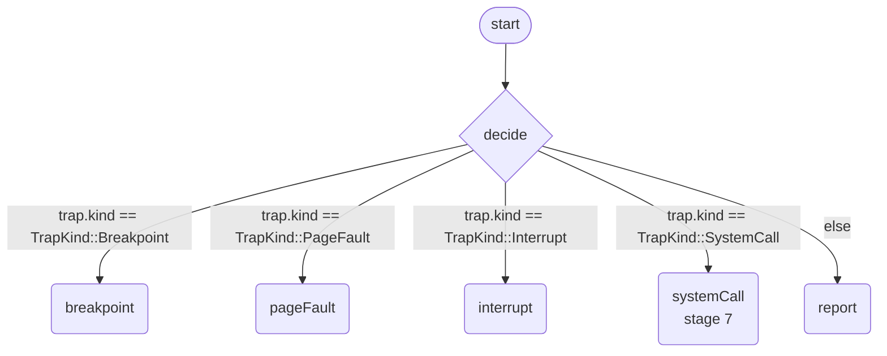

**Figure 8 — Dispatch.** 7 steps, as `Dispatch` orders them, with 5 guarded branches. [SVG](diagrams/ferrix-boot-dispatch.svg) Source: `03-boot.sysml`.

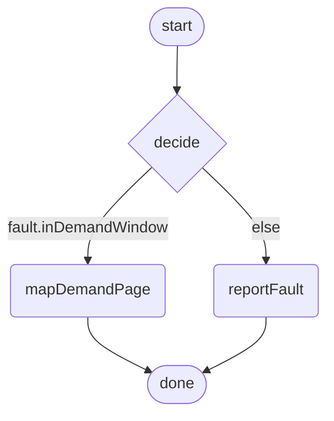

**Figure 9 — Handle page fault.** 5 steps, as `HandlePageFault` orders them, with 2 guarded branches. [SVG](diagrams/ferrix-boot-handle-page-fault.svg) Source: `03-boot.sysml`.

Classified into terms all three architectures share: `PageFault`, `Breakpoint`, `IllegalInstruction`, `Interrupt`, `SystemCall` and `Fault`. Why the kernel was entered, in terms all three architectures share. Each arch module classifies its own frame into this and the policy is written once.

## Subsystems

One entry per definition, in the order the model declares it, with the maturity keyword it carries and the stage that owns it.

### Memory

docs/ARCHITECTURE.md §4. The physical allocator, the heap, the page-table arithmetic and the kernel arena since stage 2; VMOs, process address spaces, demand paging and copy-on-write since stage 6, file mappings since stage 8. Reclaim is stage 13's and not built.

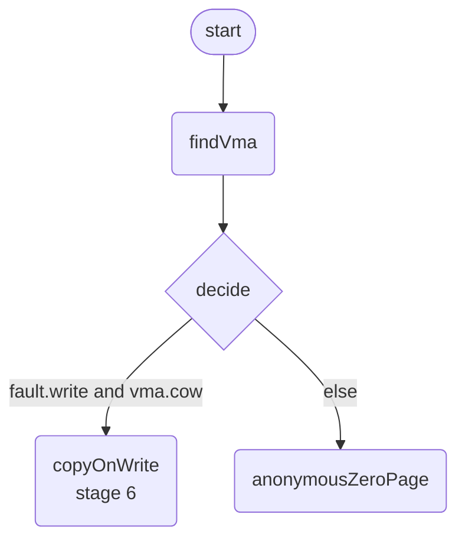

**Figure 10 — Demand fault.** 5 steps, as `DemandFault` orders them, with 2 guarded branches. [SVG](diagrams/ferrix-memory-demand-fault.svg) Source: `04-memory.sysml`.

**FrameState** — `Reserved`, `Free`, `FreeTail` and `Allocated`. 

#### PageEntry

—

One per frame, in a side array, so the allocator is index arithmetic and forbid(unsafe_code). Not a concession to testing: the refcount is what copy-on-write needs, and the free-object count is what lets the heap return slab pages. Linux calls the same conclusion struct page.

| Feature | Kind | Type | Maturity | Note |
| --- | --- | --- | --- | --- |
| `next` | attribute | `Natural` |  |  |
| `previous` | attribute | `Natural` |  |  |
| `refcount` | attribute | `Natural` |  |  |
| `order` | attribute | `Natural` |  |  |
| `frameState` | attribute | `FrameState` |  |  |
| `owner` | attribute | `Natural` | `#planned` | The owning VMO, for reclaim and copy-on-write. |
| `flags` | attribute | `Natural` | `#planned` |  |

#### FrameAllocator

`#implemented`  ·  stage 2

Buddy allocator over the memory map, orders 0 to 10 (up to 4 MiB blocks). Blocks split when a smaller one is needed and merge with their buddy when freed. allocate_below finds frames under a limit, which the x86-64 AP trampoline needs.

| Feature | Kind | Type | Maturity | Note |
| --- | --- | --- | --- | --- |
| `maxOrder` | attribute | `Natural` |  |  |
| `freeFrames` | attribute | `Natural` |  |  |
| `managedFrames` | attribute | `Natural` |  |  |
| `entries` | attribute | `PageEntry` |  |  |
| `allocateBlock` | action |  |  |  |
| `allocateBelow` | action |  |  |  |
| `deallocate` | action |  |  |  |
| `insertFree` | action |  |  |  |

#### PhysicalMemory

`#implemented`  ·  stage 2

kernel/src/mm.rs: where the per-frame array goes, reaching physical memory through the direct map, and the kernel's own page tables. The per-frame array is carved from the front of the largest usable region inside the direct map before there is an allocator to make it. Three globals behind interrupt-masking locks in a fixed order: TABLES, then FRAMES, then HEAP.

| Feature | Kind | Type | Maturity | Note |
| --- | --- | --- | --- | --- |
| `frames` | part | `FrameAllocator` |  |  |
| `heap` | part | `KernelHeap` |  |  |
| `tables` | part | `KernelPageTables` |  |  |
| `allocateFrames` | action |  |  |  |
| `deallocateFrames` | action |  |  |  |
| `mapKernel` | action |  |  |  |
| `unmapKernel` | action |  |  | Unmap, invalidate everywhere, and only then free — holding what was released inline so the stage 2 checks' exact frame accounting still holds. |
| `protectKernel` | action |  |  |  |
| `translate` | action |  |  |  |
| `checkWriteXorExecute` | action |  |  |  |
| `reclaim` | action |  |  |  |
| `mapDemandPage` | action |  |  |  |
| `perCpuCaches` | part | `PerCpuFrameCache` | `@deferred` | Each allocator is one lock, which is correct; the per-CPU magazines are a performance change waiting for a workload that can measure them. |

#### PerCpuFrameCache

—

#### HeapBacking

—

The unsafe trait behind which a free-list allocator's loads and stores live, so the allocator body is pure and host-testable. A test implements it over a map; the kernel over the direct map and the buddy allocator.

| Feature | Kind | Type | Maturity | Note |
| --- | --- | --- | --- | --- |
| `allocatePages` | action |  |  |  |
| `deallocatePages` | action |  |  |  |
| `readLink` | action |  |  |  |
| `writeLink` | action |  |  |  |

#### KernelHeap

`#implemented`  ·  stage 2

Segregated free lists over a page supply: power-of-two size classes from 8 to 2048 bytes, refilled a page at a time; larger requests go to the backing as whole pages. Alignment up to the class size comes free from page-aligned slabs. Empty slab pages are returned to the buddy, with the free-object count in the per-frame record; the last page of a class stays so a workload oscillating across a page boundary does not pay a buddy call per cycle. Makes Box, Vec and BTreeMap work.

| Feature | Kind | Type | Maturity | Note |
| --- | --- | --- | --- | --- |
| `classSizes` | attribute | `Natural` |  |  |
| `allocatedBytes` | attribute | `Natural` |  |  |
| `pagesHeld` | attribute | `Natural` |  |  |
| `objectSlabs` | part | `ObjectSlab` | `#planned` | Kernel object types get their own slabs, so a Task allocation is a pop off a list. |

#### ObjectSlab

—

#### MapFlags

—

| Feature | Kind | Type | Maturity | Note |
| --- | --- | --- | --- | --- |
| `read` | attribute | `Boolean` |  |  |
| `write` | attribute | `Boolean` |  |  |
| `execute` | attribute | `Boolean` |  |  |
| `user` | attribute | `Boolean` |  |  |
| `global` | attribute | `Boolean` |  |  |
| `device` | attribute | `Boolean` |  |  |

#### TableGeometry

—

Every architecture uses 512 eight-byte descriptors over a 4 KiB granule; what differs is the number of levels and the address width. Four over 48 bits on the 64-bit pair, three over 32 on ARMv7-A, whose LPAE format is AArch64's descriptor with a narrower physical address.

| Feature | Kind | Type | Maturity | Note |
| --- | --- | --- | --- | --- |
| `levels` | attribute | `Natural` |  |  |
| `virtualBits` | attribute | `Natural` |  |  |

#### Encoding

—

The roughly forty lines of bit layout each architecture supplies: table and leaf descriptors, presence, leafness at a level, the address in an entry, block support per level.

| Feature | Kind | Type | Maturity | Note |
| --- | --- | --- | --- | --- |
| `tableDescriptor` | action |  |  |  |
| `leafDescriptor` | action |  |  |  |
| `isPresent` | action |  |  |  |
| `isLeaf` | action |  |  |  |
| `address` | action |  |  |  |
| `supportsBlock` | action |  |  |  |
| `leafFlags` | action |  |  |  |

#### PhysMem

—

Reading and writing table entries at physical addresses, and allocating a table. The loader implements it over its pool, the kernel over the direct map and the buddy.

| Feature | Kind | Type | Maturity | Note |
| --- | --- | --- | --- | --- |
| `read` | action |  |  |  |
| `write` | action |  |  |  |
| `allocateTable` | action |  |  |  |

#### Mapper

`#implemented`  ·  stage 1

The walk, written once, generic over an Encoding and a geometry. PhysAddr and VirtAddr are distinct newtypes with no arithmetic between them: confusing the two is this project's characteristic bug and the one the compiler catches for free.

| Feature | Kind | Type | Maturity | Note |
| --- | --- | --- | --- | --- |
| `geometry` | attribute | `TableGeometry` |  |  |
| `mapRange` | action |  |  |  |
| `unmapRange` | action |  |  | Reports what it released — leaves and pruned tables — so the caller can invalidate first and free afterwards. |
| `protectRange` | action |  |  |  |
| `translate` | action |  |  |  |
| `forEachLeaf` | action |  |  | What the W^X sweep walks. |

#### KernelPageTables

`#implemented`  ·  stage 2

The kernel's root, shared into every secondary's tree and, from stage 6, into every process's upper half through share_kernel_slots.

| Feature | Kind | Type | Maturity | Note |
| --- | --- | --- | --- | --- |
| `mapper` | part | `Mapper` |  |  |

#### VmapArena

`#implemented`  ·  stage 2

"Give me a range of addresses and let me decide later what goes behind it": device windows, non-contiguous buffers, guard-paged stacks. The arena is a libs/vma AddressSpace over the vmap area past the reserved windows, because a kernel arena and a process address space are the same problem. Allocation identity lives in a second map beside it, because the arena merges adjacent equal ranges, which is right for a process and wrong for an allocator.

| Feature | Kind | Type | Maturity | Note |
| --- | --- | --- | --- | --- |
| `stackPages` | attribute | `Natural` |  |  |
| `ranges` | part | `VmaMap` |  |  |
| `allocateRange` | action |  |  | A page-aligned range with an unmapped guard page either side, mapped with the flags asked for. |
| `free` | action |  |  | Unmap first, then release the address; the unmapping cannot happen under the arena lock because it waits for processors that cannot answer while spinning for it, so the address is reserved across the gap. |
| `mapDevice` | action |  |  |  |
| `unmapDevice` | action |  |  |  |
| `allocateStack` | action |  |  | Guard-paged kernel stacks: what every per-CPU record, every secondary and, from stage 5, every task runs on. |
| `checkInvariants` | action |  |  |  |

**BackingKind** — `Anonymous`, `File` and `Device`. 

#### Backing

—

Every Vma names the object it maps and where in it, anonymous memory included: Anonymous carries an id and an offset exactly as File does, so both sides of a fork point at one VMO and copy on write per page, and MAP_SHARED|MAP_ANONYMOUS needs nothing unpicked when it arrives. An id of zero denotes private anonymous memory with no shared object; by convention its offset is the mapping's own start address (what Linux's vm_pgoff holds for an anonymous VMA), so that adjacent private regions remain contiguous and mergeable.

| Feature | Kind | Type | Maturity | Note |
| --- | --- | --- | --- | --- |
| `kind` | attribute | `BackingKind` |  |  |
| `id` | attribute | `Natural` |  |  |
| `offset` | attribute | `Natural` |  |  |

#### PageRange

—

Page-aligned, non-empty, does not wrap: validated once on the way in, so a value of this type is a standing promise.

| Feature | Kind | Type | Maturity | Note |
| --- | --- | --- | --- | --- |
| `start` | attribute | `Natural` |  |  |
| `limit` | attribute | `Natural` |  |  |

#### Vma

—

| Feature | Kind | Type | Maturity | Note |
| --- | --- | --- | --- | --- |
| `range` | attribute | `PageRange` |  |  |
| `flags` | attribute | `MapFlags` |  |  |
| `backing` | attribute | `Backing` |  |  |
| `cow` | attribute | `Boolean` |  | Copy on write: the fault handler installs the page read-only when this is set. |

#### VmaMap

`#implemented`  ·  stage 6

A sorted, non-overlapping set of regions in a Vec searched by binary search — a span of adjacent regions is what every operation works on, which a contiguous index range expresses directly. Every operation is total: it succeeds or returns an error, never panics. Adjacent regions with equal flags and contiguous backing merge, without which an mprotect loop leaks regions until the next mmap fails. Reached at stage 2 as the vmap arena; stage 6 is its intended consumer.

| Feature | Kind | Type | Maturity | Note |
| --- | --- | --- | --- | --- |
| `regions` | attribute | `Vma` |  |  |
| `insert` | action |  |  |  |
| `mapFixed` | action |  |  | mmap with MAP_FIXED. |
| `remove` | action |  |  | munmap: splits at both edges. |
| `protect` | action |  |  | mprotect: splits and re-permissions. |
| `findFree` | action |  |  | Top-down: the highest gap that fits. |
| `find` | action |  |  |  |

#### Vmo

`#implemented`  ·  stage 6

kernel/src/user/vmo.rs. A pageable memory object: pages, not a mapping. Anonymous memory, page-cache pages, shared memory and DMA buffers are all VMOs. The load-bearing unification: a block driver filling a page-cache page fills the VMO the cache already holds, with no copy, which is what makes userspace drivers affordable for a compiler workload. All three kinds exist: a file's VMO is its page cache since stage 8 (FerrixStorage's PageCache), filled from a disk by a Filler before a fault commits the page, and a VMO's pages are pinned into a device's IOMMU domain for DMA since stage 10, held where they are by Vmo::hold. The shape was the one they extended rather than unpicked. An object knows which spaces map it (Vmo::attach), so it can take a page away from under them. Frames go back through the per-frame refcount.

| Feature | Kind | Type | Maturity | Note |
| --- | --- | --- | --- | --- |
| `pages` | attribute | `Natural` |  | Sparse: a map from page index to frame, absence meaning uncommitted, with commit on demand. |
| `size` | attribute | `Natural` |  |  |
| `commitPage` | action |  |  |  |
| `lookupPage` | action |  |  |  |
| `replacePage` | action |  |  |  |
| `decommitRange` | action |  |  | What munmap of part of a mapping does to the object behind it: the pages are gone, not merely unmapped, because a process that unmaps half its heap expects the memory back. |
| `fileFill` | action |  | `#implemented` | The Filler a disk filesystem's file VMO carries: an absent page is filled from the file before a fault commits it, and not committed as zeros. |

#### ProcessAddressSpace

`#implemented`  ·  stage 6

kernel/src/user/space.rs: a root frame, a libs/vma AddressSpace, and a map from id to VMO. Each Vma names a VMO, an offset, a protection and a share mode. VMOs are shared through Arc, so this references them and never owns them. The kernel half is shared into the root by prepare_user_root.

| Feature | Kind | Type | Maturity | Note |
| --- | --- | --- | --- | --- |
| `tables` | part | `Mapper` |  |  |
| `vmas` | part | `VmaMap` |  |  |
| `vmos` | part | `Vmo` |  |  |
| `mapAnonymous` | action |  |  |  |
| `fault` | action | `DemandFault` |  |  |
| `invalidate` | action |  |  | Drop every processor's cached translations after a change that takes one down or makes it less permissive: unmap, fork, and the copy-on-write fault. |
| `install` | action |  |  | Put this space's root in the processor's root register, so that the MMU walks in hardware what the mapper has until now only walked in software through the direct map. |
| `unmap` | action |  |  | Reshape the map, change the tables to match, and decommit the object's pages only if this space is its sole holder. |
| `forkSpace` | action |  |  | Mark both sides read-only and copy on the first write fault; the per-frame refcount is what makes it tractable. |
| `mmap` | action |  | `#implemented` | kernel/src/syscall/memory.rs decodes the arguments -- mmap2 counting its offset in pages on ARMv7-A -- and the space does the rest: anonymous memory, a file mapped shared onto its own VMO pages or privately through a shadow object, MAP_FIXED clearing its… |
| `mprotect` | action |  | `#implemented` | libs/vma's protect, with splitting and merging; PROT_NONE is kept as no access rather than widened to readable. |
| `brk` | action |  | `#implemented` |  |

#### DemandFault

`#implemented`  ·  stage 6

The stage 3 handler generalised: find the Vma, then either allocate a zeroed page (anonymous, lazy), fault from the page cache VMO (file mapping, so a mapped file and a read file are the same pages), copy a shared page whose refcount is above one (copy-on-write), or deliver SIGSEGV. Built: find the Vma; refuse an access its permissions deny, a plain read of an inaccessible region included; commit the page in its VMO and install it; copy on a write to a copy-on-write region whose page has another holder. A fault from user mode arrives with the running process's address space. Since stage 8 a file mapping faults in the file's own pages, and since stage 7 a fault that cannot be resolved is a signal to the program.

| Feature | Kind | Type | Maturity | Note |
| --- | --- | --- | --- | --- |
| `findVma` | action |  |  |  |
| `anonymousZeroPage` | action |  |  |  |
| `pageCacheFill` | action |  | `#implemented` | A shared file mapping reaches the file's VMO, so the page a read fills is the page the mapping shows; a private one shows those pages until it writes, and the write copies into its shadow object. |
| `copyOnWrite` | action |  |  | Copy the page, replace it in this space's own object, and install it writable. |
| `deliverSigsegv` | action |  | `#implemented` | kernel/src/trap.rs: a user-mode fault the space cannot resolve becomes SIGSEGV, or SIGBUS with BUS_ADRERR for an address with nothing behind it, raised with interrupts open and delivered on the way back to user mode. |

1. `findVma`
2. `decide`

#### VirtualMemory

`#implemented`  ·  stage 6

kernel/src/user: the VM subsystem above stage 2's allocators. VMOs and address spaces, demand paging, fork with copy-on-write, TLB invalidation where a live mapping changes, and the root swap on a task switch, all self-checked at boot on all three architectures. Reclaim scoped by cgroup is stage 13's.

| Feature | Kind | Type | Maturity | Note |
| --- | --- | --- | --- | --- |
| `vmos` | part | `Vmo` |  |  |
| `spaces` | part | `ProcessAddressSpace` |  |  |
| `reclaim` | part | `Reclaim` | `#planned` |  |
| `elfLoader` | part | `UserElfLoader` |  |  |

#### Reclaim

`#planned`  ·  stage 13

Two-list LRU (active/inactive) with a shrinker interface for the caches. rustc will exhaust memory on a small machine, so this is correctness: an OOM kill scoped by Job and cgroup, never a livelock.

| Feature | Kind | Type | Maturity | Note |
| --- | --- | --- | --- | --- |
| `activeList` | part | `LruList` |  |  |
| `inactiveList` | part | `LruList` |  |  |
| `shrink` | action |  |  |  |
| `oomKill` | action |  |  |  |

#### LruList

—

#### UserElfLoader

`#implemented`  ·  stage 6

kernel/src/syscall/load.rs over libs/elf. Each PT_LOAD is mapped as anonymous memory and its bytes copied in through the user copy layer, with permissions computed per page so two segments sharing a page get their union, and a union that is writable and executable refused. ET_EXEC; a static PIE, ET_DYN with no interpreter, placed at two thirds of the user half to relocate itself; and since dynamic linking a program whose PT_INTERP names a linker, loaded beside it at INTERP_BASE, which is entered with AT_BASE. Segments are still copied in rather than mapped from the file's VMO, though stage 8's page cache now exists.

### Processors, time and scheduling

Stages 3 to 5 run today: interrupts, a clock, every processor online, IPIs, TLB shootdown, grace periods, fair locks, and tasks scheduled by EEVDF in one Throughput domain. Stage 14's real-time domains are designed here (docs/ARCHITECTURE.md §5) and not yet written.

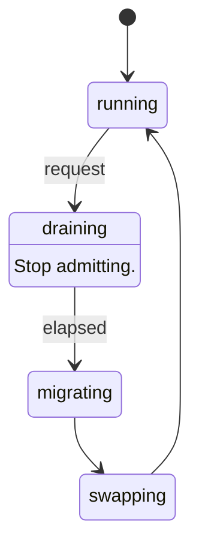

**Figure 11 — Domain lifecycle.** 4 states and 4 transitions; a label is the event the transition accepts. [SVG](diagrams/ferrix-scheduling-domain-lifecycle.svg) Source: `05-scheduling.sysml`.

#### TicketSpinLock

`#implemented`  ·  stage 4

Fair by construction: arrival order is acquisition order, so the worst-case wait is bounded by the CPUs ahead rather than by luck. An unfair lock on a starved core is a stage-14 latency bug nobody will find. Rules the callers keep: never a plain SpinLock from an interrupt handler, never twice on one CPU, one global order, never sleep inside. lock_manually / force_unlock exist for the one case a guard cannot express: a run queue lock handed from the outgoing context to the incoming one across a context switch.

| Feature | Kind | Type | Maturity | Note |
| --- | --- | --- | --- | --- |
| `lock` | action |  |  |  |
| `lockManually` | action |  |  |  |
| `forceUnlock` | action |  |  |  |

#### IrqSpinLock

`#implemented`  ·  specialises `TicketSpinLock`

The same, with interrupts masked for the duration through an IrqControl implemented over each architecture's mask.

#### Once

`#implemented`

#### RwSpinLock

`#writtenAhead`

Many readers or one writer, writer-preferring. Not yet reached.

#### IrqTable

`#implemented`  ·  stage 3

A table of 1024 slots behind an interrupt-masking lock; dispatch copies the handler out and runs it after release, so two CPUs taking interrupts contend for a load, not for each other's handlers. The acknowledge protocol stays in arch; what arrives here is the number. Nothing is ever unregistered: stage 10's Interrupt objects register one kernel handler per line for good and find the line's holder in a table of their own (kernel/src/object/interrupt.rs), so the grace period a removal would need is never paid.

| Feature | Kind | Type | Maturity | Note |
| --- | --- | --- | --- | --- |
| `slots` | attribute | `Natural` |  |  |
| `delivered` | attribute | `Natural` |  |  |
| `unclaimed` | attribute | `Natural` |  |  |
| `register` | action |  |  |  |
| `dispatch` | action |  |  |  |

#### Timer

`#implemented`  ·  stage 3

Two things deliberately kept apart. The counter answers "how long since boot" and is read, never waited on. The timer is an interrupt scheduled for a future instant. One-shot is the primitive, because the Arm timers compare against an absolute instant and a tickless scheduler wants one-shot anyway.

| Feature | Kind | Type | Maturity | Note |
| --- | --- | --- | --- | --- |
| `afterNanos` | action |  |  | One-shot, in nanoseconds. |
| `every` | action |  |  | Periodic as a schedule: tick n is due at start + n \* interval and the instant tick n-1 arrived has no say in it, so a late tick is absorbed rather than propagated. |
| `stop` | action |  |  |  |
| `ticks` | action |  |  |  |
| `nowNanos` | action |  |  |  |
| `counterHz` | action |  |  |  |
| `catchUpLimit` | attribute | `Natural` |  |  |

#### PerCpu

`#implemented`  ·  stage 4

One record per processor, allocated once and never freed, with a register pointing at it: GS base, TPIDR_EL1, or TPIDRPRW. It holds its own address first so gs:0 is a pointer. Every processor checks its record against what its hardware says it is.

| Feature | Kind | Type | Maturity | Note |
| --- | --- | --- | --- | --- |
| `logicalIndex` | attribute | `Natural` |  |  |
| `hardwareId` | attribute | `Natural` |  |  |
| `online` | attribute | `Boolean` |  |  |
| `ipisTaken` | attribute | `Natural` |  |  |
| `stack` | part | `KernelStack` |  |  |
| `runqueue` | part | `Runqueue` | `#implemented` |  |
| `needResched` | attribute | `Boolean` |  |  |

#### KernelStack

—

#### Smp

`#implemented`  ·  stage 4

Discover, start, and coordinate every processor.

| Feature | Kind | Type | Maturity | Note |
| --- | --- | --- | --- | --- |
| `topology` | part | `PerCpu` |  |  |
| `discover` | action |  |  | From the MADT or the device tree; duplicates refused; the reading processor must be among them. |
| `startSecondaries` | action |  |  |  |
| `secondaryMain` | action |  |  | Bring up this core's interrupt controller interface, mark online, then sleep in sti;hlt or wfi between pieces of work, woken by a broadcast IPI. |
| `runEverywhere` | action |  |  |  |
| `flushTlbEverywhere` | action |  |  | A shootdown IPI where the hardware does not broadcast invalidation (x86-64, which invalidates global entries by toggling CR4.PGE); nothing extra where it does. |
| `readSection` | action |  |  | A read-side critical section: interrupts masked. |
| `synchronize` | action |  |  | The grace period: interrupt every other processor and wait for each to take it, which none can inside a section. |
| `shootdowns` | attribute | `Natural` |  |  |
| `gracePeriods` | attribute | `Natural` |  |  |
| `offlining` | attribute | `Boolean` | `@deferred` | Nothing takes a processor offline; records and stacks live for the life of the machine. |

**TaskState** — `Runnable`, `Blocked` and `Dead`. 

**SchedClass** — `Edf`, `Fifo`, `RoundRobin`, `Eevdf` and `Idle`. Highest first. libs/sched names Fair and Idle today; the real-time classes are stage 14's.

**LinuxPolicy** — `SchedOther`, `SchedBatch`, `SchedIdle`, `SchedFifo`, `SchedRr` and `SchedDeadline`. 

#### Task

`#implemented`  ·  stage 5

kernel/src/sched/task.rs: a kernel thread — a guard-paged stack, a saved stack pointer, and the bookkeeping that says where it is. Everything about choosing between tasks is libs/sched's. The saved stack pointer is touched only by the CPU that holds the owning run queue's lock at that moment. From stage 6 also a user thread, 1:1, forced by the ABI; one of the nine kernel objects.

| Feature | Kind | Type | Maturity | Note |
| --- | --- | --- | --- | --- |
| `taskState` | attribute | `TaskState` |  |  |
| `weight` | attribute | `Natural` |  | From nice: nice 0 is 1024. |
| `affinity` | attribute | `Natural` |  | The processors it may run on, one bit each. |
| `runtimeNanos` | attribute | `Natural` |  |  |
| `switches` | attribute | `Natural` |  |  |
| `sleepDeadline` | attribute | `Natural` |  |  |
| `stack` | part | `KernelStack` |  |  |
| `cpu` | part | `PerCpu` |  |  |
| `addressSpace` | part | `FerrixMemory::ProcessAddressSpace` |  | The address space its user half is translated through, absent for a kernel thread. |
| `schedClass` | attribute | `SchedClass` | `#planned` |  |
| `policy` | attribute | `LinuxPolicy` | `#planned` |  |
| `priority` | attribute | `Natural` | `#planned` | 1 to 99 for FIFO/RR. |
| `bandwidth` | attribute | `Natural` | `#planned` | CBS reservation for EDF. |

#### Tasks

`#implemented`  ·  stage 5

kernel/src/sched/mod.rs: spawn, spawn_on, exit, yield, sleep, wake, reap. Preemption happens only on the way out of an interrupt: the timer sets need_resched and returns, and the trap path decides once the controller has been told the interrupt is done, because switching inside the handler would leave it in service for as long as the next task ran.

| Feature | Kind | Type | Maturity | Note |
| --- | --- | --- | --- | --- |
| `tasks` | part | `Task` |  |  |
| `spawnKernelThread` | action |  |  |  |
| `spawnInAddressSpace` | action |  |  | Start a task that has an address space. |
| `switchTo` | action |  |  | Deciding and switching are one operation under the queue lock. |
| `swapAddressSpace` | action |  |  | Install the incoming task's root, inside choose_next, under the run queue lock and before the registers move -- not in the architecture's switch, which takes two stack pointers and does register operations, and not after, where the incoming context has… |
| `placeTask` | action |  |  | Chosen on spawn rather than inherited from the creator. |
| `exitTask` | action |  |  |  |
| `yieldNow` | action |  |  |  |
| `sleepUntil` | action |  |  |  |
| `wake` | action |  |  | Places the task and wakes an idle processor, which is otherwise never told. |
| `preemptOnIrqExit` | action |  |  |  |
| `reap` | action |  |  |  |
| `waitQueues` | part | `WaitQueue` |  |  |

#### WaitQueue

`#implemented`  ·  stage 5

kernel/src/sched/wait.rs. The lost wake-up between a waiter and a waker is closed by order: a waiter marks itself blocked and joins the queue before its last look at the condition; a waker takes the same lock, so it either sees the waiter or made the condition true before that look.

That argument is necessary and was not sufficient, and the gap is worth recording because it cost a day. It assumes a waker exists. Seven waits watched a counter that was incremented when a task \*started\* and signalled by nothing, because the only wake came from a task \*finishing\* — so they slept their entire deadline, woke on the timer, found the condition true and reported success. Twenty seconds each, silently, indistinguishable from a slow machine.

Two rules follow. Every store to a counter a predicate reads is followed by a notify. And a wait sleeps in slices rather than in one span to its deadline, so the next missing notify costs milliseconds instead of the whole budget.

| Feature | Kind | Type | Maturity | Note |
| --- | --- | --- | --- | --- |
| `waitUntilDeadline` | action |  |  | Bounded, and off the queue however it leaves: a waiter that returns while still listed is woken by the next wakeAll, out of whatever it is doing by then. |
| `notify` | action |  |  | Called wherever a watched counter is stored. |
| `wakeAll` | action |  |  |  |

#### Runqueue

`#implemented`  ·  stage 5

kernel/src/sched/queue.rs: one per CPU, one plain SpinLock taken with interrupts masked and handed across the switch. Tickless: the timer is armed for the end of the running task's slice or the first sleeper's wake-up, whichever is first, and not at all for one task with nothing behind it. Work stealing by an idle processor in Throughput; none in HardRt, because partitioned scheduling is what makes the admission test valid.

| Feature | Kind | Type | Maturity | Note |
| --- | --- | --- | --- | --- |
| `targetLatencyNanos` | attribute | `Natural` |  | Shared among whatever is runnable rather than handed to each in full. |
| `minSliceNanos` | attribute | `Natural` |  | The floor. |
| `load` | part | `LoadAverage` |  |  |
| `fair` | part | `EevdfRunQueue` |  |  |
| `current` | part | `Task` |  |  |
| `idle` | part | `Task` |  |  |
| `sleepers` | part | `Task` |  |  |
| `pickNext` | action |  |  |  |
| `account` | action |  |  |  |
| `armTimer` | action |  |  |  |
| `stealCandidate` | action |  |  |  |
| `shouldPreempt` | action |  |  |  |
| `checkInvariants` | action |  |  |  |

#### EevdfRunQueue

`#implemented`  ·  stage 5

libs/sched: entities with weight and virtual runtime; the queue's virtual time is the weight-average; an entity is eligible when its virtual runtime is at or behind it; the pick is the eligible entity with the earliest virtual deadline. The tree is an AVL ordered by deadline, each subtree remembering its minimum virtual runtime, so the pick is one O(log n) walk. Lag stays within one request, which is what the boot test measures.

| Feature | Kind | Type | Maturity | Note |
| --- | --- | --- | --- | --- |
| `nice0Weight` | attribute | `Natural` |  |  |
| `insert` | action |  |  |  |
| `remove` | action |  |  |  |
| `pick` | action |  |  |  |
| `release` | action |  |  | For a steal: hand the entity's state to another queue. |

#### CpuLoad

—

One processor as a placement or balancing decision sees it.

| Feature | Kind | Type | Maturity | Note |
| --- | --- | --- | --- | --- |
| `queued` | attribute | `Natural` |  | Entities on its queue, running one included. |
| `average` | attribute | `Natural` |  | Its decaying load, in units of a nice-0 task. |
| `idle` | attribute | `Boolean` |  | Nothing runnable, rather than "running the idle task": a processor just given a task still has idle current until it next schedules, and a burst would otherwise all pile on behind the first. |

#### LoadAverage

`#implemented`  ·  stage 5

libs/sched/balance.rs. A geometric decay with a 33-millisecond half-life, in the shape of Linux's PELT, measuring \*weighted demand\* rather than occupancy — a processor is either running something or it is not, so "busy" saturates at one task and says nothing after that, which leaves a balancer nothing to compare. Four runnable nice-0 tasks read four times one.

Carried with ten bits of extra precision, which is not a detail: each step truncates twice, and without them the loss balances the gain at about 978 of 1024, so a permanently busy processor would report 95% forever and every comparison would be against a ceiling nothing could reach.

| Feature | Kind | Type | Maturity | Note |
| --- | --- | --- | --- | --- |
| `scale` | attribute | `Natural` |  |  |
| `periodNanos` | attribute | `Natural` |  |  |
| `halfLifePeriods` | attribute | `Natural` |  |  |
| `accumulate` | action |  |  | A level held for an interval, so a caller sampling on ticks and one sampling on switches describe the same history. |
| `decay` | action |  |  |  |

#### Placement

`#implemented`  ·  stage 5

Where a task should run, asked on spawn and folded one processor at a time rather than snapshotted into an array — the array was sized for 256 processors, six kilobytes of a sixteen-kilobyte kernel stack, and the balancing caller asks from inside an interrupt on the stack of whatever it interrupted.

The order: the preferred processor if it is idle, since nothing beats staying where the caches are; then any idle processor, because idle capacity is waste and this is the case a burst of spawns otherwise queues behind itself; then fewest queued, and only then least loaded.

Fewest-queued before least-loaded is not a refinement, it is the fix to a real defect. The count moves the instant a task is placed and is the only thing here that shows a placer the effect of its own last decision; the average is a decaying history that cannot move inside a burst. Ranking on the average first sends every task in a burst to whichever processor has been idle longest. Found on an STM32MP157D-DK1, where a two-task burst on a quiet machine put both on one core.

| Feature | Kind | Type | Maturity | Note |
| --- | --- | --- | --- | --- |
| `consider` | action |  |  |  |
| `choice` | action |  |  |  |

#### Balancing

`#implemented`  ·  stage 5

Moving work that is already placed. Stealing by an idle processor covers the case that matters most and costs nothing, because a processor about to idle is not busy. This covers the other: every processor busy, one much busier.

It pushes as well as pulls, and on a tickless kernel the push is the one that works. A processor alone with one task is never interrupted — arming a timer would buy nothing, which is where tickless comes from — so an under-loaded processor never reaches the balancer to pull anything towards itself. The overloaded one is interrupted constantly, precisely because it has tasks to switch between, so it is the only one awake to notice.

Two tests, not one, and the second is a brake. The load average is deliberately slow, so moving a task does not change it for tens of milliseconds and a balancer consulting only the average keeps moving more: eight movable tasks were observed moving over a thousand times. The queue count updates instantly, so a difference of at least two is required as well.

| Feature | Kind | Type | Maturity | Note |
| --- | --- | --- | --- | --- |
| `thresholdFraction` | attribute | `Natural` |  | Half a nice-0 task, because the imbalance moved is half the difference. |
| `intervalNanos` | attribute | `Natural` |  |  |
| `pullFrom` | action |  |  |  |
| `pushTo` | action |  |  |  |

**DomainMode** — `Throughput`, `SoftRt` and `HardRt`. 

#### ModeSpec

—

| Feature | Kind | Type | Maturity | Note |
| --- | --- | --- | --- | --- |
| `mode` | attribute | `DomainMode` |  |  |
| `classes` | attribute | `SchedClass` |  |  |
| `preemption` | attribute | `String` |  |  |
| `interrupts` | attribute | `String` |  |  |

#### SchedulingDomain

`#implemented`  ·  stage 5

libs/sched/domain.rs. CPUs are partitioned into domains, each in one of three modes, changeable at runtime. Per domain, not global: a four-core machine runs a HardRt partition on one core and Throughput on the other three, with rustc on the latter. Stage 5 builds one domain holding every CPU (up to 256) in Throughput; the mode is a property of the domain from the first line, the class stack is looked up from the mode, and SoftRt and HardRt are named and refused until stage 14. check_partition requires the domains to cover the online CPUs exactly once.

| Feature | Kind | Type | Maturity | Note |
| --- | --- | --- | --- | --- |
| `cpus` | part | `PerCpu` |  |  |
| `mode` | attribute | `DomainMode` |  |  |
| `classStack` | attribute | `SchedClass` |  |  |
| `throughput` | attribute | `ModeSpec` |  |  |
| `softRt` | attribute | `ModeSpec` |  |  |
| `hardRt` | attribute | `ModeSpec` |  |  |

#### ModeSwitchRequest

—

| Feature | Kind | Type | Maturity | Note |
| --- | --- | --- | --- | --- |
| `target` | attribute | `DomainMode` |  |  |

#### GracePeriodElapsed

—

#### DomainLifecycle

`#planned`  ·  stage 14

Switching modes takes the domain through a quiescent point. Tasks the new mode cannot represent are demoted with an errno the switching caller sees, never silently.

1. `running`

#### Scheduler

`#implemented`  ·  stage 5

Not one policy: a class stack per domain. EEVDF rather than CFS for the fair class, because each task gets an actual eligible time and a deadline, so latency has a bound and not only fairness. Tickless: the timer is armed for the next decision.

| Feature | Kind | Type | Maturity | Note |
| --- | --- | --- | --- | --- |
| `domains` | part | `SchedulingDomain` |  |  |
| `fair` | part | `EevdfClass` |  |  |
| `idle` | part | `IdleClass` |  |  |
| `loadBalancing` | part | `LoadBalancing` | `#implemented` | Stage 5 left nothing beyond work stealing by an idle processor; Placement and Balancing above were added after it: kernel/src/sched/mod.rs's balance(), at most every 16 milliseconds per processor, pulling and pushing over libs/sched's arithmetic. |
| `fifoRr` | part | `FifoRrClass` | `#planned` |  |
| `edf` | part | `EdfClass` | `#planned` |  |
| `pickNext` | action |  |  |  |
| `tick` | action |  |  |  |
| `setScheduler` | action |  | `#inProgress` | Linux sched_setscheduler: SCHED_FIFO/RR to the soft-RT classes, SCHED_DEADLINE to EDF, SCHED_OTHER/BATCH/IDLE to fair. kernel/src/syscall/limits.rs answers it today with the one policy there is a class for: SCHED_OTHER at priority zero is accepted and every… |
| `switchDomainMode` | action |  | `#planned` |  |

#### LoadBalancing

—

#### EevdfClass

—

Eligible virtual deadline first. Weight and bandwidth arrive from the cpu cgroup controller at stage 13.

#### IdleClass

—

#### FifoRrClass

—

Priorities 1 to 99, with priority-inheritance mutexes and threaded interrupts in SoftRt.

#### EdfClass

—

Earliest deadline first with constant-bandwidth-server admission control that refuses an unschedulable set instead of missing deadlines. Preallocated pools on the RT path; no dynamic allocation there.

| Feature | Kind | Type | Maturity | Note |
| --- | --- | --- | --- | --- |
| `admit` | action |  |  |  |

#### Futex

`#implemented`  ·  stage 7

kernel/src/syscall/futex.rs: wait, wake and requeue, plain and with a bitset, with the word read and the waiter listed under one table lock so no wake is lost, and the read under it never faulting. One table. A private futex is keyed by address space and user address; one without FUTEX_PRIVATE_FLAG on a word in a shared region, by the VMO behind it and the word's offset there, so a word two processes map shared is one futex, as on Linux. A thread that ends clears its clear_child_tid word and wakes whoever waits on it. The robust list's head is recorded and never walked, and the priority-inheritance operations and FUTEX_WAKE_OP are ENOSYS.

### Kernel objects and the two ABIs

docs/ARCHITECTURE.md §2 and §3. The constants for the Linux half are in libs/linux-abi and for the native half in libs/native-abi. The objects a handle can name exist in kernel/src/object; processes and threads in kernel/src/syscall. No handle names an address space or a thread yet.

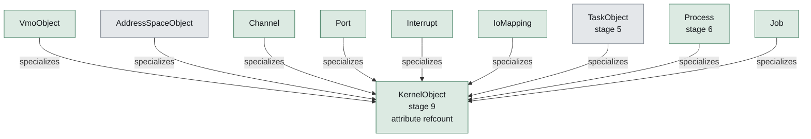

**Figure 12 — Kernel object and its subtypes.** 9 definitions specialize `KernelObject`; the hollow arrow points at what they have in common. [SVG](diagrams/ferrix-objects-kernel-object.svg) Source: `06-objects.sysml`.

#### KernelObject

`#implemented`  ·  stage 9

Typed, reference-counted, reached through per-process handle tables. The native ABI is built on these. kernel/src/object's Object is a channel end, a VMO, a job, a device node, an interrupt, an I/O mapping, a pin, a process's ending, or a port; each reports its signals as a level and names the queue woken when they may have changed.

| Feature | Kind | Type | Maturity | Note |
| --- | --- | --- | --- | --- |
| `refcount` | attribute | `Natural` |  |  |

#### VmoObject

`#implemented`  ·  specialises `KernelObject, Vmo`

#### AddressSpaceObject

`#planned`  ·  specialises `KernelObject, ProcessAddressSpace`

#### Channel

`#implemented`  ·  specialises `KernelObject`

Bidirectional datagram pipe carrying bytes and handles. The basis of driver IPC.

| Feature | Kind | Type | Maturity | Note |
| --- | --- | --- | --- | --- |
| `write` | action |  |  |  |
| `read` | action |  |  |  |

#### Port

`#implemented`  ·  specialises `KernelObject`

An event queue a thread waits on; how one driver thread services many sources.

| Feature | Kind | Type | Maturity | Note |
| --- | --- | --- | --- | --- |
| `wait` | action |  |  |  |
| `queue` | action |  |  |  |

#### Interrupt

`#implemented`  ·  specialises `KernelObject`

A bindable hardware interrupt. A userspace driver waits on it through a Port.

| Feature | Kind | Type | Maturity | Note |
| --- | --- | --- | --- | --- |
| `irq` | attribute | `Natural` |  |  |
| `boundPort` | part | `Port` |  |  |
| `bindToPort` | action |  |  |  |
| `ack` | action |  |  |  |

#### IoMapping

`#implemented`  ·  specialises `KernelObject`

An MMIO aperture, mappable into a driver's address space, with its IOMMU domain. Nothing outside the aperture: kernel/src/object/io_mapping.rs makes one only from an Aperture a device node minted, and whole pages or none.

| Feature | Kind | Type | Maturity | Note |
| --- | --- | --- | --- | --- |
| `phys` | attribute | `Natural` |  |  |
| `len` | attribute | `Natural` |  |  |
| `domain` | part | `FerrixDrivers::IommuDomain` |  |  |

#### TaskObject

`#planned`  ·  stage 5  ·  specialises `KernelObject, Task`

Threads exist (kernel/src/syscall/thread.rs), each running on a task of its own, but no native handle names one.

#### Process

`#implemented`  ·  stage 6  ·  specialises `KernelObject`

A group of tasks sharing an address space, fd table, fs context and signal dispositions. Precisely a particular sharing arrangement of independently shareable objects, composed by clone flags as Linux composes them, within what Clone below refuses. kernel/src/syscall/process.rs; a native handle to one names only how it ended, so a handle kept past its end keeps nothing else it owned alive. No namespace set until stage 13: every process shares the one of everything.

| Feature | Kind | Type | Maturity | Note |
| --- | --- | --- | --- | --- |
| `tasks` | part | `TaskObject` |  |  |
| `space` | part | `AddressSpaceObject` |  |  |
| `fdTable` | part | `FdTable` |  |  |
| `fsContext` | part | `FsContext` |  |  |
| `sigHandlers` | part | `SignalDispositions` |  |  |
| `namespaces` | part | `FerrixIsolation::NsSet` |  |  |
| `handles` | part | `HandleTable` |  |  |
| `credentials` | attribute | `FerrixIsolation::Credentials` |  |  |
| `job` | part | `Job` |  |  |
| `pid` | attribute | `Natural` |  | Meaningless without saying in which pid namespace. |

#### Job

`#implemented`  ·  specialises `KernelObject`

A container of processes, where resource limits and kill authority live. A wedged userspace driver has to be killable as a unit together with anything it spawned.

| Feature | Kind | Type | Maturity | Note |
| --- | --- | --- | --- | --- |
| `processes` | part | `Process` |  |  |
| `children` | part | `Job` |  |  |
| `kill` | action |  |  |  |

#### HandleTable

`#implemented`  ·  stage 9

| Feature | Kind | Type | Maturity | Note |
| --- | --- | --- | --- | --- |
| `handles` | attribute | `Handle` |  |  |

#### Handle

—

| Feature | Kind | Type | Maturity | Note |
| --- | --- | --- | --- | --- |
| `index` | attribute | `Natural` |  |  |
| `rights` | attribute | `String` |  |  |

#### FdTable

—

File descriptors and their sharing rules, stage 8: libs/vfs's descriptor table behind an Arc, shared where CLONE_FILES asks, with close-on-exec belonging to the number.

#### FsContext

—

cwd, root, umask.

#### SignalDispositions

—

**Shareable** — `AddressSpace`, `FdTable`, `FsContext`, `SignalHandlers`, `NamespaceSet` and `ThreadGroup`. 

#### Clone

`#implemented`  ·  stage 7

clone: each Shareable is shared or copied independently. CLONE_THREAD|CLONE_VM|CLONE_SETTLS is a thread; none of them is fork, which marks both address spaces copy-on-write. kernel/src/syscall/family.rs, with clone3 through the same path. What Linux allows between a thread and a process is refused with ENOSYS: memory shared between processes without CLONE_VFORK, handlers shared between processes, and a thread with a descriptor table or directories of its own. vfork copies rather than lends, and the parent still waits.

**SyscallGroup** — `Memory`, `Files`, `Process`, `Threads`, `Signals`, `Time`, `Identity` and `Native`. 

#### LinuxSyscallLayer

`#implemented`  ·  stage 7

The entry path on every architecture, the dispatch table, and the ~150-call surface rustc needs. libs/linux-abi holds the numbers for x86-64, AArch64 and the ARM EABI table, the errnos, and the repr(C) layouts (statx, dirent64, sigaction, ...).

kernel/src/syscall, reached through arch::decode_syscall, which is the only place in the kernel that knows which of the three number tables this build uses. Memory, files and paths, processes and threads, futex, signals, time, identity and credentials, terminals, sockets, epoll, eventfd and timerfd; enough for somebody else's busybox (cargo xtask test-shell), a Rust program's threads (test-threads) and rustc compiling hello.rs (test-rustc). The boot test puts every number in 0..=600 through dispatch. Still ENOSYS, each named at its arm: swap, modules, System V IPC, acct, vhangup and rseq.

| Feature | Kind | Type | Maturity | Note |
| --- | --- | --- | --- | --- |
| `groups` | attribute | `SyscallGroup` |  |  |
| `syscallEntry` | action |  | `#implemented` | The assembly trampoline; then Rust. |
| `dispatch` | action |  | `#implemented` | One function. |
| `seccompCheck` | action |  | `#planned` | The filter runs on entry, before dispatch. |

#### Signals

`#implemented`  ·  stage 7

kernel/src/syscall/signal.rs keeps each disposition, the blocked mask and the alternate stack, split between thread and process as Linux splits them; deliver.rs delivers on every return to user mode, onto each architecture's own Linux frame, and rt_sigreturn unwinds it. Stop and continue, SIGPIPE, SIGALRM, and a user-mode fault as SIGSEGV, SIGILL, SIGBUS, SIGFPE or SIGTRAP, which is what rustc's stack-overflow guard needs. An interrupted call restarts or is EINTR as Linux's arch_do_signal_or_restart decides. No vDSO, so a handler needs SA_RESTORER, and only ITIMER_REAL arms.

| Feature | Kind | Type | Maturity | Note |
| --- | --- | --- | --- | --- |
| `deliver` | action |  |  |  |
| `sigreturn` | action |  |  |  |

#### PosixIpc

`#implemented`  ·  stage 15

Pipes, ttys and job control: what an interactive shell needs. Pipes and FIFOs are stage 8's (kernel/src/fs/pipe.rs), the console a terminal with a line discipline since stage 7 (fs/terminal.rs) and pseudo-terminals stage 18's (fs/pty.rs), and every call job control is made of has been answered since stage 7; zinc uses them. System V IPC is ENOSYS.

#### NativeAbi

`#implemented`  ·  stage 9

Syscall numbers from 0x1000. Handle-table operations, channel send/receive with handle passing, port wait, interrupt bind, VMO create/map, job create/kill. What devmgr and drivers speak; a process may use both ABIs.

kernel/src/syscall/native.rs, branched to before any Linux table is asked, with the numbers in libs/native-abi/src/nr.rs and typed wrappers in libs/native. Beyond that first list: waits on one object or asynchronously through a port, VMO pins for a device's DMA, process create and start, device info and quiesce, and the calls that make a block or net ring and a display, input or render control channel. Left: an EXECUTE right on a VMO handle, sub-page apertures, and the process calls beyond create and start, 0x1032..=0x1037 held for them.

| Feature | Kind | Type | Maturity | Note |
| --- | --- | --- | --- | --- |
| `firstNumber` | attribute | `String` |  |  |
| `handleClose` | action |  |  |  |
| `handleDuplicate` | action |  |  |  |
| `handleReplace` | action |  |  |  |
| `objectWaitOne` | action |  |  |  |
| `objectWaitAsync` | action |  |  |  |
| `channelCreate` | action |  |  |  |
| `channelWrite` | action |  |  |  |
| `channelRead` | action |  |  |  |
| `portCreate` | action |  |  |  |
| `portQueue` | action |  |  |  |
| `portWait` | action |  |  |  |
| `vmoCreate` | action |  |  |  |
| `vmoRead` | action |  |  |  |
| `vmoWrite` | action |  |  |  |
| `vmoGetSize` | action |  |  |  |
| `vmoMap` | action |  |  |  |
| `vmoPin` | action |  |  |  |
| `vmoPinAddresses` | action |  |  |  |
| `jobCreate` | action |  |  |  |
| `jobKill` | action |  |  |  |
| `processCreate` | action |  |  |  |
| `processStart` | action |  |  |  |
| `interruptCreate` | action |  |  |  |
| `interruptBind` | action |  |  |  |
| `interruptAck` | action |  |  |  |
| `ioMappingCreate` | action |  |  |  |
| `ioMappingMap` | action |  |  |  |
| `blockRingCreate` | action |  |  |  |
| `netRingCreate` | action |  |  |  |
| `displayControlCreate` | action |  |  |  |
| `inputControlCreate` | action |  |  |  |
| `renderControlCreate` | action |  |  |  |
| `deviceInfo` | action |  |  |  |
| `deviceQuiesce` | action |  |  |  |

### Isolation

docs/ARCHITECTURE.md §6: namespaces, cgroups v2, seccomp, credentials. Stage 13, designed in from the start so that no global table has to be found later. Only the credentials exist, since stage 7; namespaces, cgroups and seccomp are not built, and unshare and setns answer as a Linux built without namespaces does.

**NamespaceKind** — `Pid`, `Mount`, `Uts`, `Ipc`, `Net`, `User`, `Cgroup` and `Time`. 

#### Namespace

`#planned`  ·  stage 13

| Feature | Kind | Type | Maturity | Note |
| --- | --- | --- | --- | --- |
| `kind` | attribute | `NamespaceKind` |  |  |
| `parent` | part | `Namespace` |  |  |

#### NsSet

`#planned`  ·  stage 13

One namespace of each kind, held by every task. Every table that would otherwise be global — pids, mounts, hostname, ... — is reached through this, from the first line.

| Feature | Kind | Type | Maturity | Note |
| --- | --- | --- | --- | --- |
| `namespaces` | part | `Namespace` |  |  |

#### Namespaces

`#planned`  ·  stage 13

| Feature | Kind | Type | Maturity | Note |
| --- | --- | --- | --- | --- |
| `every` | part | `Namespace` |  |  |
| `unshare` | action |  |  |  |
| `setns` | action |  |  |  |

**CgroupController** — `Cpu`, `Memory`, `Io` and `Pids`. 

#### Cgroup

`#planned`  ·  stage 13

| Feature | Kind | Type | Maturity | Note |
| --- | --- | --- | --- | --- |
| `controllers` | attribute | `CgroupController` |  |  |
| `children` | part | `Cgroup` |  |  |
| `memoryLimit` | attribute | `Natural` |  |  |
| `cpuWeight` | attribute | `Natural` |  |  |
| `pidsMax` | attribute | `Natural` |  |  |

#### Cgroups

`#planned`  ·  stage 13

One unified hierarchy (v2), exposed as cgroupfs. cpu is not a separate mechanism: it is bandwidth and weight handed to the scheduling classes. memory scopes reclaim and the OOM kill.

| Feature | Kind | Type | Maturity | Note |
| --- | --- | --- | --- | --- |
| `root` | part | `Cgroup` |  |  |

#### Seccomp

`#planned`  ·  stage 13

Classic BPF filters evaluated on syscall entry. The interpreter is a pure function over bytes in libs/, fuzzable and Miri-able.

| Feature | Kind | Type | Maturity | Note |
| --- | --- | --- | --- | --- |
| `interpreter` | part | `ClassicBpfInterpreter` |  |  |
| `installFilter` | action |  |  |  |
| `evaluate` | action |  |  |  |

#### ClassicBpfInterpreter

`#planned`  ·  stage 13

libs/seccomp, owed before stage 13 starts.

#### Credentials

`#implemented`  ·  stage 7

Unix: uid, gid, supplementary groups, POSIX capability sets, no-new-privs. They sit on top of the handle system rather than beside it.

kernel/src/syscall/credentials.rs: Linux's four user ids and four group ids and the supplementary groups on every Process, copied by fork, kept by execve with the saved and filesystem ids made the effective ones, and changed by the set\*id calls under kernel/sys.c's rules. They are enforced: the VFS checks file permissions against the filesystem ids, and the calls only root may make, and those that reach another user's processes, refuse anyone else. A set-user-id program runs as its file's owner unless PR_SET_NO_NEW_PRIVS forbade it.

| Feature | Kind | Type | Maturity | Note |
| --- | --- | --- | --- | --- |
| `uid` | attribute | `Natural` |  |  |
| `gid` | attribute | `Natural` |  |  |
| `groups` | attribute | `Natural` |  |  |
| `capabilities` | attribute | `String` | `#planned` | No capability sets are kept: an effective uid of 0 stands for every capability, capget reports every set empty for any other, and capset refuses a process whose real or saved uid is 0 and whose effective uid is not. |
| `noNewPrivs` | attribute | `Boolean` |  |  |

### Devices and drivers

docs/ARCHITECTURE.md §7. The kernel enumerates buses because that needs ACPI or a device tree and privileged access; it does not drive devices. Everything from the device node outward is stage 10, which is done: the drivers are processes devmgr starts. What it still owes is named on the part that owes it.

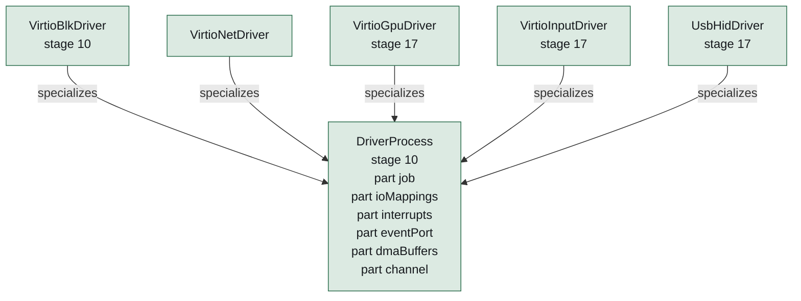

**Figure 13 — Driver process and its subtypes.** 5 definitions specialize `DriverProcess`; the hollow arrow points at what they have in common. [SVG](diagrams/ferrix-drivers-driver-process.svg) Source: `08-drivers.sysml`.

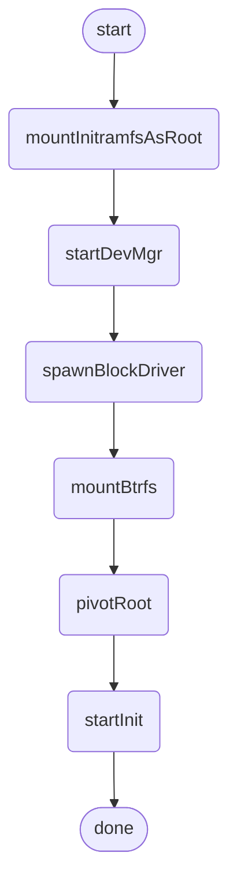

**Figure 14 — Driver bootstrap.** 8 steps, as `DriverBootstrap` orders them. [SVG](diagrams/ferrix-drivers-driver-bootstrap.svg) Source: `08-drivers.sysml`.

#### AcpiAccess

`#implemented`  ·  stage 3

kernel/src/acpi.rs: the one place a physical address firmware wrote becomes a reference the parser reads, through the direct map, refusing addresses or lengths outside it. libs/acpi never dereferences a pointer: RSDP, XSDT/RSDT, MADT, FADT fixed fields, GTDT, HPET, and for stage 10 the MCFG, GICv2m frames, the DMAR and the IORT. No AML.

| Feature | Kind | Type | Maturity | Note |
| --- | --- | --- | --- | --- |
| `open` | action |  |  |  |
| `madt` | action |  |  |  |
| `fadt` | action |  |  |  |
| `gtdt` | action |  |  |  |
| `hpet` | action |  |  |  |

#### FdtAccess

`#implemented`  ·  stage 1

kernel/src/fdt.rs: the loader's copy of firmware's tree, read through the direct map from DeviceTree memory that nothing reclaims, so the borrow is honestly 'static. libs/fdt: nodes, properties, reg, interrupts, compatible, stdout-path, the interrupt controller, the timer, /cpus, the PSCI conduit.

| Feature | Kind | Type | Maturity | Note |
| --- | --- | --- | --- | --- |
| `open` | action |  |  |  |
| `console` | action |  |  |  |
| `interruptController` | action |  |  |  |
| `timer` | action |  |  |  |
| `cpus` | action |  |  |  |
| `psci` | action |  |  |  |

#### MmioWindows

`#implemented`  ·  stage 3

kernel/src/mmio.rs: the one place that says read_volatile and write_volatile. A window with no base reads zero and discards writes, so "never mapped" is a value rather than a null dereference.

| Feature | Kind | Type | Maturity | Note |
| --- | --- | --- | --- | --- |
| `read32` | action |  |  |  |
| `write32` | action |  |  |  |

#### DeviceNode

`#implemented`  ·  stage 10

What the kernel creates per device found, and hands devmgr a handle to. kernel/src/device.rs: one per PCI function and per virtio,mmio tree node, published at boot. Apertures and vectors are Aperture and Vector tokens only this module mints, and IoMapping and Interrupt take those rather than numbers, so a driver cannot name memory or an interrupt its device does not have. The pages of a PCI function's MSI-X table and pending-bit array are withheld from its apertures. A PCI function's vectors are its MSI-X entries, minted on first ask and masked at the entry's own bit. device_info writes what a driver needs to find its registers, and each node has the IOMMU domain its DMA goes through.

| Feature | Kind | Type | Maturity | Note |
| --- | --- | --- | --- | --- |
| `compatible` | attribute | `String` |  |  |
| `mmioWindows` | attribute | `Natural` |  |  |
| `interrupts` | attribute | `Natural` |  |  |

#### DeviceEnumeration

`#implemented`  ·  stage 10

ACPI on x86-64 and AArch64 under EDK2, device tree on ARMv7-A and where AArch64 firmware offers one; PCIe bus walk from either. kernel/src/pci.rs: MCFG (libs/acpi) or pci-host-ecam-generic (libs/fdt), ECAM mapped a bus at a time, the libs/pci walk with every BAR sized and every capability list walked, in the boot test on all three architectures. Device nodes are built from what it finds: see DeviceNode. Owed after the exit: trusting a BAR firmware placed but left decoding off, of which only the device tree's host-bridge windows are read so far.

| Feature | Kind | Type | Maturity | Note |
| --- | --- | --- | --- | --- |
| `nodes` | part | `DeviceNode` |  |  |
| `enumerate` | action |  |  |  |

#### IommuDomain

`#implemented`  ·  stage 10

Scoped to one device: the device addresses a DMA VMO gets come from here, so a driver cannot DMA over the kernel or over another driver. kernel/src/iommu.rs's Domain, one per device node, made the first time it is asked for: a pin gives each page a device address and an unpin takes them back. A translated domain maps each pinned page at its own physical address and nothing else; an untranslated one, where no unit translates, hands out physical addresses.

| Feature | Kind | Type | Maturity | Note |
| --- | --- | --- | --- | --- |
| `device` | part | `DeviceNode` |  |  |
| `mapForDevice` | action |  |  |  |
| `unmapForDevice` | action |  |  |  |

**IommuMode** — `Enforced` and `DegradedTrusted`. 

#### IommuDomains

`#implemented`  ·  stage 10

Where the hardware is: libs/acpi's dmar module (VT-d units and their device scopes) and iort module (root complex to SMMUv3 stream IDs), tested against QEMU's own table builders, and the device tree's arm,smmu-v3 nodes and iommu-map. kernel/src/iommu.rs places every PCI function behind a unit before any is programmed, counting what it cannot follow as unresolved rather than bypassing. VT-d on x86-64 and the SMMUv3 under ACPI on AArch64 translate from before PCI enumeration, and a deliberate out-of-domain write faults on both in every boot test. ARMv7-A stays in degraded trusted mode, announced at boot. AMD-Vi is not driven.

| Feature | Kind | Type | Maturity | Note |
| --- | --- | --- | --- | --- |
| `mode` | attribute | `IommuMode` |  |  |
| `domains` | part | `IommuDomain` |  |  |

#### DriverProcess

`#implemented`  ·  stage 10

An ordinary user process in its own Job, holding exactly the capabilities devmgr gave it. A driver fault is a process fault; a wedged driver is a Job kill. Seven exist, native programs on user/rt under /lib/drivers: blk, net, gpu, ltdc, input, usbhid and vport, each a thin layer of handles over its libs/ crates.

| Feature | Kind | Type | Maturity | Note |
| --- | --- | --- | --- | --- |
| `job` | part | `Job` |  |  |
| `ioMappings` | part | `IoMapping` |  | One per BAR or MMIO window, and nothing outside it. |
| `interrupts` | part | `Interrupt` |  | One per vector, bound to a Port. |
| `eventPort` | part | `Port` |  |  |
| `dmaBuffers` | part | `Vmo` |  | Device addresses from the device's IOMMU domain. |
| `channel` | part | `Channel` |  | To the kernel subsystem it serves: block, display, net, input. |
| `ring` | part | `SharedRing` |  |  |

#### SharedRing

`#implemented`  ·  stage 10

The data path is not per-request IPC: driver and kernel share a descriptor ring in a VMO and ring a doorbell; requests batch. The same shape virtio and NVMe already use. libs/virtio's split virtqueue (driver and device halves, over abstract shared memory) is the first of these. Between kernel and driver: libs/blkring (docs/BLOCK-RING.md) and libs/netring (docs/NET-RING.md), with kernel/src/block_ring and kernel/src/net_ring as the kernel's ends and doorbells as port packets. The display and input drivers need none: frames do not move, and their control channels carry the rest.

| Feature | Kind | Type | Maturity | Note |
| --- | --- | --- | --- | --- |
| `memory` | part | `Vmo` |  |  |
| `addChain` | action |  |  |  |
| `takeUsed` | action |  |  |  |
| `doorbell` | action |  |  |  |

#### DevMgr

`#implemented`  ·  stage 10

A native program on user/rt, not a musl binary: user/devmgr, /sbin/devmgr. Receives a handle per device node, matches a driver, spawns it in its own Job with the four resources above. The kernel starts it from stage 10's boot check with DEVICES messages holding a job, every device node twice and every driver image /lib/drivers/MANIFEST lists (kernel/src/devmgr.rs, libs/devmgr-proto); it matches virtio-blk, virtio-net, virtio-gpu, virtio-input and the virtio-serial port by a table of its own, starts each driver with START, waits for every one but the port driver to be PUBLISHED before the next, and REPORTs. docs/DEVMGR.md.

| Feature | Kind | Type | Maturity | Note |
| --- | --- | --- | --- | --- |
| `match` | action |  |  |  |
| `spawnDriver` | action |  |  |  |
| `quiesceOnDeath` | action |  | `#implemented` | device_quiesce after a driver's TERMINATED: the kernel waits for the block, display and render cores to let the device go (kernel/src/claim.rs), then DIED. |
| `restartDriver` | action |  | `#implemented` | A display driver that died is started again on a duplicate of devmgr's kept device handle, at most eight times a device; its card returns as the number it had. |

#### VirtioBlkDriver

`#implemented`  ·  stage 10  ·  specialises `DriverProcess`

The first driver: virtio-blk as a user process. Exit test: a sector read through ring 3 with the IOMMU on, and a deliberate out-of-domain DMA attempt faulting. user/blk over libs/virtio-blk and libs/blkserve; the exit is met in the boot test, with VT-d translating on x86-64 and the SMMUv3 on AArch64, and ARMv7-A in degraded trusted mode.

#### VirtioNetDriver

`#implemented`  ·  specialises `DriverProcess`

user/net over libs/virtio-net and libs/netserve, speaking the net ring; cargo xtask test-net is its gate.

#### VirtioGpuDriver

`#implemented`  ·  stage 17  ·  specialises `DriverProcess`

user/gpu over libs/virtio-gpu: the display core's card0 over displayctl, and since stage 19 the render core's renderD128 over renderctl, turning its messages into virtio-gpu's 3D commands. cargo xtask test-display is its gate. The one driver devmgr starts again after it dies (restartDriver).

#### VirtioInputDriver

`#implemented`  ·  stage 17  ·  specialises `DriverProcess`

user/input over libs/virtio-input, feeding the input core's /dev/input/eventN over inputctl; cargo xtask test-input is its gate.

#### UsbHidDriver

`#implemented`  ·  stage 17  ·  specialises `DriverProcess`

user/usbhid over libs/usb-host: the STM32MP157's EHCI controller, its hubs, and HID keyboards, mice and media keys read by their report descriptors, each served to the input core over a control channel of its own, keyboards' LEDs lit by the core's STATUS. devmgr starts it as a bus host and does not wait for it; its memory is pinned PIN_COHERENT. No QEMU machine has the device, so no boot test exercises it: its gates are libs/usb-host's tests against a model of EHCI and the board's bus, and it ran on the DK1 on 2026-09-23 (docs/INPUT.md §7).

#### DriverBootstrap

`#implemented`  ·  stage 10

The loader places an initramfs in RAM holding devmgr, the drivers and init. The kernel unpacks it into a tmpfs root and starts devmgr from stage 10's boot check, and devmgr starts the drivers; on a boot with a btrfs root disk the kernel then mounts it and moves every process after onto it, as Linux's switch_root does (kernel/src/fs/root_disk.rs), and starts init last, after the boot marker. Linux's answer, for the same reason. The test boots keep the tmpfs root, so only cargo xtask run mounts a root disk and moves onto it. pivot_root itself, so the tmpfs can be unmounted from under the new root, is an init's work, which stage 15 owes.

| Feature | Kind | Type | Maturity | Note |
| --- | --- | --- | --- | --- |
| `mountInitramfsAsRoot` | action |  |  |  |
| `startDevMgr` | action |  |  |  |
| `spawnBlockDriver` | action |  |  |  |
| `mountBtrfs` | action |  |  |  |
| `pivotRoot` | action |  |  |  |
| `startInit` | action |  |  |  |

1. `mountInitramfsAsRoot`
2. `startDevMgr`
3. `spawnBlockDriver`
4. `mountBtrfs`
5. `pivotRoot`
6. `startInit`

### Storage

docs/ARCHITECTURE.md §8. Block core, VFS, the small in-kernel filesystems and btrfs in three stages. What exists today is marked on each part.

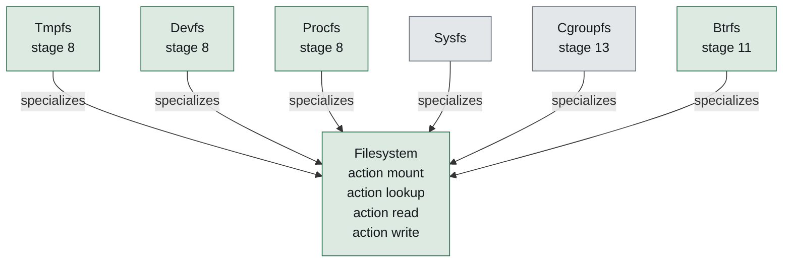

**Figure 15 — Filesystem and its subtypes.** 6 definitions specialize `Filesystem`; the hollow arrow points at what they have in common. [SVG](diagrams/ferrix-storage-filesystem.svg) Source: `09-storage.sysml`.

#### BlockCore

`#implemented`  ·  stage 11

Request queues, merging, an I/O scheduler with per-cgroup bandwidth, and the ring protocol to userspace block drivers. A read into a page-cache page fills the VMO the cache already holds. The queue itself (merging, flush and FUA barriers, deadline scheduling) is libs/block, in front of every block ring (kernel/src/block_ring, libs/blkring): one kernel task per ring moves requests onto it and copies payloads through the ring's data VMO, and publishes the disk in devfs's registry as a BlockDevice (kernel/src/fs/block.rs) that reads, writes and flushes whole sectors. No per-cgroup bandwidth: cgroups are stage 13's.

| Feature | Kind | Type | Maturity | Note |
| --- | --- | --- | --- | --- |
| `queues` | part | `RequestQueue` |  |  |
| `ioScheduler` | part | `IoScheduler` |  |  |
| `submit` | action |  |  |  |
| `flush` | action |  |  |  |
| `fua` | action |  |  |  |

#### RequestQueue

—

#### IoScheduler

—

#### NetCore

`#implemented`

The networking stage (docs/ROADMAP.md, Networking), which is not on the path to rustc and was taken after stage 11: AF_INET and AF_INET6 sockets over libs/net, AF_NETLINK route sockets and the ifreq ioctls for configuring an interface, /proc/net for the programs that read it, the net ring, and virtio-net as its first driver, in ring 3, with AF_UNIX names under it all. Its exit criterion is met: cargo xtask test-net configures eth0, resolves a name and fetches a file byte for byte on every architecture.

#### Inode

`#implemented`  ·  stage 8

libs/vfs's Inode trait, which tmpfs, devfs, procfs, pipes, sockets and btrfs implement; Inode::mapping offers what mmap maps.

| Feature | Kind | Type | Maturity | Note |
| --- | --- | --- | --- | --- |
| `pages` | part | `Vmo` |  | The page cache is the inode's VMO; a mapped file and a read file are the same pages. |

#### Dentry

`#implemented`  ·  stage 8

| Feature | Kind | Type | Maturity | Note |
| --- | --- | --- | --- | --- |
| `name` | attribute | `String` |  |  |
| `inode` | part | `Inode` |  | Absent for a negative entry, which is what makes a failed lookup cheap the second time. |

#### Mount

`#implemented`  ·  stage 8

| Feature | Kind | Type | Maturity | Note |
| --- | --- | --- | --- | --- |
| `root` | part | `Dentry` |  |  |
| `filesystem` | part | `Filesystem` |  |  |

#### Vfs

`#implemented`  ·  stage 8

rustc opens tens of thousands of files during a build; this is a performance requirement. Inode cache, dentry cache with negative entries, mount table per mount namespace, fd tables with their sharing rules.

libs/vfs, host-tested and fuzzed by vfs_ops: dentries with negative entries kept alive by a bounded queue of recent ones, mounts and one path walk for every call that takes a path, open file descriptions apart from descriptor tables, and the permission checks where Linux makes them. kernel/src/fs builds the one namespace every process resolves paths in; mount namespaces are stage 13's.

| Feature | Kind | Type | Maturity | Note |
| --- | --- | --- | --- | --- |
| `inodes` | part | `Inode` |  |  |
| `dentries` | part | `Dentry` |  |  |
| `mounts` | part | `Mount` |  |  |
| `openat` | action |  |  |  |
| `getdents64` | action |  |  |  |
| `statx` | action |  |  |  |
| `renameat2` | action |  |  |  |
| `pread64` | action |  |  |  |

#### PageCache

`#implemented`  ·  stage 8

Unified with VMOs: not a separate cache but the set of file VMOs, subject to reclaim's LRU. kernel/src/fs/pages.rs: each file's VMO, filled from a disk filesystem's PageSource in runs of at most 32 missing pages with no lock held, and by a fault through a mapping as by a read. Reclaim is stage 13's and not built, and no page is marked dirty, so a page written through MAP_SHARED reaches a btrfs disk only if write writes it too.

| Feature | Kind | Type | Maturity | Note |
| --- | --- | --- | --- | --- |
| `vmos` | part | `Vmo` |  |  |

#### Filesystem

`#implemented`

libs/vfs's FileSystem trait.

| Feature | Kind | Type | Maturity | Note |
| --- | --- | --- | --- | --- |
| `mount` | action |  |  |  |
| `lookup` | action |  |  |  |
| `read` | action |  |  |  |
| `write` | action |  |  |  |

#### Tmpfs

`#implemented`  ·  stage 8  ·  specialises `Filesystem`

libs/vfs/src/tmpfs.rs, whose file contents are a page store the kernel supplies as a VMO, so a shared mmap of a tmpfs file maps the file's own pages. The root and /tmp are tmpfs, and mount -t tmpfs makes a fresh one.

#### Devfs

`#implemented`  ·  stage 8  ·  specialises `Filesystem`

kernel/src/fs/devfs.rs: null, zero, full, random, urandom, tty and console, numbered as Linux numbers them, ptmx and the dri, input and pts directories since stages 17 and 18, and the disks a driver's kernel side registers. It calls itself devtmpfs, the name init scripts look for.

#### Procfs

`#implemented`  ·  stage 8  ·  specialises `Filesystem`

self/maps, self/exe, self/fd backed by the real VM and fd table; cpuinfo, meminfo. kernel/src/fs/procfs.rs over libs/procfs's text, rendered at open: each /proc/\<pid> with its fd, status, comm, cmdline, stat, maps, exe, cwd, root, task and mounts, and /proc's mounts, stat, partitions, filesystems, uptime, version, sys, sysrq-trigger and net beside them.

#### Sysfs

`#planned`  ·  specialises `Filesystem`

Not built: mount -t sysfs is ENODEV, and the boot check requires it to be.

#### Cgroupfs

`#planned`  ·  stage 13  ·  specialises `Filesystem`

#### InitramfsUnpack

`#implemented`  ·  stage 8

libs/cpio: the "newc" reader. Borrows, copies nothing, allocates nothing, rejects unsafe paths. Unpacked into tmpfs by libs/vfs's initramfs module through the same calls a program makes, hard links and device nodes included.

#### BtrfsParsing

`#implemented`  ·  stage 11

libs/btrfs: superblock, sys chunk array and chunk map (logical to physical), B-tree nodes and leaves, item payloads (inode, inode ref, dir, extent data), crc32c. Pure functions over bytes, forbid(unsafe_code); no cache, no transactions. Fuzzed from images mkfs.btrfs produced.

#### Btrfs

`#implemented`  ·  stage 11  ·  specialises `Filesystem`

The real filesystem, read and write, single device, no RAID 5/6. The largest single piece of work in the project. kernel/src/fs/btrfs.rs mounts it from a block node, read-only over libs/btrfs-vfs or writable over libs/btrfs-write, one inode object per inode so two names share one page cache. `/` is a btrfs volume under cargo xtask run, and test-rustc's sysroot is one at /data.

| Feature | Kind | Type | Maturity | Note |
| --- | --- | --- | --- | --- |
| `parsing` | part | `BtrfsParsing` |  |  |
| `read` | part | `BtrfsRead` |  |  |
| `write` | part | `BtrfsWrite` |  |  |
| `subvolumes` | part | `BtrfsSubvolumes` | `#planned` |  |

#### BtrfsRead

`#implemented`  ·  stage 11

Stage A: superblock, chunk tree, root tree, fs trees, extent data inline and regular, directory and inode items, crc32c verification, zstd/zlib/lzo. Enough to mount what mkfs.btrfs produced and read a sysroot out of it.

libs/btrfs and libs/btrfs-vfs, host-tested against real images, with every data sector checked against the checksum tree before its bytes are used and a bounded cache of metadata reads. Exit met on all three architectures: a mkfs.btrfs fixture on a second virtio-blk disk, served by the ring-3 driver, mounted at /mnt and read back against its manifest. A file on the read-only mount cannot be mapped yet (ENODEV); one on the writable mount can.

#### BtrfsWrite

`#implemented`  ·  stage 12

Stage B: copy-on-write allocation through the extent tree, delayed refs, transaction commit against both superblock copies with the right flush/FUA ordering, the free-space tree, the log tree and its replay.

All three are in libs/btrfs-write, mounted writable by the kernel through libs/btrfs-vfs, and clean under host btrfs check: over what every boot writes (cargo xtask test-btrfs), and before and after the log is replayed when QEMU is killed inside a transaction (cargo xtask test-powerfail). Owed beside the stage: writeback of pages written through MAP_SHARED.

| Feature | Kind | Type | Maturity | Note |
| --- | --- | --- | --- | --- |
| `allocateCow` | action |  |  |  |
| `commitTransaction` | action |  |  |  |
| `replayLog` | action |  |  |  |

#### BtrfsSubvolumes

`#planned`

Stage C: subvolumes and snapshots, then the rest. The reader mounts the default subvolume; entering others, subvol= and subvolid= are owed, and the writer refuses subvolumes and snapshots.

#### Filesystems

`#implemented`

| Feature | Kind | Type | Maturity | Note |
| --- | --- | --- | --- | --- |
| `tmpfs` | part | `Tmpfs` |  |  |
| `devfs` | part | `Devfs` |  |  |
| `procfs` | part | `Procfs` |  |  |
| `sysfs` | part | `Sysfs` | `#planned` |  |
| `cgroupfs` | part | `Cgroupfs` | `#planned` |  |
| `btrfs` | part | `Btrfs` |  |  |
| `initramfs` | part | `InitramfsUnpack` |  |  |

## The workspace

docs/ARCHITECTURE.md §9. libs/ is host-testable by design and is the only code cargo test, Miri and the fuzzers can reach; boot/ and kernel/ are reached by the QEMU boot test; xtask/ by cargo test. user/ holds the native programs the initramfs carries -- devmgr, the drivers and the runtime they link -- built for the kernel's targets and kept out of the host gates. scripts/check-crate-layering.sh keeps the arrows below pointing the right way.

| Crate | Maturity | Stage | Unsafe | Host tests | Note |
| --- | --- | ---: | --- | ---: | --- |
| `libs/bootinfo` | `#implemented` | — | allowed | — | The hand-off ABI, both address layouts, checked at compile time on every build. |
| `libs/elf` | `#implemented` | — | `forbid` | — | ELF64 and, since the ARMv7-A port, ELF32. |
| `libs/frame` | `#implemented` | — | `forbid` | — |  |
| `libs/heap` | `#implemented` | — | allowed | — | The body has no unsafe; the crate cannot forbid it because declaring Backing as an unsafe trait is the point. |
| `libs/paging` | `#implemented` | — | allowed | — |  |
| `libs/acpi` | `#implemented` | — | `forbid` | 81 | Reached at stage 3: the MADT walk the interrupt controller needed. |
| `libs/fdt` | `#implemented` | — | `forbid` | 87 | Reached at stage 1 on ARMv7-A: console, GIC, timer interrupt and PSCI conduit come from it there. |
| `libs/sync` | `#implemented` | — | allowed | 27 | Reached at stage 4: its ticket locks guard every shared kernel structure, the kernel's SpinLock being PreemptSpinLock, which holds off preemption, and IrqSpinLock masking interrupts as well. |
| `libs/crng` | `#implemented` | — | `forbid` | 9 | Reached with curl's HTTPS: ChaCha20 with fast key erasure behind getrandom, /dev/urandom and AT_RANDOM, seeded from firmware, the CPU and timer jitter. |
| `libs/sched` | `#implemented` | 5 | `forbid` | 72 | The half of the scheduler that is arithmetic: the EEVDF tree, weights, lag, the domain partition. cargo test drives a run queue through hundreds of thousands of decisions. |
| `libs/vma` | `#implemented` | — | `forbid` | 66 | Written for stage 6; reached at stage 2 as the vmap arena's range map, and since stage 6 every process's address space. |
| `libs/linux-abi` | `#implemented` | 7 | `forbid` | 126 | Three system call number tables, not two: x86-64's own, AArch64's generic one, and ARMv7-A's EABI one. |
| `libs/ustack` | `#implemented` | 7 | `forbid` | 22 | The initial process stack image: argc, argv, envp and the auxiliary vector, laid out as a program's \_start reads them, at both pointer widths. |
| `libs/cpio` | `#implemented` | 8 | `forbid` | 45 | The newc reader the initramfs is unpacked with, reached through libs/vfs. |
| `libs/vfs` | `#implemented` | 8 | `forbid` | 101 | Dentries with negative entries, mounts, the path walk, open file descriptions, descriptor tables, tmpfs over a page store the kernel supplies, pipes and socket buffers, the permission rules as pure functions, initramfs unpacking and the getdents64 packer. |
| `libs/procfs` | `#implemented` | 8 | `forbid` | 33 | The text of /proc as pure functions: maps lines padded to their name column at both pointer widths, meminfo, status, stat and mounts, pinned byte for byte against lines a real Linux printed, and the maps parser the kernel's boot check reads its own output… |
| `libs/virtio` | `#implemented` | 10 | allowed | 164 | The split virtqueue as logic over an abstract shared memory, the PCI transport's status protocol, and each device class's own protocol: blk, net, gpu, input and console. |
| `libs/netwire` | `#implemented` | — | `forbid` | 54 | The byte-level half of the net core, written ahead of the networking stage: Ethernet with one 802.1Q tag, ARP, IPv4 with its options, IPv6 with the extension-header walk, ICMPv4, ICMPv6 and Neighbor Discovery, UDP, and TCP headers with their negotiated… |
| `libs/nettcp` | `#implemented` | — | `forbid` | 31 | The TCP state machine, written ahead of the networking stage and above netwire: the eleven states of RFC 9293 in the standard's order, reassembly of what arrives out of order, window scaling, selective acknowledgment blocks, Nagle, delayed acknowledgments,… |
| `libs/net` | `#implemented` | — | `forbid` | 69 | The net core, written ahead of the networking stage: interfaces and the addresses on them, one routing table for both families, a neighbour cache that answers ARP's question and Neighbor Discovery's the same way, IPv4 fragmentation and reassembly under a… |
| `libs/netserve` | `#implemented` | — | `forbid` | 12 | A ring-3 network driver's serve loop: the net ring on one side, a virtio-net device on the other, and the rules where they meet. |
| `libs/netring` | `#implemented` | — | `forbid` | 32 | The net ring: the memory the kernel shares with a ring-3 network driver, specified in docs/NET-RING.md. |
| `libs/netlink` | `#implemented` | — |  | 48 | The byte-level half of netlink, over linux-abi's headers: walking a buffer of messages and the attributes after each fixed header, and building replies into a caller's buffer with every length and pad computed rather than taken. |
| `libs/virtio-net` | `#implemented` | 10 |  | 22 | The virtio-net driver logic, written ahead of the network device it drives from user/net: bring-up in the order the status protocol fixes, a receive queue the driver fills and refills because an empty one drops every frame in silence, a transmit queue whose… |
| `libs/virtio-gpu` | `#implemented` | 17 |  | 16 | The virtio-gpu 2D driver logic, written ahead of the driver process for the compositor's first iteration and driven from user/gpu since: bring-up with the control queue alone, one command at a time, every response checked, and the pipeline from the display… |
| `libs/virtio-input` | `#implemented` | 17 |  | 28 | The virtio-input driver logic, written ahead of the driver process for the input iteration (docs/INPUT.md) and driven from user/input since: bring-up that stops at FEATURES_OK so no event is discarded before the core has judged the device, the device's… |
| `libs/displayctl` | `#implemented` | 17 | `forbid` | 12 | The control protocol between the kernel's display core and a ring-3 display driver, written ahead of both for the compositor's first iteration (docs/DISPLAY.md). |
| `libs/inputctl` | `#implemented` | 17 | `forbid` | 25 | The control protocol between the kernel's input core and a ring-3 input driver, and evdev's per-open queues, written ahead of both for the input iteration (docs/INPUT.md). |
| `libs/pci` | `#implemented` | 10 | `forbid` | 47 | PCI configuration space over a ConfigSpace the caller implements: ECAM geometry, headers, BAR decoding and sizing, both capability lists with a visited set, MSI-X, the bus walk without recursion or allocation, and virtio's PCI transport. |
| `libs/native-abi` | `#implemented` | 9 | `forbid` | 14 | The native ABI's numbers, handle values, rights, signals, errno names and repr(C) layouts. |
| `libs/objects` | `#implemented` | 9 | `forbid` | 24 | The handle table and the channel message queue, generic over what a handle names. |
| `libs/btrfs` | `#implemented` | 11 | `forbid` | 167 | The btrfs read path, allocating nothing: parsing, mount bootstrap, lookup, readdir and read with every data sector checked against the checksum tree, and zlib, LZO and zstd decoders. |
| `libs/btrfs-write` | `#implemented` | 12 | `forbid` | 32 | The btrfs write path: copy-on-write trees, delayed refs, extent and free-space-tree bookkeeping, chunk allocation, the commit with its flush before the superblock, file operations, and the log tree fsync writes and the mount replays. |
| `libs/btrfs-vfs` | `#implemented` | 11 | `forbid` | 32 | btrfs mounted into the VFS: FileSystem and Inode over the read path, read-only and holding no lock across I/O, and a writable mount over libs/btrfs-write behind one sleeping lock, whose writes become extents at the commit. |
| `libs/block` | `#implemented` | 11 | `forbid` | 36 | The block core's request queue: merging, flush and FUA barriers no request crosses, deadline scheduling. |
| `libs/blkring` | `#implemented` | 10 | `forbid` | 52 | The block ring, docs/BLOCK-RING.md in code: the memory the kernel shares with a ring-3 block driver, every index and entry the other side writes checked before it is used, doorbells over ports, and the HELLO, READY and START messages, linked by both the… |
| `libs/blkserve` | `#implemented` | 10 | `forbid` | 6 | A ring-3 block driver's serve loop between the block ring and a virtio-blk device, written against a trait so it runs on the host with a fake device; user/blk adds only the handles. |
| `libs/virtio-blk` | `#implemented` | 10 |  | 39 | The virtio-blk driver logic over a transport and DMA memory it is handed: bring-up to DRIVER_OK, read, write and flush, each completion counted once even from a hostile device, and memory handed back only after the device's reset. |
| `libs/devmgr-proto` | `#implemented` | 10 | `forbid` | 5 | The messages between the kernel and devmgr on its bootstrap channel as docs/DEVMGR.md fixes them -- DEVICES, REPORT, PUBLISHED, DIED and RESTARTED -- so the kernel and the program share one definition. |
| `libs/native` | `#implemented` | — | `forbid` | 28 | Typed, safe wrappers over every native system call, with owned handles, written against a raw call trait: user/rt implements it with the trap instruction, and the tests with a recorder that plays the kernel's part. |
| `libs/renderctl` | `#implemented` | 19 | `forbid` | 19 | The render control protocol between the kernel's render core and a ring-3 GPU driver (docs/GPU.md §3.3), in displayctl's shape: fixed messages decoded strictly, command buffers passed through as bytes the driver understands and the core does not, and the… |
| `libs/fbtext` | `#implemented` | — | `forbid` | 30 | Text and filled rectangles on a linear framebuffer, with an embedded Spleen 8x16 font, clipped rather than refused and allocating nothing: what the panic screen (kernel/src/panic/screen.rs) draws with, and compositor/term as well. |
| `libs/qr` | `#implemented` | — | `forbid` | 20 | A QR code encoder with no heap, ported from Linux's drm_panic_qr.rs, for the panic screen's report. |
| `libs/vdagent` | `#writtenAhead` | — | `forbid` | 16 | SPICE's vdagent protocol as bytes, the chunk framing and the clipboard messages (docs/CLIPBOARD.md §4), written ahead of the clipboard agent that will speak it; nothing links it yet. |
| `libs/virtio-console` | `#writtenAhead` | — | allowed | 14 | The virtio-console driver: bring-up, the control conversation until a named port is open, and that port's bytes (docs/CLIPBOARD.md §3). |
| `libs/seccomp` | `#planned` | 13 | `forbid` | — | The classic-BPF interpreter as a pure function over bytes. |
| `boot` | `#implemented` | — | allowed | — |  |
| `kernel` | `#implemented` | — | allowed | — |  |
| `xtask` | `#implemented` | — | allowed | 242 | Cross-compiles both halves and the native programs, writes the FAT32 image and the initramfs with its own writers, converts the ARMv7-A loader ELF to PE32, drives QEMU, runs the NAT gateway the network tests sit behind, and runs every gate. |
| `fuzz` | `#implemented` | — | allowed | — |  |

### Dependency edges

```mermaid
flowchart LR
  n0_FerrixStructure_Workspace_bootinfo["bootinfo<br>libs/bootinfo"]
  n1_FerrixStructure_Workspace_elf["elf<br>libs/elf"]
  n2_FerrixStructure_Workspace_frameCrate["frameCrate<br>libs/frame"]
  n3_FerrixStructure_Workspace_heap["heap<br>libs/heap"]
  n4_FerrixStructure_Workspace_paging["paging<br>libs/paging"]
  n5_FerrixStructure_Workspace_acpi["acpi<br>libs/acpi"]
  n6_FerrixStructure_Workspace_fdt["fdt<br>libs/fdt"]
  n7_FerrixStructure_Workspace_sync["sync<br>libs/sync"]
  n8_FerrixStructure_Workspace_crng["crng<br>libs/crng"]
  n9_FerrixStructure_Workspace_sched["sched<br>libs/sched"]
  n10_FerrixStructure_Workspace_vma["vma<br>libs/vma"]
  n11_FerrixStructure_Workspace_linuxAbi["linuxAbi<br>libs/linux-abi"]
  n12_FerrixStructure_Workspace_ustack["ustack<br>libs/ustack"]
  n13_FerrixStructure_Workspace_cpio["cpio<br>libs/cpio"]
  n14_FerrixStructure_Workspace_vfs["vfs<br>libs/vfs"]
  n15_FerrixStructure_Workspace_procfs["procfs<br>libs/procfs"]
  n16_FerrixStructure_Workspace_virtio["virtio<br>libs/virtio"]
  n17_FerrixStructure_Workspace_netwire["netwire<br>libs/netwire"]
  n18_FerrixStructure_Workspace_nettcp["nettcp<br>libs/nettcp"]
  n19_FerrixStructure_Workspace_netCore["netCore<br>libs/net"]
  n20_FerrixStructure_Workspace_netServe["netServe<br>libs/netserve"]
  n21_FerrixStructure_Workspace_netRing["netRing<br>libs/netring"]
  n22_FerrixStructure_Workspace_netlink["netlink<br>libs/netlink"]
  n23_FerrixStructure_Workspace_virtioNet["virtioNet<br>libs/virtio-net"]
  n24_FerrixStructure_Workspace_virtioGpu["virtioGpu<br>libs/virtio-gpu"]
  n25_FerrixStructure_Workspace_virtioInput["virtioInput<br>libs/virtio-input"]
  n26_FerrixStructure_Workspace_displayctl["displayctl<br>libs/displayctl"]
  n27_FerrixStructure_Workspace_inputctl["inputctl<br>libs/inputctl"]
  n28_FerrixStructure_Workspace_pci["pci<br>libs/pci"]
  n29_FerrixStructure_Workspace_nativeAbi["nativeAbi<br>libs/native-abi"]
  n30_FerrixStructure_Workspace_objects["objects<br>libs/objects"]
  n31_FerrixStructure_Workspace_btrfs["btrfs<br>libs/btrfs"]
  n32_FerrixStructure_Workspace_btrfsWrite["btrfsWrite<br>libs/btrfs-write"]
  n33_FerrixStructure_Workspace_btrfsVfs["btrfsVfs<br>libs/btrfs-vfs"]
  n34_FerrixStructure_Workspace_blockQueue["blockQueue<br>libs/block"]
  n35_FerrixStructure_Workspace_blkRing["blkRing<br>libs/blkring"]
  n36_FerrixStructure_Workspace_blkServe["blkServe<br>libs/blkserve"]
  n37_FerrixStructure_Workspace_virtioBlk["virtioBlk<br>libs/virtio-blk"]
  n38_FerrixStructure_Workspace_devmgrProto["devmgrProto<br>libs/devmgr-proto"]
  n39_FerrixStructure_Workspace_nativeCrate["nativeCrate<br>libs/native"]
  n40_FerrixStructure_Workspace_renderctl["renderctl<br>libs/renderctl"]
  n41_FerrixStructure_Workspace_fbtext["fbtext<br>libs/fbtext"]
  n42_FerrixStructure_Workspace_qr["qr<br>libs/qr"]
  n43_FerrixStructure_Workspace_vdagent["vdagent<br>libs/vdagent"]
  n44_FerrixStructure_Workspace_virtioConsole["virtioConsole<br>libs/virtio-console"]
  n45_FerrixStructure_Workspace_seccompBpf["seccompBpf<br>libs/seccomp"]
  n46_FerrixStructure_Workspace_bootCrate["bootCrate<br>boot"]
  n47_FerrixStructure_Workspace_kernelCrate["kernelCrate<br>kernel"]
  n48_FerrixStructure_Workspace_xtask["xtask<br>xtask"]
  n49_FerrixStructure_Workspace_fuzz["fuzz<br>fuzz"]
  n47_FerrixStructure_Workspace_kernelCrate -. "depends on" .-> n5_FerrixStructure_Workspace_acpi
  n47_FerrixStructure_Workspace_kernelCrate -. "depends on" .-> n35_FerrixStructure_Workspace_blkRing
  n47_FerrixStructure_Workspace_kernelCrate -. "depends on" .-> n34_FerrixStructure_Workspace_blockQueue
  n47_FerrixStructure_Workspace_kernelCrate -. "depends on" .-> n0_FerrixStructure_Workspace_bootinfo
  n47_FerrixStructure_Workspace_kernelCrate -. "depends on" .-> n31_FerrixStructure_Workspace_btrfs
  n47_FerrixStructure_Workspace_kernelCrate -. "depends on" .-> n33_FerrixStructure_Workspace_btrfsVfs
  n47_FerrixStructure_Workspace_kernelCrate -. "depends on" .-> n32_FerrixStructure_Workspace_btrfsWrite
  n47_FerrixStructure_Workspace_kernelCrate -. "depends on" .-> n8_FerrixStructure_Workspace_crng
  n47_FerrixStructure_Workspace_kernelCrate -. "depends on" .-> n38_FerrixStructure_Workspace_devmgrProto
  n47_FerrixStructure_Workspace_kernelCrate -. "depends on" .-> n26_FerrixStructure_Workspace_displayctl
  n47_FerrixStructure_Workspace_kernelCrate -. "depends on" .-> n1_FerrixStructure_Workspace_elf
  n47_FerrixStructure_Workspace_kernelCrate -. "depends on" .-> n41_FerrixStructure_Workspace_fbtext
  n47_FerrixStructure_Workspace_kernelCrate -. "depends on" .-> n6_FerrixStructure_Workspace_fdt
  n47_FerrixStructure_Workspace_kernelCrate -. "depends on" .-> n2_FerrixStructure_Workspace_frameCrate
  n47_FerrixStructure_Workspace_kernelCrate -. "depends on" .-> n3_FerrixStructure_Workspace_heap
  n47_FerrixStructure_Workspace_kernelCrate -. "depends on" .-> n27_FerrixStructure_Workspace_inputctl
  n47_FerrixStructure_Workspace_kernelCrate -. "depends on" .-> n11_FerrixStructure_Workspace_linuxAbi
  n47_FerrixStructure_Workspace_kernelCrate -. "depends on" .-> n29_FerrixStructure_Workspace_nativeAbi
  n47_FerrixStructure_Workspace_kernelCrate -. "depends on" .-> n19_FerrixStructure_Workspace_netCore
  n47_FerrixStructure_Workspace_kernelCrate -. "depends on" .-> n22_FerrixStructure_Workspace_netlink
  n47_FerrixStructure_Workspace_kernelCrate -. "depends on" .-> n21_FerrixStructure_Workspace_netRing
  n47_FerrixStructure_Workspace_kernelCrate -. "depends on" .-> n18_FerrixStructure_Workspace_nettcp
  n47_FerrixStructure_Workspace_kernelCrate -. "depends on" .-> n17_FerrixStructure_Workspace_netwire
  n47_FerrixStructure_Workspace_kernelCrate -. "depends on" .-> n30_FerrixStructure_Workspace_objects
  n47_FerrixStructure_Workspace_kernelCrate -. "depends on" .-> n4_FerrixStructure_Workspace_paging
  n47_FerrixStructure_Workspace_kernelCrate -. "depends on" .-> n28_FerrixStructure_Workspace_pci
  n47_FerrixStructure_Workspace_kernelCrate -. "depends on" .-> n15_FerrixStructure_Workspace_procfs
  n47_FerrixStructure_Workspace_kernelCrate -. "depends on" .-> n42_FerrixStructure_Workspace_qr
  n47_FerrixStructure_Workspace_kernelCrate -. "depends on" .-> n40_FerrixStructure_Workspace_renderctl
  n47_FerrixStructure_Workspace_kernelCrate -. "depends on" .-> n9_FerrixStructure_Workspace_sched
  n47_FerrixStructure_Workspace_kernelCrate -. "depends on" .-> n7_FerrixStructure_Workspace_sync
  n47_FerrixStructure_Workspace_kernelCrate -. "depends on" .-> n12_FerrixStructure_Workspace_ustack
  n47_FerrixStructure_Workspace_kernelCrate -. "depends on" .-> n14_FerrixStructure_Workspace_vfs
  n47_FerrixStructure_Workspace_kernelCrate -. "depends on" .-> n16_FerrixStructure_Workspace_virtio
  n47_FerrixStructure_Workspace_kernelCrate -. "depends on" .-> n10_FerrixStructure_Workspace_vma
  n46_FerrixStructure_Workspace_bootCrate -. "depends on" .-> n0_FerrixStructure_Workspace_bootinfo
  n46_FerrixStructure_Workspace_bootCrate -. "depends on" .-> n1_FerrixStructure_Workspace_elf
  n46_FerrixStructure_Workspace_bootCrate -. "depends on" .-> n4_FerrixStructure_Workspace_paging
  n48_FerrixStructure_Workspace_xtask -. "depends on" .-> n1_FerrixStructure_Workspace_elf
  n48_FerrixStructure_Workspace_xtask -. "depends on" .-> n17_FerrixStructure_Workspace_netwire
  n49_FerrixStructure_Workspace_fuzz -. "depends on" .-> n5_FerrixStructure_Workspace_acpi
  n49_FerrixStructure_Workspace_fuzz -. "depends on" .-> n35_FerrixStructure_Workspace_blkRing
  n49_FerrixStructure_Workspace_fuzz -. "depends on" .-> n34_FerrixStructure_Workspace_blockQueue
  n49_FerrixStructure_Workspace_fuzz -. "depends on" .-> n31_FerrixStructure_Workspace_btrfs
  n49_FerrixStructure_Workspace_fuzz -. "depends on" .-> n13_FerrixStructure_Workspace_cpio
  n49_FerrixStructure_Workspace_fuzz -. "depends on" .-> n26_FerrixStructure_Workspace_displayctl
  n49_FerrixStructure_Workspace_fuzz -. "depends on" .-> n1_FerrixStructure_Workspace_elf
  n49_FerrixStructure_Workspace_fuzz -. "depends on" .-> n6_FerrixStructure_Workspace_fdt
  n49_FerrixStructure_Workspace_fuzz -. "depends on" .-> n2_FerrixStructure_Workspace_frameCrate
  n49_FerrixStructure_Workspace_fuzz -. "depends on" .-> n27_FerrixStructure_Workspace_inputctl
  n49_FerrixStructure_Workspace_fuzz -. "depends on" .-> n11_FerrixStructure_Workspace_linuxAbi
  n49_FerrixStructure_Workspace_fuzz -. "depends on" .-> n29_FerrixStructure_Workspace_nativeAbi
  n49_FerrixStructure_Workspace_fuzz -. "depends on" .-> n19_FerrixStructure_Workspace_netCore
  n49_FerrixStructure_Workspace_fuzz -. "depends on" .-> n22_FerrixStructure_Workspace_netlink
  n49_FerrixStructure_Workspace_fuzz -. "depends on" .-> n18_FerrixStructure_Workspace_nettcp
  n49_FerrixStructure_Workspace_fuzz -. "depends on" .-> n17_FerrixStructure_Workspace_netwire
  n49_FerrixStructure_Workspace_fuzz -. "depends on" .-> n30_FerrixStructure_Workspace_objects
  n49_FerrixStructure_Workspace_fuzz -. "depends on" .-> n28_FerrixStructure_Workspace_pci
  n49_FerrixStructure_Workspace_fuzz -. "depends on" .-> n40_FerrixStructure_Workspace_renderctl
  n49_FerrixStructure_Workspace_fuzz -. "depends on" .-> n7_FerrixStructure_Workspace_sync
  n49_FerrixStructure_Workspace_fuzz -. "depends on" .-> n12_FerrixStructure_Workspace_ustack
  n49_FerrixStructure_Workspace_fuzz -. "depends on" .-> n14_FerrixStructure_Workspace_vfs
  n49_FerrixStructure_Workspace_fuzz -. "depends on" .-> n16_FerrixStructure_Workspace_virtio
  n49_FerrixStructure_Workspace_fuzz -. "depends on" .-> n37_FerrixStructure_Workspace_virtioBlk
  n49_FerrixStructure_Workspace_fuzz -. "depends on" .-> n24_FerrixStructure_Workspace_virtioGpu
  n49_FerrixStructure_Workspace_fuzz -. "depends on" .-> n25_FerrixStructure_Workspace_virtioInput
  n49_FerrixStructure_Workspace_fuzz -. "depends on" .-> n23_FerrixStructure_Workspace_virtioNet
  n35_FerrixStructure_Workspace_blkRing -. "depends on" .-> n11_FerrixStructure_Workspace_linuxAbi
  n35_FerrixStructure_Workspace_blkRing -. "depends on" .-> n29_FerrixStructure_Workspace_nativeAbi
  n36_FerrixStructure_Workspace_blkServe -. "depends on" .-> n35_FerrixStructure_Workspace_blkRing
  n36_FerrixStructure_Workspace_blkServe -. "depends on" .-> n16_FerrixStructure_Workspace_virtio
  n36_FerrixStructure_Workspace_blkServe -. "depends on" .-> n37_FerrixStructure_Workspace_virtioBlk
  n33_FerrixStructure_Workspace_btrfsVfs -. "depends on" .-> n31_FerrixStructure_Workspace_btrfs
  n33_FerrixStructure_Workspace_btrfsVfs -. "depends on" .-> n32_FerrixStructure_Workspace_btrfsWrite
  n33_FerrixStructure_Workspace_btrfsVfs -. "depends on" .-> n7_FerrixStructure_Workspace_sync
  n33_FerrixStructure_Workspace_btrfsVfs -. "depends on" .-> n14_FerrixStructure_Workspace_vfs
  n32_FerrixStructure_Workspace_btrfsWrite -. "depends on" .-> n31_FerrixStructure_Workspace_btrfs
  n26_FerrixStructure_Workspace_displayctl -. "depends on" .-> n11_FerrixStructure_Workspace_linuxAbi
  n26_FerrixStructure_Workspace_displayctl -. "depends on" .-> n29_FerrixStructure_Workspace_nativeAbi
  n27_FerrixStructure_Workspace_inputctl -. "depends on" .-> n11_FerrixStructure_Workspace_linuxAbi
  n27_FerrixStructure_Workspace_inputctl -. "depends on" .-> n29_FerrixStructure_Workspace_nativeAbi
  n29_FerrixStructure_Workspace_nativeAbi -. "depends on" .-> n11_FerrixStructure_Workspace_linuxAbi
  n39_FerrixStructure_Workspace_nativeCrate -. "depends on" .-> n11_FerrixStructure_Workspace_linuxAbi
  n39_FerrixStructure_Workspace_nativeCrate -. "depends on" .-> n29_FerrixStructure_Workspace_nativeAbi
  n19_FerrixStructure_Workspace_netCore -. "depends on" .-> n17_FerrixStructure_Workspace_netwire
  n19_FerrixStructure_Workspace_netCore -. "depends on" .-> n18_FerrixStructure_Workspace_nettcp
  n22_FerrixStructure_Workspace_netlink -. "depends on" .-> n11_FerrixStructure_Workspace_linuxAbi
  n21_FerrixStructure_Workspace_netRing -. "depends on" .-> n11_FerrixStructure_Workspace_linuxAbi
  n21_FerrixStructure_Workspace_netRing -. "depends on" .-> n29_FerrixStructure_Workspace_nativeAbi
  n20_FerrixStructure_Workspace_netServe -. "depends on" .-> n21_FerrixStructure_Workspace_netRing
  n20_FerrixStructure_Workspace_netServe -. "depends on" .-> n23_FerrixStructure_Workspace_virtioNet
  n18_FerrixStructure_Workspace_nettcp -. "depends on" .-> n17_FerrixStructure_Workspace_netwire
  n30_FerrixStructure_Workspace_objects -. "depends on" .-> n29_FerrixStructure_Workspace_nativeAbi
  n40_FerrixStructure_Workspace_renderctl -. "depends on" .-> n29_FerrixStructure_Workspace_nativeAbi
  n12_FerrixStructure_Workspace_ustack -. "depends on" .-> n11_FerrixStructure_Workspace_linuxAbi
  n14_FerrixStructure_Workspace_vfs -. "depends on" .-> n13_FerrixStructure_Workspace_cpio
  n14_FerrixStructure_Workspace_vfs -. "depends on" .-> n11_FerrixStructure_Workspace_linuxAbi
  n14_FerrixStructure_Workspace_vfs -. "depends on" .-> n7_FerrixStructure_Workspace_sync
  n16_FerrixStructure_Workspace_virtio -. "depends on" .-> n11_FerrixStructure_Workspace_linuxAbi
  n37_FerrixStructure_Workspace_virtioBlk -. "depends on" .-> n16_FerrixStructure_Workspace_virtio
  n44_FerrixStructure_Workspace_virtioConsole -. "depends on" .-> n16_FerrixStructure_Workspace_virtio
  n24_FerrixStructure_Workspace_virtioGpu -. "depends on" .-> n26_FerrixStructure_Workspace_displayctl
  n24_FerrixStructure_Workspace_virtioGpu -. "depends on" .-> n16_FerrixStructure_Workspace_virtio
  n25_FerrixStructure_Workspace_virtioInput -. "depends on" .-> n27_FerrixStructure_Workspace_inputctl
  n25_FerrixStructure_Workspace_virtioInput -. "depends on" .-> n11_FerrixStructure_Workspace_linuxAbi
  n25_FerrixStructure_Workspace_virtioInput -. "depends on" .-> n16_FerrixStructure_Workspace_virtio
  n23_FerrixStructure_Workspace_virtioNet -. "depends on" .-> n16_FerrixStructure_Workspace_virtio
  classDef implemented fill:#dceae2,stroke:#2c6e4e,color:#16191d
  classDef writtenAhead fill:#e5dff0,stroke:#6b4fa0,color:#16191d
  classDef planned fill:#e4e7ea,stroke:#6a737e,color:#16191d
  class n0_FerrixStructure_Workspace_bootinfo,n1_FerrixStructure_Workspace_elf,n2_FerrixStructure_Workspace_frameCrate,n3_FerrixStructure_Workspace_heap,n4_FerrixStructure_Workspace_paging,n5_FerrixStructure_Workspace_acpi,n6_FerrixStructure_Workspace_fdt,n7_FerrixStructure_Workspace_sync,n8_FerrixStructure_Workspace_crng,n9_FerrixStructure_Workspace_sched,n10_FerrixStructure_Workspace_vma,n11_FerrixStructure_Workspace_linuxAbi,n12_FerrixStructure_Workspace_ustack,n13_FerrixStructure_Workspace_cpio,n14_FerrixStructure_Workspace_vfs,n15_FerrixStructure_Workspace_procfs,n16_FerrixStructure_Workspace_virtio,n17_FerrixStructure_Workspace_netwire,n18_FerrixStructure_Workspace_nettcp,n19_FerrixStructure_Workspace_netCore,n20_FerrixStructure_Workspace_netServe,n21_FerrixStructure_Workspace_netRing,n22_FerrixStructure_Workspace_netlink,n23_FerrixStructure_Workspace_virtioNet,n24_FerrixStructure_Workspace_virtioGpu,n25_FerrixStructure_Workspace_virtioInput,n26_FerrixStructure_Workspace_displayctl,n27_FerrixStructure_Workspace_inputctl,n28_FerrixStructure_Workspace_pci,n29_FerrixStructure_Workspace_nativeAbi,n30_FerrixStructure_Workspace_objects,n31_FerrixStructure_Workspace_btrfs,n32_FerrixStructure_Workspace_btrfsWrite,n33_FerrixStructure_Workspace_btrfsVfs,n34_FerrixStructure_Workspace_blockQueue,n35_FerrixStructure_Workspace_blkRing,n36_FerrixStructure_Workspace_blkServe,n37_FerrixStructure_Workspace_virtioBlk,n38_FerrixStructure_Workspace_devmgrProto,n39_FerrixStructure_Workspace_nativeCrate,n40_FerrixStructure_Workspace_renderctl,n41_FerrixStructure_Workspace_fbtext,n42_FerrixStructure_Workspace_qr,n46_FerrixStructure_Workspace_bootCrate,n47_FerrixStructure_Workspace_kernelCrate,n48_FerrixStructure_Workspace_xtask,n49_FerrixStructure_Workspace_fuzz implemented
  class n43_FerrixStructure_Workspace_vdagent,n44_FerrixStructure_Workspace_virtioConsole writtenAhead
  class n45_FerrixStructure_Workspace_seccompBpf planned
```

**Figure 16 — The crate graph.** 107 `dependency` statements; an arrow points from the thing that needs to the thing it needs. [SVG](diagrams/crate-dependencies.svg) Source: `02-structure.sysml`.

- `kernelCrate` → `acpi`, `blkRing`, `blockQueue`, `bootinfo`, `btrfs`, `btrfsVfs`, `btrfsWrite`, `crng`, `devmgrProto`, `displayctl`, `elf`, `fbtext`, `fdt`, `frameCrate`, `heap`, `inputctl`, `linuxAbi`, `nativeAbi`, `netCore`, `netlink`, `netRing`, `nettcp`, `netwire`, `objects`, `paging`, `pci`, `procfs`, `qr`, `renderctl`, `sched`, `sync`, `ustack`, `vfs`, `virtio` and `vma`
- `bootCrate` → `bootinfo`, `elf` and `paging`
- `xtask` → `elf` and `netwire`
- `fuzz` → `acpi`, `blkRing`, `blockQueue`, `btrfs`, `cpio`, `displayctl`, `elf`, `fdt`, `frameCrate`, `inputctl`, `linuxAbi`, `nativeAbi`, `netCore`, `netlink`, `nettcp`, `netwire`, `objects`, `pci`, `renderctl`, `sync`, `ustack`, `vfs`, `virtio`, `virtioBlk`, `virtioGpu`, `virtioInput` and `virtioNet`
- `blkRing` → `linuxAbi` and `nativeAbi`
- `blkServe` → `blkRing`, `virtio` and `virtioBlk`
- `btrfsVfs` → `btrfs`, `btrfsWrite`, `sync` and `vfs`
- `btrfsWrite` → `btrfs`
- `displayctl` → `linuxAbi` and `nativeAbi`
- `inputctl` → `linuxAbi` and `nativeAbi`
- `nativeAbi` → `linuxAbi`
- `nativeCrate` → `linuxAbi` and `nativeAbi`
- `netCore` → `netwire` and `nettcp`
- `netlink` → `linuxAbi`
- `netRing` → `linuxAbi` and `nativeAbi`
- `netServe` → `netRing` and `virtioNet`
- `nettcp` → `netwire`
- `objects` → `nativeAbi`
- `renderctl` → `nativeAbi`
- `ustack` → `linuxAbi`
- `vfs` → `cpio`, `linuxAbi` and `sync`
- `virtio` → `linuxAbi`
- `virtioBlk` → `virtio`
- `virtioConsole` → `virtio`
- `virtioGpu` → `displayctl` and `virtio`
- `virtioInput` → `inputctl`, `linuxAbi` and `virtio`
- `virtioNet` → `virtio`

**Kernel targets**: `x86_64-unknown-none`, `aarch64-unknown-none-softfloat` and `armv7a-none-eabi`.

**Loader targets**: `x86_64-unknown-uefi`, `aarch64-unknown-uefi` and `armv7-unknown-linux-musleabi`.

**Toolchain**: `1.97.1`.

## Roadmap

Two rules govern the ordering: every stage ends in something that runs, and nothing is stubbed that a later stage has to unpick. Sizes are order-of-magnitude and not a schedule.

```mermaid
flowchart TB
  n0_FerrixRoadmap_stage0Foundation["S0  Stage 0 foundation<br>Done · weekend"]
  n1_FerrixRoadmap_stage1Boot["S1  Stage 1 boot<br>Done · week"]
  n2_FerrixRoadmap_stage2Memory["S2  Stage 2 memory<br>Done · week"]
  n3_FerrixRoadmap_stage3TrapsInterruptsTime["S3  Stage 3 traps interrupts time<br>Done · week"]
  n4_FerrixRoadmap_stage4Smp["S4  Stage 4 SMP<br>Done · week"]
  n5_FerrixRoadmap_armv7aPort["SA  ARMv7-A port<br>Done · month"]
  n6_FerrixRoadmap_stage5Scheduler["S5  Stage 5 scheduler<br>Done · week"]
  n7_FerrixRoadmap_stage6UserMode["S6  Stage 6 user mode<br>Done · week"]
  n8_FerrixRoadmap_stage7LinuxAbi["S7  Stage 7 Linux ABI<br>Done · month"]
  n9_FerrixRoadmap_stage8Vfs["S8  Stage 8 VFS<br>Done · month"]
  n10_FerrixRoadmap_stage9NativeAbi["S9  Stage 9 native ABI<br>Done · week"]
  n11_FerrixRoadmap_stage10UserspaceDrivers["S10  Stage 10 userspace drivers<br>Done · month"]
  n12_FerrixRoadmap_stage11BtrfsRead["S11  Stage 11 btrfs read<br>Done · month"]
  n13_FerrixRoadmap_stageNetworking["SN  Stage networking<br>Done · month"]
  n14_FerrixRoadmap_stageDynamicLinking["SD  Stage dynamic linking<br>Done · 39 points, spent; ferrousli's port about 34, spent"]
  n15_FerrixRoadmap_stage12BtrfsWrite["S12  Stage 12 btrfs write<br>Done · about 60 points, spent"]
  n16_FerrixRoadmap_stage13Isolation["S13  Stage 13 isolation<br>InProgress · month"]
  n17_FerrixRoadmap_stage14RealTime["S14  Stage 14 real time<br>Planned · month"]
  n18_FerrixRoadmap_stage15Userland["S15  Stage 15 userland<br>InProgress · week, about 20 points, of which job control is spent"]
  n19_FerrixRoadmap_stage16Rustc["S16  Stage 16 rustc<br>Done · the goal; about 40 guessed, 8 spent"]
  n20_FerrixRoadmap_stage17DisplayAndInput["S17  Stage 17 display and input<br>Done · 74 points, spent"]
  n21_FerrixRoadmap_stage18Compositor["S18  Stage 18 compositor<br>Done · 96 points, spent"]
  n22_FerrixRoadmap_stage19HyprlandFidelity["S19  Stage 19 hyprland fidelity<br>InProgress · 178 points, about 69 left"]
  n23_FerrixRoadmap_stage21BareMetalGpu["S21  Stage 21 bare metal gpu<br>Planned · unsized, over 100 points"]
  n24_FerrixRoadmap_stage22Steam["S22  Stage 22 steam<br>Planned · unsized, over 300 points"]
  n25_FerrixRoadmap_stage20SelfHosting["S20  Stage 20 self hosting<br>InProgress · longer"]
  n0_FerrixRoadmap_stage0Foundation -. "depends on" .-> n1_FerrixRoadmap_stage1Boot
  n1_FerrixRoadmap_stage1Boot -. "depends on" .-> n2_FerrixRoadmap_stage2Memory
  n2_FerrixRoadmap_stage2Memory -. "depends on" .-> n3_FerrixRoadmap_stage3TrapsInterruptsTime
  n3_FerrixRoadmap_stage3TrapsInterruptsTime -. "depends on" .-> n4_FerrixRoadmap_stage4Smp
  n4_FerrixRoadmap_stage4Smp -. "depends on" .-> n6_FerrixRoadmap_stage5Scheduler
  n6_FerrixRoadmap_stage5Scheduler -. "depends on" .-> n7_FerrixRoadmap_stage6UserMode
  n3_FerrixRoadmap_stage3TrapsInterruptsTime -. "depends on" .-> n7_FerrixRoadmap_stage6UserMode
  n7_FerrixRoadmap_stage6UserMode -. "depends on" .-> n8_FerrixRoadmap_stage7LinuxAbi
  n8_FerrixRoadmap_stage7LinuxAbi -. "depends on" .-> n9_FerrixRoadmap_stage8Vfs
  n9_FerrixRoadmap_stage8Vfs -. "depends on" .-> n10_FerrixRoadmap_stage9NativeAbi
  n10_FerrixRoadmap_stage9NativeAbi -. "depends on" .-> n11_FerrixRoadmap_stage10UserspaceDrivers
  n11_FerrixRoadmap_stage10UserspaceDrivers -. "depends on" .-> n12_FerrixRoadmap_stage11BtrfsRead
  n12_FerrixRoadmap_stage11BtrfsRead -. "depends on" .-> n13_FerrixRoadmap_stageNetworking
  n11_FerrixRoadmap_stage10UserspaceDrivers -. "depends on" .-> n13_FerrixRoadmap_stageNetworking
  n9_FerrixRoadmap_stage8Vfs -. "depends on" .-> n14_FerrixRoadmap_stageDynamicLinking
  n8_FerrixRoadmap_stage7LinuxAbi -. "depends on" .-> n14_FerrixRoadmap_stageDynamicLinking
  n12_FerrixRoadmap_stage11BtrfsRead -. "depends on" .-> n15_FerrixRoadmap_stage12BtrfsWrite
  n15_FerrixRoadmap_stage12BtrfsWrite -. "depends on" .-> n16_FerrixRoadmap_stage13Isolation
  n16_FerrixRoadmap_stage13Isolation -. "depends on" .-> n17_FerrixRoadmap_stage14RealTime
  n4_FerrixRoadmap_stage4Smp -. "depends on" .-> n17_FerrixRoadmap_stage14RealTime
  n17_FerrixRoadmap_stage14RealTime -. "depends on" .-> n18_FerrixRoadmap_stage15Userland
  n18_FerrixRoadmap_stage15Userland -. "depends on" .-> n19_FerrixRoadmap_stage16Rustc
  n11_FerrixRoadmap_stage10UserspaceDrivers -. "depends on" .-> n20_FerrixRoadmap_stage17DisplayAndInput
  n8_FerrixRoadmap_stage7LinuxAbi -. "depends on" .-> n20_FerrixRoadmap_stage17DisplayAndInput
  n20_FerrixRoadmap_stage17DisplayAndInput -. "depends on" .-> n21_FerrixRoadmap_stage18Compositor
  n21_FerrixRoadmap_stage18Compositor -. "depends on" .-> n22_FerrixRoadmap_stage19HyprlandFidelity
  n19_FerrixRoadmap_stage16Rustc -. "depends on" .-> n25_FerrixRoadmap_stage20SelfHosting
  n22_FerrixRoadmap_stage19HyprlandFidelity -. "depends on" .-> n23_FerrixRoadmap_stage21BareMetalGpu
  n14_FerrixRoadmap_stageDynamicLinking -. "depends on" .-> n23_FerrixRoadmap_stage21BareMetalGpu
  n22_FerrixRoadmap_stage19HyprlandFidelity -. "depends on" .-> n24_FerrixRoadmap_stage22Steam
  n14_FerrixRoadmap_stageDynamicLinking -. "depends on" .-> n24_FerrixRoadmap_stage22Steam
  n15_FerrixRoadmap_stage12BtrfsWrite -. "depends on" .-> n24_FerrixRoadmap_stage22Steam
  n16_FerrixRoadmap_stage13Isolation -. "depends on" .-> n24_FerrixRoadmap_stage22Steam
  n13_FerrixRoadmap_stageNetworking -. "depends on" .-> n24_FerrixRoadmap_stage22Steam
  classDef implemented fill:#dceae2,stroke:#2c6e4e,color:#16191d
  classDef inProgress fill:#dae5f0,stroke:#2a5f8f,color:#16191d
  classDef planned fill:#e4e7ea,stroke:#6a737e,color:#16191d
  class n0_FerrixRoadmap_stage0Foundation,n1_FerrixRoadmap_stage1Boot,n2_FerrixRoadmap_stage2Memory,n3_FerrixRoadmap_stage3TrapsInterruptsTime,n4_FerrixRoadmap_stage4Smp,n5_FerrixRoadmap_armv7aPort,n6_FerrixRoadmap_stage5Scheduler,n7_FerrixRoadmap_stage6UserMode,n8_FerrixRoadmap_stage7LinuxAbi,n9_FerrixRoadmap_stage8Vfs,n10_FerrixRoadmap_stage9NativeAbi,n11_FerrixRoadmap_stage10UserspaceDrivers,n12_FerrixRoadmap_stage11BtrfsRead,n13_FerrixRoadmap_stageNetworking,n14_FerrixRoadmap_stageDynamicLinking,n15_FerrixRoadmap_stage12BtrfsWrite,n19_FerrixRoadmap_stage16Rustc,n20_FerrixRoadmap_stage17DisplayAndInput,n21_FerrixRoadmap_stage18Compositor implemented
  class n16_FerrixRoadmap_stage13Isolation,n18_FerrixRoadmap_stage15Userland,n22_FerrixRoadmap_stage19HyprlandFidelity,n25_FerrixRoadmap_stage20SelfHosting inProgress
  class n17_FerrixRoadmap_stage14RealTime,n23_FerrixRoadmap_stage21BareMetalGpu,n24_FerrixRoadmap_stage22Steam planned
```

**Figure 17 — The roadmap, stage by stage.** An arrow points from a stage to the stage it unblocks. The two stages with a second arrow into them are the ones that need more than their predecessor. [SVG](diagrams/roadmap-stages.svg) Source: `10-roadmap.sysml`.

| Id | No. | Stage | Status | Size | Maturity |
| --- | ---: | --- | --- | --- | --- |
| `S0` | 0 | Stage 0 foundation | Done | weekend | `#implemented` |
| `S1` | 1 | Stage 1 boot | Done | week | `#implemented` |
| `S2` | 2 | Stage 2 memory | Done | week | `#implemented` |
| `S3` | 3 | Stage 3 traps interrupts time | Done | week | `#implemented` |
| `S4` | 4 | Stage 4 SMP | Done | week | `#implemented` |
| `SA` | 4 | ARMv7-A port | Done | month | `#implemented` |
| `S5` | 5 | Stage 5 scheduler | Done | week | `#implemented` |
| `S6` | 6 | Stage 6 user mode | Done | week | `#implemented` |
| `S7` | 7 | Stage 7 Linux ABI | Done | month | `#implemented` |
| `S8` | 8 | Stage 8 VFS | Done | month | `#implemented` |
| `S9` | 9 | Stage 9 native ABI | Done | week | `#implemented` |
| `S10` | 10 | Stage 10 userspace drivers | Done | month | `#implemented` |
| `S11` | 11 | Stage 11 btrfs read | Done | month | `#implemented` |
| `SN` | 11 | Stage networking | Done | month | `#implemented` |
| `SD` | 11 | Stage dynamic linking | Done | 39 points, spent; ferrousli's port about 34, spent | `#implemented` |
| `S12` | 12 | Stage 12 btrfs write | Done | about 60 points, spent | `#implemented` |
| `S13` | 13 | Stage 13 isolation | InProgress | month | `#inProgress` |
| `S14` | 14 | Stage 14 real time | Planned | month | `#planned` |
| `S15` | 15 | Stage 15 userland | InProgress | week, about 20 points, of which job control is spent | `#inProgress` |
| `S16` | 16 | Stage 16 rustc | Done | the goal; about 40 guessed, 8 spent | `#implemented` |
| `S17` | 17 | Stage 17 display and input | Done | 74 points, spent | `#implemented` |
| `S18` | 18 | Stage 18 compositor | Done | 96 points, spent | `#implemented` |
| `S19` | 19 | Stage 19 hyprland fidelity | InProgress | 178 points, about 69 left | `#inProgress` |
| `S21` | 21 | Stage 21 bare metal gpu | Planned | unsized, over 100 points | `#planned` |
| `S22` | 22 | Stage 22 steam | Planned | unsized, over 300 points | `#planned` |
| `S20` | 20 | Stage 20 self hosting | InProgress | longer | `#inProgress` |

Sizes are order-of-magnitude and not a schedule.

### S0 — Stage 0 foundation

**Done**  ·  size weekend  ·  `#implemented`

Workspace, the quality gates ported from Starling, CI, the first host-testable libraries. Exit: cargo xtask check passes on an empty tree.

### S1 — Stage 1 boot

**Done**  ·  size week  ·  `#implemented`

UEFI loader in Rust to a kernel Rust entry point, zero bootstrap assembly. Exit, met on all three: the hand-off's magic, version and layout agree; the memory map is sorted, non-overlapping, has usable RAM and describes the loader's own allocations; the direct map aliases physical memory; the kernel can walk and extend the loader's tables.

**Satisfied by: **`ferrix.loader`

**Verified by: **`FerrixRoadmap::bootAArch64`, `FerrixRoadmap::bootArmv7a` and `FerrixRoadmap::bootX86`

### S2 — Stage 2 memory

**Done**  ·  size week  ·  `#implemented`

Buddy allocator, heap, vmap arena with guard pages and stacks, identity map dropped, W^X sweep, boot memory reclaimed, empty slab pages returned. Exit, met: 4096 blocks allocated and freed with the free count returning exactly; Box, Vec, BTreeMap; arena and stack checks; address zero translates to nothing; the sweep finds no writable-and-executable leaf.

**Satisfied by: **`ferrix.kernel.mm` and `ferrix.kernel.vmap`

**Verified by: **`FerrixRoadmap::bootAArch64`, `FerrixRoadmap::bootArmv7a` and `FerrixRoadmap::bootX86`

- **`perCpuCaches`** — Needs a workload that can measure them; the per-CPU area exists since stage 4.

### S3 — Stage 3 traps interrupts time

**Done**  ·  size week  ·  `#implemented`

Vectors on every architecture, one dispatch above them; LAPIC, I/O APIC, HPET (TSC/PIT fallback); GICv2 and the architected virtual timer; the facade's irq::register, timer::after and trap::Frame. Exit, met: two breakpoints with a register canary, four page faults with an exact frame bound, a one-shot that fires once, a thousand ticks measured against the counter at 998 to 999 Hz for a requested 1000.

**Satisfied by: **`ferrix.kernel.trap`, `ferrix.kernel.irq` and `ferrix.kernel.timer`

**Verified by: **`FerrixRoadmap::bootAArch64`, `FerrixRoadmap::bootArmv7a` and `FerrixRoadmap::bootX86`

- **`gicv3`** — Refused rather than guessed; needs a second boot-test configuration.
- **`tscDeadline`** — Calibration exists; waits for a tickless scheduler.

### S4 — Stage 4 SMP

**Done**  ·  size week  ·  `#implemented`

Every processor online: INIT-SIPI-SIPI and a real-mode trampoline, PSCI CPU_ON through an identity map of the entry; a record per processor; every "one CPU" global now a lock; IPIs; TLB shootdown where hardware does not broadcast; grace periods. Exit, met: four processors increment one counter under one ticket lock 25,000 times each to exactly 100,000 with their shares overlapping in time, while an unlocked count beside it loses updates.

**Satisfied by: **`ferrix.kernel.smp`

**Verified by: **`FerrixRoadmap::bootAArch64`, `FerrixRoadmap::bootArmv7a` and `FerrixRoadmap::bootX86`

- **`x2apic`** — APIC IDs above 255 refused; QEMU's are 0 to 3.
- **`psciParking`** — Refused, not guessed at.
- **`cpuOffline`** — Nothing takes a processor offline.

### SA — ARMv7-A port

**Done**  ·  size month  ·  `#implemented`

The third architecture, joined after stage 3 and brought through stage 4: the same loader converted ELF to PE32, a 32-bit layout argued rather than shrunk, LPAE as a paging geometry, device tree only, traps without mode stacks. Exit, met: the same self-checks and the same marker under U-Boot on QEMU virt.

**Satisfied by: **`ferrixArmv7a`

**Verified by: **`FerrixRoadmap::BoardBoot` and `FerrixRoadmap::bootArmv7a`

- **`ed1Ev1Boards`** — 1 GiB boards put RAM's identity range on the direct map; plan_identity_map refuses, so they need a trampoline page.
- **`hardwareBootTest`** — Automated hardware boot testing beyond watch-serial.

### S5 — Stage 5 scheduler

**Done**  ·  size week  ·  `#implemented`

Task, kernel stacks, context switch, per-CPU runqueues, the class stack, EEVDF in libs/sched. Scheduling domains from the start with Throughput alone implemented. Exit, met on all three: a thousand kernel threads spawned on one processor run bounded work to completion and give every stack back (about 28,000 switches and 1,000 steals when it landed); then twelve spinners at two weights, each required to stay within EEVDF's own bound of its weighted share, the bound printed beside the lag. Three bugs it found: an idle processor never told of work, vmap::free releasing the address before unmapping, and banked private interrupt enables leaving every other core's timer off.

**Satisfied by: **`ferrix.kernel.sched` and `ferrix.kernel.tasks`

**Verified by: **`FerrixRoadmap::bootAArch64`, `FerrixRoadmap::bootArmv7a` and `FerrixRoadmap::bootX86`

### S6 — Stage 6 user mode

**Done**  ·  size week  ·  `#implemented`

AddressSpace, VMOs, the VMA tree as a process map, demand paging, copy-on-write, the ELF loader, the ring-3/EL0/USR transition. Exit, met on all three: a program at user privilege writes to fd 1 and exits with 42, with a page fault serviced along the way -- counted either side of the program and required to be non-zero. Down to user mode by sysretq on x86-64, eret to EL0 on AArch64 and rfeia to USR on ARMv7-A, each onto a dedicated entry stack. Also landed: fork with copy-on-write, TLB invalidation where a live mapping changes, tasks carrying an address space with the root swapped in choose_next, and a read of an inaccessible region refused. Left: scoping the user TLB shootdown, the missing invalidation in protect, and reading the console on Arm.

**Allocated to: **`ferrix.kernel.vm`

### S7 — Stage 7 Linux ABI

**Done**  ·  size month  ·  `#implemented`

Syscall entry on every architecture, the dispatch table, the core surface: memory, files, process, threads and futex, signals with sigaltstack and rt_sigreturn, time, identity. Exit, met on all three with the script given to sh -c: Alpine's static musl busybox runs a builtins-only script and exits with its status, required line by line by cargo xtask test-shell, which is outside the boot test because it needs a binary the repository does not carry.

Built: the three number tables in libs/linux-abi, the startup stack in libs/ustack, dispatch in kernel/src/syscall, the copy layer, the ELF loader, and the calls a static binary makes -- mmap, mmap2, munmap, mprotect, brk, set_tid_address, read and write/writev on the console, the clocks, getrandom, uname, the identity calls, and rt_sigaction, rt_sigprocmask and sigaltstack recorded without delivery; exit_group, arch_prctl and set_tls in each architecture's trap path. Running foreign binaries found a Thumb entry point entered in ARM state and the FPU closed to user mode on both Arm kernels. Since the exit: programs are scheduled tasks, preempted in user mode, with their thread pointer and FPU state switched per task, load/start/kill on Process, and two programs taking turns in the boot test; then fork, vfork and clone without threads, execve, wait4 and waitid, and the process-group and session calls, with a forking and an exec'ing program in the boot test, and the forking one's frames required back once its tasks are reaped; futex waits, wakes and requeues, and clone3 through the same path as clone; descriptors closed when a process ends; and the edge calls busybox makes -- prctl, limits, priorities, credentials, sleeps, clock setting, host names, sysinfo, syslog, reboot, and sockets refused; mremap, execveat, unshare and setns; and /proc/self/exe as the resolved file actually loaded. The program init starts is pid 1, and a process's orphans go to the nearest reaping ancestor or else to init, zombies included, with the parent-death signal each asked for.

Signals delivered on every return to user mode, on Linux's frames, with rt_sigreturn, stop and continue, SIGPIPE, SIGALRM and faults as signals; an interrupted call restarted under SA_RESTART or with no handler and EINTR otherwise, poll never restarting and nanosleep resuming through restart_syscall, as arch_do_signal_or_restart decides. A sigpaths boot check drives the delivery decisions -- SIGCHLD to a handler with wait4 still reaping, stop and continue, the alarm, the alternate stack, the forced fault, and the SA_RESTART truth table -- each with a negative control.

The console a terminal: termios honoured by a line discipline, the terminal and job-control requests, select and pselect6, and Ctrl-C raised on the foreground group.

Left: threads, and the stand-ins for a tty, a clock chip and an entropy source. The fault-to-signal catch and an SA_RESTART interrupted read are proven at the kernel's decision, not yet end-to-end by a user program.

**Allocated to: **`ferrix.kernel.syscalls`, `ferrix.kernel.signals` and `ferrix.kernel.futex`

### S8 — Stage 8 VFS

**Done**  ·  size month  ·  `#implemented`

Inode and dentry caches, the mount table, fd sharing rules, tmpfs, devfs, procfs, cpio initramfs. Exit: busybox ls -R /proc, cat /proc/self/maps, a script manipulating files under tmpfs.

**Allocated to: **`ferrix.kernel.vfs` and `ferrix.kernel.filesystems`

### S9 — Stage 9 native ABI

**Done**  ·  size week  ·  `#implemented`

Handle tables, Channel with handle passing, Port, Interrupt, IoMapping, Job; the 0x1000 syscalls. Exit: two processes exchange messages and a handle over a channel, and a Job kill takes down a process tree.

Built: the byte-level half, in libs/native-abi and libs/objects, host-tested, fuzzed and under Miri; and in kernel/src/object and syscall/native, handle tables on every Process, channels carrying handles, VMOs, signals and object_wait_one, Job, ports with object_wait_async, and IoMapping and Interrupt minted from stage 10's device nodes, with interrupts delivered to ports. The exit criterion runs in the boot test: two user-mode programs exchange a message and a VMO handle over a channel, and a job kill ends every program in the job and beneath it. Since: Vmo::hold, which keeps a page a DMA pin holds on its frame, an interrupt that wakes its waiter from the handler, and vmo_map, shared and never executable. Left for later: an EXECUTE right on a VMO handle, with the native loader, sub-page apertures, and process creation in the native ABI.

**Allocated to: **`ferrix.kernel.native`

### S10 — Stage 10 userspace drivers

**Done**  ·  size month  ·  `#implemented`

Enumeration, IOMMU domains, devmgr, the shared-ring block protocol, virtio-blk as a user process. Exit: a sector read through a ring-3 driver with the IOMMU on, and a deliberate out-of-domain DMA attempt faulting.

Built: PCI configuration space in libs/pci, host-tested, fuzzed and under Miri; kernel enumeration from the MCFG and the device tree, in the boot test on all three architectures against a virtio-rng-pci device; device nodes whose apertures and vectors are tokens only device.rs mints; a virtio-rng device driven by DMA from the boot check, 64 bytes on every architecture; MSI-X tables and pending bits withheld from apertures; the DMAR and IORT parsed; the ten defects a review found fixed, apertures screened against everything the kernel owns and each other; the virtio-rng completion delivered by MSI-X on every architecture, through arch::msi_allocate (local APIC vectors, GICv2m SPIs); PCI vectors minted per MSI-X entry and masked at the entry, which stage 9's Interrupt uses; every IOMMU found and each PCI function placed behind one (DMAR, IORT, device tree), virtio's DMA sent through it on x86-64 and AArch64, and VT-d and stage-2 table encodings in libs/paging; an iommu::Domain every device node has, which the entropy check's DMA goes through; VT-d programmed at boot on x86-64 and the SMMUv3 under ACPI on AArch64, with translated domains. VMO_PIN pinning VMO pages into a device's domain; the out-of-domain write faulted on x86-64 and AArch64. The block ring (ferrix-blkring, BLOCK-RING.md) with its kernel side, block_ring_create and a disk in the devfs registry from an accepted HELLO; the kernel half of devmgr (device_info, device_quiesce, START, bus mastering at the first pin; DEVMGR.md). Exit met: /sbin/blk, the virtio-blk driver in ring 3, started from the boot check with START, reads sectors through the ring with VT-d and the SMMUv3 translating, ARMv7-A in degraded trusted mode. devmgr the program started by the kernel with every device and driver image, starting blk per disk. Still owed after the exit: trusting decoding-off BARs.

**Allocated to: **`ferrix.kernel.devices` and `ferrix.kernel.iommu`

### S11 — Stage 11 btrfs read

**Done**  ·  size month  ·  `#implemented`

Block core, then btrfs stage A. Exit: an image made by real mkfs.btrfs is mounted and a file tree read out byte-for-byte matching what the host wrote.

Built, host-side: the btrfs read path in libs/btrfs (mount bootstrap, lookup, readdir, read, zlib/LZO/zstd), reading four real mkfs.btrfs images back exactly; the mount over stage 8's traits in libs/btrfs-vfs; the block queue in libs/block. In the kernel: mount -t btrfs on a registered block device, read-only, file data in the inode's VMO pages. Exit met: the mkfs.btrfs fixture on a second virtio-blk disk, served by the ring-3 driver, mounted at /mnt and read back against its manifest on all three architectures.

**Allocated to: **`ferrix.kernel.blockCore`

### SN — Stage networking

**Done**  ·  size month  ·  `#implemented`

Placed after stage 11 without a number of its own, as the ARMv7-A port sits after stage 4. The net core: AF_UNIX, AF_INET and AF_INET6 sockets, the AF_NETLINK route family, interfaces, routes and loopback; virtio-net as a userspace driver on stage 10's device objects; /proc/net; parsers and the TCP state machine in libs/, fuzzed. The host side exists already, in xtask/src/gateway/: a NAT gateway on QEMU's dgram backend, written rather than reusing -netdev user because that is slirp and slirp is an optional QEMU build dependency, while tap and unprivileged user namespaces both need privilege a build tool must not ask for. Exit: under that gateway, busybox configures eth0 with ip, route and netstat report through /proc/net, wget fetches a file byte-for-byte, and nc carries a stream over loopback and an AF_UNIX socket. Met: cargo xtask test-net does all of it on all three architectures, and the AF_UNIX stream is proven by the stage 7 boot check, because this busybox's nc has no -U and cannot open a local socket at all.

**Allocated to: **`ferrix.kernel.netCore`

### SD — Stage dynamic linking

**Done**  ·  size 39 points, spent; ferrousli's port about 34, spent  ·  `#implemented`

Placed after Networking without a number of its own: nothing on rustc's path needs it, since std targets static musl. The kernel half loads ET_DYN at a base with relative relocations and honours PT_INTERP with AT_BASE in the auxiliary vector (5 points); ferrousli's loader, ld.so with libferrousli.so, binds every relocation type of the three architectures at load, with dynamic TLS and dlfcn.h (21); then glibc's symbol versions and SONAMEs, so a glibc-linked binary loads ferrousli in glibc's place (13). No vDSO, no 32-bit ABI. Exit: a distribution's dynamic glibc busybox runs stage 7's test-shell script with its own ld-linux, then with ferrousli's loader in glibc's place, on all three architectures.

The first half is met on all three architectures and the second on x86-64 (2026-09-21): the kernel half, the loader with symbol versions, COPY relocations, every TLS form and dlfcn.h, and a libc.so.6 carrying glibc's versions. ferrousli's own port to AArch64 and ARMv7-A, which the customer put inside this stage, and then the loader and the version tables there, completed the exit on all three architectures (2026-09-23).

**Allocated to: **`ferrix.kernel.syscalls` and `ferrix.userland`

### S12 — Stage 12 btrfs write

**Done**  ·  size about 60 points, spent  ·  `#implemented`

btrfs stage B. Exit, strict: Ferrix writes a tree and host btrfs check finds nothing; then the power-fail test — kill QEMU at a random point inside a transaction, remount, replay, check again — over hundreds of seeds. Met: cargo xtask test-btrfs and cargo xtask test-powerfail. Owed beside it: writeback of MAP_SHARED pages.

### S13 — Stage 13 isolation

**InProgress**  ·  size month  ·  `#inProgress`

All eight namespaces, the unified cgroup hierarchy with cpu, memory, io and pids, cgroupfs, classic-BPF seccomp with the interpreter in libs/. Exit: an unprivileged user namespace runs pid 1 under a memory limit that triggers scoped reclaim and a scoped OOM kill, with a seccomp filter blocking a syscall.

Cgroups first (customer, 2026-09-23): stage 15's init is planned as if they exist, so the cgroup half is built before namespaces and seccomp. docs/INIT.md section 0.1 lists what init needs, C1-C5 before its first boot. C8, accepted the same day: every cgroup is backed by a Job. docs/CGROUPS.md is the design: landings G1-G5 (27 points) for init, then the controllers (58), 85 for the cgroup half. G1 done on 2026-09-23: every process in exactly one job, fork inheriting it, populated counted exactly, the two kills apart. G2 done the same day: cgroupfs mounts as cgroup2, over libs/cgroupfs.

**Allocated to: **`ferrix.kernel.namespaces`, `ferrix.kernel.cgroups` and `ferrix.kernel.seccomp`

### S14 — Stage 14 real time

**Planned**  ·  size month  ·  `#planned`

SoftRt and HardRt: FIFO/RR, threaded interrupts, PI mutexes, EDF with CBS admission, the runtime mode switch with its quiescence protocol. Exit: a cyclictest-shaped boot test on a HardRt domain while a Throughput domain is saturated, maximum wake-up latency inside the stated bound; plus an admission test that refuses an unschedulable set.

**Allocated to: **`ferrix.kernel.sched`

### S15 — Stage 15 userland

**InProgress**  ·  size week, about 20 points, of which job control is spent  ·  `#inProgress`

Static musl busybox as /bin, a working init, job control, ttys, pipes. Exit: an interactive shell over serial a person can use.

Most of it arrived under other stages' names: /bin is the uutils family and zinc rather than busybox, pipes are stage 8's, pseudo-terminals stage 18's, and the console's line discipline stage 8's over stage 7's receive interrupt.

Job control landed on 2026-09-19, in the shell rather than the kernel: every call it is made of -- setpgid, TIOCSPGRP, TIOCSCTTY, the line discipline's SIGTSTP, wait4's WUNTRACED -- had been answered since stage 7 with nothing using them. zinc/src/jobs.rs puts a pipeline in one process group, hands the terminal to the foreground job and takes it back, and keeps the table jobs, fg, bg, wait, disown and kill %1 name. Verified by jobsSession and by zinc's pty gate.

Left: a real init. The kernel starts the shell itself as pid 1, so nothing in user space mounts the pseudo-filesystems, reaps what a session orphans, gives a shell a session and a controlling terminal of its own, respawns it, or brings the machine down. That is also what a second tty would need.

Designed on 2026-09-23 in docs/INIT.md: pid 1 and a service manager, systemd-shaped units, a cgroup per service, a pure manager in libs/svc behind backends a microkernel could serve. 67 points to L10; waits on stage 13's cgroups.

**Allocated to: **`ferrix.userland`

**Verified by: **`FerrixRoadmap::JobsSession`

### S16 — Stage 16 rustc

**Done**  ·  size the goal; about 40 guessed, 8 spent  ·  `#implemented`

The remaining syscall surface, the memory scale, the spawn path for rust-lld, a sysroot on btrfs. Exit: rustc hello.rs && ./hello on Ferrix, in CI.

Met on 2026-09-22 on x86-64, verified by rustcTest: the rust-lang.org rustc 1.97.1, run by Debian's ld-linux and linking through cc and rust-lld, from a btrfs volume mounted at /data. What was new: the sysroot, the gate, and faults on a disk file's mapping that fill from the disk.

**Allocated to: **`ferrix.userland.rustc`

**Verified by: **`FerrixRoadmap::RustcTest`

### S17 — Stage 17 display and input

**Done**  ·  size 74 points, spent  ·  `#implemented`

A display core and a virtio-gpu driver in ring 3 behind /dev/dri/card0, an input core and a virtio-input driver behind /dev/input/eventN, and the calls a Rust event loop makes: epoll, eventfd, FIONBIO, memfd sealing, AF_UNIX with SCM_RIGHTS. Nothing is drawn by the kernel.

The display iteration is done (xtask test-display) and so is the input iteration (xtask test-input, which sends a key and a touch through QMP and requires them back out of the nodes on x86-64 and AArch64, with a negative control that must fail). The seat came with the compositor: xtask test-seat types into a window on Ferrix from QEMU's far end, and the stage is met. docs/DISPLAY.md and docs/INPUT.md are the designs.

### S18 — Stage 18 compositor

**Done**  ·  size 96 points, spent  ·  `#implemented`

The compositor itself: the Wayland wire protocol and its server, xdg-shell, wl_shm, the dwindle and master layouts, a CPU renderer, hyprland.conf and the hyprctl socket. Exit: two real Wayland clients tiled on Ferrix's screen, pixel for pixel as the renderer draws them, which xtask test-compositor requires on x86-64 and AArch64. Met.

### S19 — Stage 19 hyprland fidelity

**InProgress**  ·  size 178 points, about 69 left  ·  `#inProgress`

What makes a Hyprland rather than a tiling compositor: animations with bezier curves, rounded corners, blur, shadows, opacity rules, special workspaces, groups, multiple monitors, plugins -- and the GPU behind them.

Well under way: every one of Hyprland's globals, dispatchers and hyprctl commands is answered, and a person's own hyprland.conf -- 377 lines, a bar, a dock and a wallpaper daemon -- runs with no diagnostic.

The GPU path, decided on 2026-09-18 and built on 2026-09-19 (docs/GPU.md 3.7 and 3.8), is Path A: the host's driver through virtio-gpu 3D. All four of its pieces are in -- the ring-3 driver's 3D commands, a render node with the virtgpu ioctls and 3D scanout, the host half in xtask, and a Rust virgl encoder behind a renderer trait with the software renderer still under it. The desktop composites on the GPU: a 1920x1080 frame of a video wallpaper behind a blurred translucent terminal went from 39 ms to 12, where 60 fps is 16.7. A card of Ferrix's own is stage 21. Since 2026-09-23 a served desktop takes the 3D card by default (docs/GPU.md 3.9) and the pointer is on virtio-gpu's cursor plane, so moving it draws no frame (docs/GPU.md 3.10).

Of the 178, about 69 are left: the desktop's speed as it is watched (an sDDF-shaped device queue and client pages as texture backing: 21 of 34, the cursor plane spent), XWayland's 40, and the pointer-driven options and second-pass effects (no_screen_share, blur_popups, precise_mouse_move). The rest of the GPU road -- zwp_linux_dmabuf and a Mesa on ferrousli -- is for clients that render for themselves, not for the compositor.

### S21 — Stage 21 bare metal gpu

**Planned**  ·  size unsized, over 100 points  ·  `#planned`

Ferrix on bare metal with an NVIDIA card driven by Ferrix itself: Path B of the GPU decision of 2026-09-18, opened when the customer wants real hardware. NVIDIA's open kernel modules as a ring-3 driver process behind an OS interface layer written for Ferrix, their GSP firmware, and a userspace that is either glibc-built closed libraries or Mesa's NVK over a Rust driver such as Linux's Nova, weighed when the stage opens. Exit: the stage 19 exit on real hardware, drawn by the card.

### S22 — Stage 22 steam

**Planned**  ·  size unsized, over 300 points  ·  `#planned`

Steam on Ferrix, put on the roadmap by the customer on 2026-09-18 as the step after the GPU decision; a guest's stage first, on Path A's GPU, that does not wait for bare metal. What it stands on that nothing else staged: the 32-bit x86 ABI for the i386 client and 32-bit Wine, glibc's place taken by ferrousli under the Steam runtime, bubblewrap's needs over stage 13, a root on btrfs, XWayland, sound (virtio-snd, an audio core, a PulseAudio or PipeWire server), and Vulkan through Venus on a KVM host. Exit in three boots: the client logs in with its browser helper drawing; a native game installs, plays and sounds; a Windows game runs through Proton.

### S20 — Stage 20 self hosting

**InProgress**  ·  size longer  ·  `#inProgress`

Build Ferrix on Ferrix; the image the hosted compiler produces boots and passes every test above. First step met 2026-09-23: `cargo xtask test-selfhost` runs `cargo xtask build --arch x86_64` on Ferrix, from the toolchain, the tree and its vendored crates on a btrfs volume, and the image it made passes the boot test on the host. It fixed the writable btrfs's write offset and dirty-inode lifetime, made MAP_FIXED one step under a per-space layout lock, and added /proc/sys/vm/overcommit_memory. Owed: the other two architectures, the programs the other tests boot (musl std, a C compiler for ferrousli, the compositor's crates), and the whole matrix on the guest's images.

### Ordering

Every stage ends in something that runs, and nothing is stubbed that a later stage has to unpick. These are the edges the model draws.

- `stage1Boot` depends on `stage0Foundation`
- `stage2Memory` depends on `stage1Boot`
- `stage3TrapsInterruptsTime` depends on `stage2Memory`
- `stage4Smp` depends on `stage3TrapsInterruptsTime`
- `stage5Scheduler` depends on `stage4Smp`
- `stage6UserMode` depends on `stage5Scheduler` and `stage3TrapsInterruptsTime`
- `stage7LinuxAbi` depends on `stage6UserMode`
- `stage8Vfs` depends on `stage7LinuxAbi`
- `stage9NativeAbi` depends on `stage8Vfs`
- `stage10UserspaceDrivers` depends on `stage9NativeAbi`
- `stage11BtrfsRead` depends on `stage10UserspaceDrivers`
- `stageNetworking` depends on `stage11BtrfsRead` and `stage10UserspaceDrivers`
- `stageDynamicLinking` depends on `stage8Vfs` and `stage7LinuxAbi`
- `stage12BtrfsWrite` depends on `stage11BtrfsRead`
- `stage13Isolation` depends on `stage12BtrfsWrite`
- `stage14RealTime` depends on `stage13Isolation` and `stage4Smp`
- `stage15Userland` depends on `stage14RealTime`
- `stage16Rustc` depends on `stage15Userland`
- `stage17DisplayAndInput` depends on `stage10UserspaceDrivers` and `stage7LinuxAbi`
- `stage18Compositor` depends on `stage17DisplayAndInput`
- `stage19HyprlandFidelity` depends on `stage18Compositor`
- `stage20SelfHosting` depends on `stage16Rustc`
- `stage21BareMetalGpu` depends on `stage19HyprlandFidelity` and `stageDynamicLinking`
- `stage22Steam` depends on `stage19HyprlandFidelity`, `stageDynamicLinking`, `stage12BtrfsWrite`, `stage13Isolation` and `stageNetworking`
- `stage5Scheduler` depends on `hostsRustc::kernelThreads`
- `stage6UserMode` depends on `hostsRustc::addressSpaceScale`
- `stage7LinuxAbi` depends on `hostsRustc::signalDelivery` and `hostsRustc::processSpawn`
- `stage8Vfs` depends on `hostsRustc::syscallSurface` and `hostsRustc::procfs`
- `stage12BtrfsWrite` depends on `hostsRustc::durableFilesystem`
- `stage13Isolation` depends on `hostsRustc::memoryPressure`

## Assurance

A check that fails the build. Cheapest first in cargo xtask check, so the gate most likely to fail on a work-in-progress tree fails first.

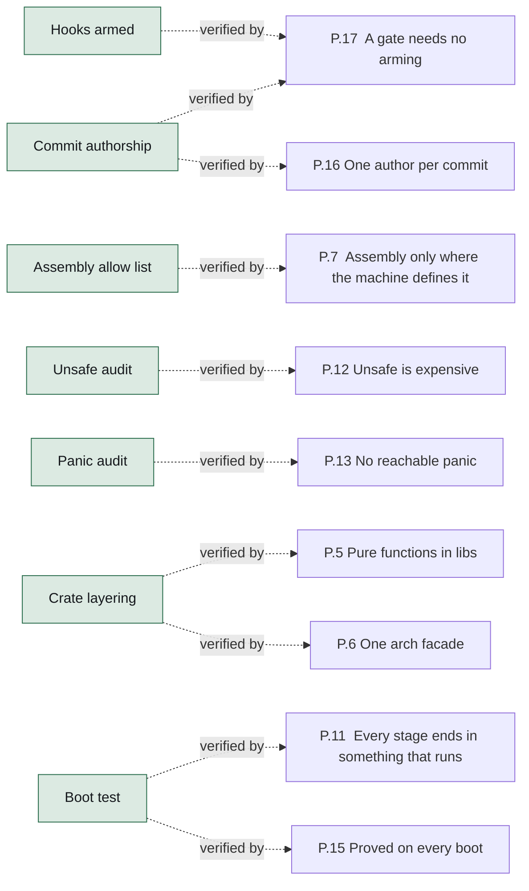

**Figure 18 — The gates and the rules they uphold.** Each gate, and the design rule it exists to enforce. A rule with no gate into it is a rule enforced by review. [SVG](diagrams/gates-and-rules.svg) Source: `11-assurance.sysml`.

| Gate | Command | Upholds | Note |
| --- | --- | --- | --- |
| `hooksArmed` | `python3 scripts/check-commit-authors.py --hooks` | `aGateNeedsNoArming` | The first gate in cargo xtask check: fails when this clone has not run `git config core.hooksPath .githooks`, so the missing line reports itself rather than waiting to be noticed. |
| `commitAuthorship` | `python3 scripts/check-commit-authors.py BASE HEAD` | `oneAuthorPerCommit` and `aGateNeedsNoArming` | The One-author-per-commit CI job, over the range a push or pull request adds and never the whole tree, so public history that already carries a trailer cannot make the gate permanent red. |
| `formatting` | `cargo fmt --all -- --check` | — |  |
| `lineEndings` | `python3 scripts/check-line-endings.py` | — | A CRLF in a shell script makes its shebang unparseable. |
| `assemblyAllowList` | `python3 scripts/check-asm-budget.py` | `assemblyOnlyWhereTheMachineDefinesIt` | Fails on an assembly site not in scripts/asm-allowlist.json, on a file over its budget, and on a stale entry. |
| `deviceAccessAllowList` | `python3 scripts/check-device-access.py` | — | The seam docs/ARCHITECTURE.md §7 is built on: the kernel enumerates devices and drives none, so a register access in the wrong file fails the build rather than waiting for a review. |
| `unsafeAudit` | `python3 scripts/check-unsafe-audit.py` | `unsafeIsExpensive` | Every unsafe block has a SAFETY comment and one operation; every unsafe fn a Safety section. |
| `panicAudit` | `python3 scripts/check-panic-audit.py` | `noReachablePanic` | Every panic-lint exemption is an #\[expect\] whose reason begins AUDIT:. expect fails once the lint stops firing, so a site refactored into safety loses its exemption. |
| `architectureDocument` | `python3 scripts/sysml/tests.py && python3 scripts/gen-arch-doc.py --check` | — | docs/generated is generated from this model and committed; a model edited without regenerating fails here. |
| `waylandProtocolTables` | `python3 scripts/gen-wayland-protocol.py --check` | — | The compositor's interface tables against the protocol XML vendored beside them. |
| `xkbTables` | `python3 scripts/gen-xkb-tables.py --check` | — | The keymap every client is handed, and its modifier bits, against libxkbcommon's own output through a committed probe. |
| `panicFont` | `python3 scripts/gen-font.py --check` | — | The panic screen's font against the BDF committed beside it. |
| `terminalFont` | `python3 scripts/gen-term-font.py --check` | — | The terminal's font, rasterised from the TrueType faces committed beside it by a rasteriser in the repository, so the result is byte-identical on every checkout. |
| `panicCatalog` | `python3 scripts/gen-panic-catalog.py --check` | — | The explanations a panic prints, rendered into a document that goes stale the moment an entry changes without it. |
| `crateLayering` | `scripts/check-crate-layering.sh` | `pureFunctionsInLibs` and `oneArchFacade` | libs/ depend on nothing above them; generic kernel code names no architecture; cfg(target_arch) only under arch/. |
| `clippy` | `cargo clippy -- -D warnings` | — | Ten runs: the host (libraries and xtask), and the kernel, the loader, and the native runtime with its programs for each of the three targets, because cfg(target_arch) code is invisible to a lint pass for another machine. |
| `hostTests` | `cargo test --workspace --exclude ferrix-kernel --exclude ferrix-boot` | — | 1950 unit tests across libs/ on 2026-09-23 (about 520 when this gate was first written down), plus doc tests and xtask's 242. |
| `cargoDeny` | `cargo deny check` | — |  |
| `docsBuild` | `cargo doc` | — | Broken intra-doc links are denied. |
| `miri` | `cargo miri test` | — | libs/elf, bootinfo, ustack, objects, vfs, pci, block, blkring, native, virtio-blk, frame, heap and paging. cargo xtask check --miri runs the same list, and an xtask test holds it to the workflow. |
| `fuzz` | `cargo fuzz run <target>, for every target cargo fuzz list names` | — | Replays the committed corpus first, searches second: an input that crashed once fails again in seconds. ustack_build asserts a round trip rather than the absence of a crash -- whatever the builder accepts, a walk that knows only the stack pointer must… |
| `buildImages` | `cargo xtask build --arch all --release` | — | One bootable FAT32 image per architecture, byte-for-byte reproducible, uploaded as a CI artifact. xtask refuses to build a kernel with RUSTFLAGS set, because cargo lets that variable replace the per-target flags and silently drop the linker script. |
| `bootTest` | `cargo xtask test-boot --arch all` | `everyStageEndsInSomethingThatRuns` and `provedOnEveryBoot` | The gate that answers the question the others cannot. |

23 gates, cheapest first.

### The assembly budget

An absolute cap, because assembly here is a fixed cost that a scheduler, a filesystem or a driver must add nothing to. The ratio is a backstop and the target is the direction of travel: reached by writing the operating system, not by shrinking the vector table. 303 lines and about 99.2% Rust when this was written, across fifteen sites; scripts/asm-allowlist.json now names nineteen, the x86-64 SYSCALL entry and the native runtime's three (docs/ASSEMBLY.md, A native program) having joined them.

| Site | Line budget |
| --- | ---: |
| `boot/src/arch/x86_64.rs` | 30 |
| `boot/src/arch/aarch64.rs` | 60 |
| `boot/src/arch/armv7a.rs` | 61 |
| `kernel/src/arch/x86_64/cpu.rs` | 100 |
| `kernel/src/arch/aarch64/cpu.rs` | 100 |
| `kernel/src/arch/armv7a/cpu.rs` | 100 |
| `kernel/src/arch/x86_64/trap.rs` | 90 |
| `kernel/src/arch/aarch64/trap.rs` | 90 |
| `kernel/src/arch/armv7a/trap.rs` | 90 |
| `kernel/src/arch/x86_64/smp.rs` | 40 |
| `kernel/src/arch/aarch64/smp.rs` | 30 |
| `kernel/src/arch/armv7a/smp.rs` | 40 |
| `kernel/src/arch/x86_64/switch.rs` | 30 |
| `kernel/src/arch/aarch64/switch.rs` | 30 |
| `kernel/src/arch/armv7a/switch.rs` | 30 |
| `kernel/src/arch/x86_64/syscall.rs` | 90 |
| `user/rt/src/arch/x86_64.rs` | 20 |
| `user/rt/src/arch/aarch64.rs` | 20 |
| `user/rt/src/arch/armv7a.rs` | 20 |

Total cap `800` lines; ratio backstop `0.06`, target `0.001`.

### What each layer's tests can reach

| Layer | Reached by | Note |
| --- | --- | --- |
| `libs/` | `CargoTest`, `Miri` and `Fuzzer` |  |
| `boot/` | `QemuBoot` |  |
| `kernel/` | `QemuBoot` | Miri cannot interpret a privileged instruction and a fuzzer cannot drive a page-fault handler, which is the whole argument for libs/. |
| `xtask/` | `CargoTest` |  |

### Verification later stages owe

- **`CyclicTest`  (stage 14)** — Wake-up latency on a HardRt domain while a Throughput domain on other cores is saturated; the maximum must be inside the stated bound.

### The boot tests

cargo xtask test-boot --arch \<a>: boot firmware, loader and kernel under QEMU and require FERRIX-BOOT-OK within the timeout. Every stage's exit criterion is a self-check in kmain and a line in this log. Under tcg by default; --accel auto uses the host's MMU and TLB, which is the only way a missing invalidation is reachable.

| Boot test | Architecture | Verifies |
| --- | --- | --- |
| `bootX86` | X86_64 | `stage1Boot`, `stage2Memory`, `stage3TrapsInterruptsTime`, `stage4Smp` and `stage5Scheduler` |
| `bootAArch64` | AArch64 | `stage1Boot`, `stage2Memory`, `stage3TrapsInterruptsTime`, `stage4Smp` and `stage5Scheduler` |
| `bootArmv7a` | Armv7a | `stage1Boot`, `stage2Memory`, `stage3TrapsInterruptsTime`, `stage4Smp`, `stage5Scheduler` and `armv7aPort` |

## Traceability

Every satisfy, allocate and verify edge the model draws, resolved against the element tree. A row whose target does not resolve is a broken reference and is marked.

```mermaid
flowchart LR
  n0_FerrixRoadmap_stage1Boot["S1  Stage 1 boot"]
  n1_FerrixStructure_Ferrix_loader["loader<br>ferrix.loader"]
  n2_FerrixRoadmap_stage2Memory["S2  Stage 2 memory"]
  n3_FerrixStructure_Kernel_mm["mm<br>ferrix.kernel.mm"]
  n4_FerrixStructure_Kernel_vmap["vmap<br>ferrix.kernel.vmap"]
  n5_FerrixRoadmap_stage3TrapsInterruptsTime["S3  Stage 3 traps interrupts time"]
  n6_FerrixStructure_Kernel_trap["trap<br>ferrix.kernel.trap"]
  n7_FerrixStructure_Kernel_irq["irq<br>ferrix.kernel.irq"]
  n8_FerrixStructure_Kernel_timer["timer<br>ferrix.kernel.timer"]
  n9_FerrixRoadmap_stage4Smp["S4  Stage 4 SMP"]
  n10_FerrixStructure_Kernel_smp["smp<br>ferrix.kernel.smp"]
  n11_FerrixRoadmap_armv7aPort["SA  ARMv7-A port"]
  n12_FerrixStructure_ferrixArmv7a["ferrixArmv7a"]
  n13_FerrixRoadmap_stage5Scheduler["S5  Stage 5 scheduler"]
  n14_FerrixStructure_Kernel_sched["sched<br>ferrix.kernel.sched"]
  n15_FerrixStructure_Kernel_tasks["tasks<br>ferrix.kernel.tasks"]
  n16_FerrixRoadmap_stage6UserMode["S6  Stage 6 user mode"]
  n17_FerrixStructure_Kernel_vm["vm<br>ferrix.kernel.vm"]
  n18_FerrixRoadmap_stage7LinuxAbi["S7  Stage 7 Linux ABI"]
  n19_FerrixStructure_Kernel_syscalls["syscalls<br>ferrix.kernel.syscalls"]
  n20_FerrixStructure_Kernel_signals["signals<br>ferrix.kernel.signals"]
  n21_FerrixStructure_Kernel_futex["futex<br>ferrix.kernel.futex"]
  n22_FerrixRoadmap_stage8Vfs["S8  Stage 8 VFS"]
  n23_FerrixStructure_Kernel_vfs["vfs<br>ferrix.kernel.vfs"]
  n24_FerrixStructure_Kernel_filesystems["filesystems<br>ferrix.kernel.filesystems"]
  n25_FerrixRoadmap_stage9NativeAbi["S9  Stage 9 native ABI"]
  n26_FerrixStructure_Kernel_native["native<br>ferrix.kernel.native"]
  n27_FerrixRoadmap_stage10UserspaceDrivers["S10  Stage 10 userspace drivers"]
  n28_FerrixStructure_Machine_devices["devices<br>ferrix.kernel.devices"]
  n29_FerrixStructure_Machine_iommu["iommu<br>ferrix.kernel.iommu"]
  n30_FerrixRoadmap_stage11BtrfsRead["S11  Stage 11 btrfs read"]
  n31_FerrixStructure_Kernel_blockCore["blockCore<br>ferrix.kernel.blockCore"]
  n32_FerrixRoadmap_stageNetworking["SN  Stage networking"]
  n33_FerrixStructure_Kernel_netCore["netCore<br>ferrix.kernel.netCore"]
  n34_FerrixRoadmap_stageDynamicLinking["SD  Stage dynamic linking"]
  n35_FerrixStructure_Ferrix_userland["userland<br>ferrix.userland"]
  n36_FerrixRoadmap_stage13Isolation["S13  Stage 13 isolation"]
  n37_FerrixStructure_Kernel_namespaces["namespaces<br>ferrix.kernel.namespaces"]
  n38_FerrixStructure_Kernel_cgroups["cgroups<br>ferrix.kernel.cgroups"]
  n39_FerrixStructure_Kernel_seccomp["seccomp<br>ferrix.kernel.seccomp"]
  n40_FerrixRoadmap_stage14RealTime["S14  Stage 14 real time"]
  n41_FerrixRoadmap_stage15Userland["S15  Stage 15 userland"]
  n42_FerrixRoadmap_stage16Rustc["S16  Stage 16 rustc"]
  n43_FerrixStructure_Userland_rustc["rustc<br>ferrix.userland.rustc"]
  n0_FerrixRoadmap_stage1Boot -. "satisfy" .-> n1_FerrixStructure_Ferrix_loader
  n2_FerrixRoadmap_stage2Memory -. "satisfy" .-> n3_FerrixStructure_Kernel_mm
  n2_FerrixRoadmap_stage2Memory -. "satisfy" .-> n4_FerrixStructure_Kernel_vmap
  n5_FerrixRoadmap_stage3TrapsInterruptsTime -. "satisfy" .-> n6_FerrixStructure_Kernel_trap
  n5_FerrixRoadmap_stage3TrapsInterruptsTime -. "satisfy" .-> n7_FerrixStructure_Kernel_irq
  n5_FerrixRoadmap_stage3TrapsInterruptsTime -. "satisfy" .-> n8_FerrixStructure_Kernel_timer
  n9_FerrixRoadmap_stage4Smp -. "satisfy" .-> n10_FerrixStructure_Kernel_smp
  n11_FerrixRoadmap_armv7aPort -. "satisfy" .-> n12_FerrixStructure_ferrixArmv7a
  n13_FerrixRoadmap_stage5Scheduler -. "satisfy" .-> n14_FerrixStructure_Kernel_sched
  n13_FerrixRoadmap_stage5Scheduler -. "satisfy" .-> n15_FerrixStructure_Kernel_tasks
  n16_FerrixRoadmap_stage6UserMode -. "allocate" .-> n17_FerrixStructure_Kernel_vm
  n18_FerrixRoadmap_stage7LinuxAbi -. "allocate" .-> n19_FerrixStructure_Kernel_syscalls
  n18_FerrixRoadmap_stage7LinuxAbi -. "allocate" .-> n20_FerrixStructure_Kernel_signals
  n18_FerrixRoadmap_stage7LinuxAbi -. "allocate" .-> n21_FerrixStructure_Kernel_futex
  n22_FerrixRoadmap_stage8Vfs -. "allocate" .-> n23_FerrixStructure_Kernel_vfs
  n22_FerrixRoadmap_stage8Vfs -. "allocate" .-> n24_FerrixStructure_Kernel_filesystems
  n25_FerrixRoadmap_stage9NativeAbi -. "allocate" .-> n26_FerrixStructure_Kernel_native
  n27_FerrixRoadmap_stage10UserspaceDrivers -. "allocate" .-> n28_FerrixStructure_Machine_devices
  n27_FerrixRoadmap_stage10UserspaceDrivers -. "allocate" .-> n29_FerrixStructure_Machine_iommu
  n30_FerrixRoadmap_stage11BtrfsRead -. "allocate" .-> n31_FerrixStructure_Kernel_blockCore
  n32_FerrixRoadmap_stageNetworking -. "allocate" .-> n33_FerrixStructure_Kernel_netCore
  n34_FerrixRoadmap_stageDynamicLinking -. "allocate" .-> n19_FerrixStructure_Kernel_syscalls
  n34_FerrixRoadmap_stageDynamicLinking -. "allocate" .-> n35_FerrixStructure_Ferrix_userland
  n36_FerrixRoadmap_stage13Isolation -. "allocate" .-> n37_FerrixStructure_Kernel_namespaces
  n36_FerrixRoadmap_stage13Isolation -. "allocate" .-> n38_FerrixStructure_Kernel_cgroups
  n36_FerrixRoadmap_stage13Isolation -. "allocate" .-> n39_FerrixStructure_Kernel_seccomp
  n40_FerrixRoadmap_stage14RealTime -. "allocate" .-> n14_FerrixStructure_Kernel_sched
  n41_FerrixRoadmap_stage15Userland -. "allocate" .-> n35_FerrixStructure_Ferrix_userland
  n42_FerrixRoadmap_stage16Rustc -. "allocate" .-> n43_FerrixStructure_Userland_rustc
  classDef implemented fill:#dceae2,stroke:#2c6e4e,color:#16191d
  classDef inProgress fill:#dae5f0,stroke:#2a5f8f,color:#16191d
  classDef planned fill:#e4e7ea,stroke:#6a737e,color:#16191d
  class n0_FerrixRoadmap_stage1Boot,n2_FerrixRoadmap_stage2Memory,n3_FerrixStructure_Kernel_mm,n4_FerrixStructure_Kernel_vmap,n5_FerrixRoadmap_stage3TrapsInterruptsTime,n6_FerrixStructure_Kernel_trap,n7_FerrixStructure_Kernel_irq,n8_FerrixStructure_Kernel_timer,n9_FerrixRoadmap_stage4Smp,n10_FerrixStructure_Kernel_smp,n11_FerrixRoadmap_armv7aPort,n13_FerrixRoadmap_stage5Scheduler,n14_FerrixStructure_Kernel_sched,n15_FerrixStructure_Kernel_tasks,n16_FerrixRoadmap_stage6UserMode,n17_FerrixStructure_Kernel_vm,n18_FerrixRoadmap_stage7LinuxAbi,n19_FerrixStructure_Kernel_syscalls,n20_FerrixStructure_Kernel_signals,n21_FerrixStructure_Kernel_futex,n22_FerrixRoadmap_stage8Vfs,n23_FerrixStructure_Kernel_vfs,n24_FerrixStructure_Kernel_filesystems,n25_FerrixRoadmap_stage9NativeAbi,n26_FerrixStructure_Kernel_native,n27_FerrixRoadmap_stage10UserspaceDrivers,n30_FerrixRoadmap_stage11BtrfsRead,n31_FerrixStructure_Kernel_blockCore,n32_FerrixRoadmap_stageNetworking,n33_FerrixStructure_Kernel_netCore,n34_FerrixRoadmap_stageDynamicLinking,n42_FerrixRoadmap_stage16Rustc,n43_FerrixStructure_Userland_rustc implemented
  class n35_FerrixStructure_Ferrix_userland,n36_FerrixRoadmap_stage13Isolation,n41_FerrixRoadmap_stage15Userland inProgress
  class n37_FerrixStructure_Kernel_namespaces,n38_FerrixStructure_Kernel_cgroups,n39_FerrixStructure_Kernel_seccomp,n40_FerrixRoadmap_stage14RealTime planned
```

**Figure 19 — Stages and the parts that answer them.** Each line carries the word the model wrote: `satisfy` where the part exists, `allocate` where it is one the stage still owes. [SVG](diagrams/stages-and-parts.svg) Source: `10-roadmap.sysml`.

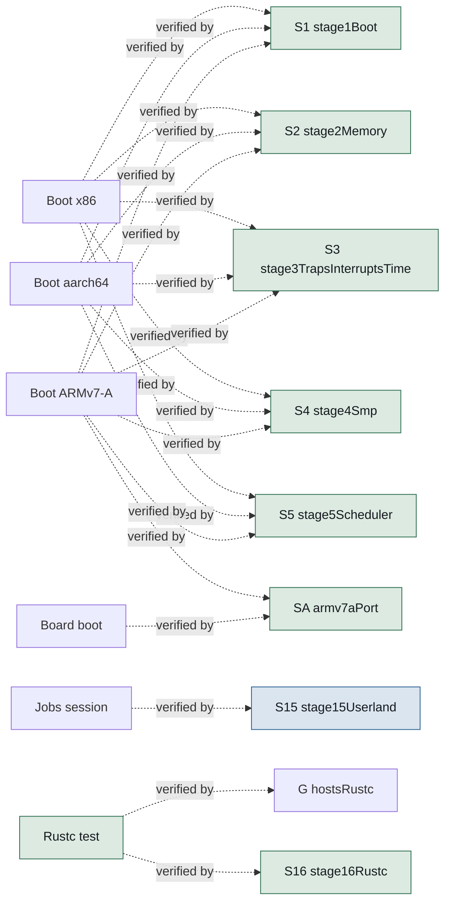

**Figure 20 — The boot tests and the stages they verify.** Each verification case, and every stage whose exit criterion it demonstrates on a boot. [SVG](diagrams/tests-and-stages.svg) Source: `10-roadmap.sysml`.

### Satisfied by

| Requirement | Element |
| --- | --- |
| `stage1Boot` | `ferrix.loader` |
| `stage2Memory` | `ferrix.kernel.mm` |
| `stage2Memory` | `ferrix.kernel.vmap` |
| `stage3TrapsInterruptsTime` | `ferrix.kernel.trap` |
| `stage3TrapsInterruptsTime` | `ferrix.kernel.irq` |
| `stage3TrapsInterruptsTime` | `ferrix.kernel.timer` |
| `stage4Smp` | `ferrix.kernel.smp` |
| `armv7aPort` | `ferrixArmv7a` |
| `stage5Scheduler` | `ferrix.kernel.sched` |
| `stage5Scheduler` | `ferrix.kernel.tasks` |

10 edges — each reads “requirement is satisfied by element”.

### Allocated to

| Requirement | Element |
| --- | --- |
| `stage6UserMode` | `ferrix.kernel.vm` |
| `stage7LinuxAbi` | `ferrix.kernel.syscalls` |
| `stage7LinuxAbi` | `ferrix.kernel.signals` |
| `stage7LinuxAbi` | `ferrix.kernel.futex` |
| `stage8Vfs` | `ferrix.kernel.vfs` |
| `stage8Vfs` | `ferrix.kernel.filesystems` |
| `stage9NativeAbi` | `ferrix.kernel.native` |
| `stage10UserspaceDrivers` | `ferrix.kernel.devices` |
| `stage10UserspaceDrivers` | `ferrix.kernel.iommu` |
| `stage11BtrfsRead` | `ferrix.kernel.blockCore` |
| `stageNetworking` | `ferrix.kernel.netCore` |
| `stageDynamicLinking` | `ferrix.kernel.syscalls` |
| `stageDynamicLinking` | `ferrix.userland` |
| `stage13Isolation` | `ferrix.kernel.namespaces` |
| `stage13Isolation` | `ferrix.kernel.cgroups` |
| `stage13Isolation` | `ferrix.kernel.seccomp` |
| `stage14RealTime` | `ferrix.kernel.sched` |
| `stage15Userland` | `ferrix.userland` |
| `stage16Rustc` | `ferrix.userland.rustc` |

19 edges — each reads “requirement is allocated to element”.

### Verified by

| Requirement | Element |
| --- | --- |
| `stage1Boot` | `FerrixRoadmap::bootX86` |
| `stage2Memory` | `FerrixRoadmap::bootX86` |
| `stage3TrapsInterruptsTime` | `FerrixRoadmap::bootX86` |
| `stage4Smp` | `FerrixRoadmap::bootX86` |
| `stage5Scheduler` | `FerrixRoadmap::bootX86` |
| `stage1Boot` | `FerrixRoadmap::bootAArch64` |
| `stage2Memory` | `FerrixRoadmap::bootAArch64` |
| `stage3TrapsInterruptsTime` | `FerrixRoadmap::bootAArch64` |
| `stage4Smp` | `FerrixRoadmap::bootAArch64` |
| `stage5Scheduler` | `FerrixRoadmap::bootAArch64` |
| `stage1Boot` | `FerrixRoadmap::bootArmv7a` |
| `stage2Memory` | `FerrixRoadmap::bootArmv7a` |
| `stage3TrapsInterruptsTime` | `FerrixRoadmap::bootArmv7a` |
| `stage4Smp` | `FerrixRoadmap::bootArmv7a` |
| `stage5Scheduler` | `FerrixRoadmap::bootArmv7a` |
| `armv7aPort` | `FerrixRoadmap::bootArmv7a` |
| `armv7aPort` | `FerrixRoadmap::BoardBoot` |
| `stage15Userland` | `FerrixRoadmap::JobsSession` |
| `hostsRustc` | `FerrixRoadmap::RustcTest` |
| `stage16Rustc` | `FerrixRoadmap::RustcTest` |
| `aGateNeedsNoArming` | `FerrixAssurance::hooksArmed` |
| `oneAuthorPerCommit` | `FerrixAssurance::commitAuthorship` |
| `aGateNeedsNoArming` | `FerrixAssurance::commitAuthorship` |
| `assemblyOnlyWhereTheMachineDefinesIt` | `FerrixAssurance::assemblyAllowList` |
| `unsafeIsExpensive` | `FerrixAssurance::unsafeAudit` |
| `noReachablePanic` | `FerrixAssurance::panicAudit` |
| `pureFunctionsInLibs` | `FerrixAssurance::crateLayering` |
| `oneArchFacade` | `FerrixAssurance::crateLayering` |
| `everyStageEndsInSomethingThatRuns` | `FerrixAssurance::bootTest` |
| `provedOnEveryBoot` | `FerrixAssurance::bootTest` |

30 edges — each reads “requirement is verified by element”.

### Coverage

| Id | Requirement | Traced by | Verified | Maturity |
| --- | --- | --- | --- | --- |
| `G` | `hostsRustc` | `dependency` | yes | — |
| `G.1` | `kernelThreads` | `dependency` | — | — |
| `G.2` | `addressSpaceScale` | `dependency` | — | — |
| `G.3` | `signalDelivery` | `dependency` | — | — |
| `G.4` | `processSpawn` | `dependency` | — | — |
| `G.5` | `syscallSurface` | `dependency` | — | — |
| `G.6` | `procfs` | `dependency` | — | — |
| `G.7` | `durableFilesystem` | `dependency` | — | — |
| `G.8` | `memoryPressure` | `dependency` | — | — |
| `G+` | `selfHosting` | — | — | — |
| `P.1` | `linuxIsTheNativeAbi` | — | — | — |
| `P.2` | `monolithicCoreCapabilitySeams` | — | — | — |
| `P.3` | `oneInKernelDevice` | — | — | — |
| `P.4` | `nothingStubbed` | — | — | — |
| `P.5` | `pureFunctionsInLibs` | — | yes | — |
| `P.6` | `oneArchFacade` | — | yes | — |
| `P.7` | `assemblyOnlyWhereTheMachineDefinesIt` | — | yes | — |
| `P.8` | `oneLayoutPerAddressWidth` | — | — | — |
| `P.9` | `namespacesDesignedIn` | — | — | — |
| `P.10` | `iommuIsNotOptional` | — | — | — |
| `P.11` | `everyStageEndsInSomethingThatRuns` | — | yes | — |
| `P.12` | `unsafeIsExpensive` | — | yes | — |
| `P.13` | `noReachablePanic` | — | yes | — |
| `P.14` | `overflowChecksInRelease` | — | — | — |
| `P.15` | `provedOnEveryBoot` | — | yes | — |
| `P.16` | `oneAuthorPerCommit` | — | yes | — |
| `P.17` | `aGateNeedsNoArming` | — | yes | — |
| `N.1` | `noCertifiedWcet` | — | — | — |
| `N.2` | `noRaid56` | — | — | — |
| `N.3` | `noAml` | — | — | — |
| `S0` | `stage0Foundation` | `dependency` | — | `#implemented` |
| `S1` | `stage1Boot` | `dependency` and `satisfy` | yes | `#implemented` |
| `S2` | `stage2Memory` | `dependency` and `satisfy` | yes | `#implemented` |
| `S3` | `stage3TrapsInterruptsTime` | `dependency` and `satisfy` | yes | `#implemented` |
| `S4` | `stage4Smp` | `dependency` and `satisfy` | yes | `#implemented` |
| `SA` | `armv7aPort` | `satisfy` | yes | `#implemented` |
| `S5` | `stage5Scheduler` | `dependency` and `satisfy` | yes | `#implemented` |
| `S6` | `stage6UserMode` | `allocate` and `dependency` | — | `#implemented` |
| `S7` | `stage7LinuxAbi` | `allocate` and `dependency` | — | `#implemented` |
| `S8` | `stage8Vfs` | `allocate` and `dependency` | — | `#implemented` |
| `S9` | `stage9NativeAbi` | `allocate` and `dependency` | — | `#implemented` |
| `S10` | `stage10UserspaceDrivers` | `allocate` and `dependency` | — | `#implemented` |
| `S11` | `stage11BtrfsRead` | `allocate` and `dependency` | — | `#implemented` |
| `SN` | `stageNetworking` | `allocate` and `dependency` | — | `#implemented` |
| `SD` | `stageDynamicLinking` | `allocate` and `dependency` | — | `#implemented` |
| `S12` | `stage12BtrfsWrite` | `dependency` | — | `#implemented` |
| `S13` | `stage13Isolation` | `allocate` and `dependency` | — | `#inProgress` |
| `S14` | `stage14RealTime` | `allocate` and `dependency` | — | `#planned` |
| `S15` | `stage15Userland` | `allocate` and `dependency` | yes | `#inProgress` |
| `S16` | `stage16Rustc` | `allocate` and `dependency` | yes | `#implemented` |
| `S17` | `stage17DisplayAndInput` | `dependency` | — | `#implemented` |
| `S18` | `stage18Compositor` | `dependency` | — | `#implemented` |
| `S19` | `stage19HyprlandFidelity` | `dependency` | — | `#inProgress` |
| `S21` | `stage21BareMetalGpu` | — | — | `#planned` |
| `S22` | `stage22Steam` | — | — | `#planned` |
| `S20` | `stage20SelfHosting` | — | — | `#inProgress` |
| `D.fuzz` | `fuzzTargetsOwed` | — | — | `#planned` |
| `D.miri` | `miriOwed` | — | — | `#planned` |

A design rule is upheld by a gate rather than allocated to a part, so the P and N families are expected to be verified but untraced. A goal requirement is traced by the dependency the stage that discharges it draws.

## Deferred register

Work a finished stage explicitly left behind, each with the reason that stage gave. Deferred is not planned: the stage that owns it is closed, and the item waits for a machine, a workload or a later stage to make it meaningful.

| Item | Recorded against | Stage | Reason |
| --- | --- | ---: | --- |
| `tscDeadline` | `FerrixStructure::X86_64Arch` | — | Replaces the LAPIC countdown with a comparator against the TSC; the calibration exists. Waits for a tickless scheduler to want it. |
| `x2apic` | `FerrixStructure::X86_64Arch` | — | APIC IDs above 255 are refused with a message; QEMU's are 0 to 3. |
| `amdVi` | `FerrixStructure::X86_64Arch` | — | Nothing reads an IVRS table or drives an AMD IOMMU, so on such a machine DMA would not be translated. Left after stage 10's exit: none of it was on the path to rustc. |
| `gicv3` | `FerrixStructure::AArch64Arch` | — | gic::init refuses anything that is not a GICv2; QEMU virt gives GICv2 unless asked, so this needs a second boot-test configuration as much as code. |
| `parking` | `FerrixStructure::AArch64Arch` | — | For firmware without PSCI. Refused, not guessed at. |
| `boardDeferred` | `FerrixStructure::Armv7aArch` | — | The ED1 and EV1 have 1 GiB, whose identity range lands on the direct map; Layout::plan_identity_map refuses rather than guesses, so they need a trampoline page not yet written. |
| `highRam` | `FerrixStructure::Armv7aArch` | — | RAM beyond the 1.25 GiB direct map: a machine with it boots and reports the excess unused. RAM above the 2 GiB split, which the board's DDR at 3 GiB needs, works since 9ae0180f. |
| `thumb2` | `FerrixStructure::Armv7aArch` | — | ARM code generation only, as docs/arm32.md argues. |
| `vfp` | `FerrixStructure::Armv7aArch` | — | Soft float; a UEFI application may not assume firmware enabled the VFP. |
| `smmu` | `FerrixStructure::Armv7aArch` | — | The device tree's SMMUv3 is found and left alone: U-Boot's virtio-pci driver resets when a device offers VIRTIO_F_ACCESS_PLATFORM, so the machine's virtio devices would bypass it anyway, and stage 10's exit runs ARMv7-A in degraded trusted mode, as decided. |
| `perCpuCaches` | `FerrixMemory::PhysicalMemory` | — | Each allocator is one lock, which is correct; the per-CPU magazines are a performance change waiting for a workload that can measure them. |
| `offlining` | `FerrixScheduling::Smp` | — | Nothing takes a processor offline; records and stacks live for the life of the machine. |
| `perCpuCaches` | `FerrixRoadmap::stage2Memory` | — | Needs a workload that can measure them; the per-CPU area exists since stage 4. |
| `gicv3` | `FerrixRoadmap::stage3TrapsInterruptsTime` | — | Refused rather than guessed; needs a second boot-test configuration. |
| `tscDeadline` | `FerrixRoadmap::stage3TrapsInterruptsTime` | — | Calibration exists; waits for a tickless scheduler. |
| `x2apic` | `FerrixRoadmap::stage4Smp` | — | APIC IDs above 255 refused; QEMU's are 0 to 3. |
| `psciParking` | `FerrixRoadmap::stage4Smp` | — | Refused, not guessed at. |
| `cpuOffline` | `FerrixRoadmap::stage4Smp` | — | Nothing takes a processor offline. |
| `ed1Ev1Boards` | `FerrixRoadmap::armv7aPort` | — | 1 GiB boards put RAM's identity range on the direct map; plan_identity_map refuses, so they need a trampoline page. |
| `hardwareBootTest` | `FerrixRoadmap::armv7aPort` | — | Automated hardware boot testing beyond watch-serial. |

20 records. The model writes most of them twice — once against the stage that closed, once against the part that lacks them — so the register reads from either end.

## Index by stage

Every element carrying @stage, which names the roadmap stage that owns it. An element with no stage is cross-cutting and does not appear here.

| Stage | Element | Kind | Maturity |
| ---: | --- | --- | --- |
| 1 | `FerrixStructure::Loader` | part | `#implemented` |
| 1 | `FerrixBoot::BootInfo` | item | `#implemented` |
| 1 | `FerrixBoot::LoaderSequence` | action | `#implemented` |
| 1 | `FerrixBoot::EarlyMemory` | part | `#implemented` |
| 1 | `FerrixBoot::Stage1SelfCheck` | action | `#implemented` |
| 1 | `FerrixMemory::Mapper` | part | `#implemented` |
| 1 | `FerrixDrivers::FdtAccess` | part | `#implemented` |
| 2 | `FerrixBoot::Stage2SelfCheck` | action | `#implemented` |
| 2 | `FerrixBoot::FinishMemory` | action | `#implemented` |
| 2 | `FerrixMemory::FrameAllocator` | part | `#implemented` |
| 2 | `FerrixMemory::PhysicalMemory` | part | `#implemented` |
| 2 | `FerrixMemory::KernelHeap` | part | `#implemented` |
| 2 | `FerrixMemory::KernelPageTables` | part | `#implemented` |
| 2 | `FerrixMemory::VmapArena` | part | `#implemented` |
| 3 | `FerrixBoot::Stage3TrapCheck` | action | `#implemented` |
| 3 | `FerrixBoot::Stage3TimerCheck` | action | `#implemented` |
| 3 | `FerrixBoot::TrapDispatch` | part | `#implemented` |
| 3 | `FerrixScheduling::IrqTable` | part | `#implemented` |
| 3 | `FerrixScheduling::Timer` | part | `#implemented` |
| 3 | `FerrixDrivers::AcpiAccess` | part | `#implemented` |
| 3 | `FerrixDrivers::MmioWindows` | part | `#implemented` |
| 4 | `FerrixBoot::Stage4BringUp` | action | `#implemented` |
| 4 | `FerrixScheduling::TicketSpinLock` | part | `#implemented` |
| 4 | `FerrixScheduling::PerCpu` | part | `#implemented` |
| 4 | `FerrixScheduling::Smp` | part | `#implemented` |
| 5 | `FerrixStructure::Workspace::sched` | part | `#implemented` |
| 5 | `FerrixBoot::Stage5SchedulerCheck` | action | `#implemented` |
| 5 | `FerrixMemory::KernelHeap::objectSlabs` | part | `#planned` |
| 5 | `FerrixScheduling::PerCpu::runqueue` | part | `#implemented` |
| 5 | `FerrixScheduling::Task` | part | `#implemented` |
| 5 | `FerrixScheduling::Tasks` | part | `#implemented` |
| 5 | `FerrixScheduling::WaitQueue` | part | `#implemented` |
| 5 | `FerrixScheduling::Runqueue` | part | `#implemented` |
| 5 | `FerrixScheduling::EevdfRunQueue` | part | `#implemented` |
| 5 | `FerrixScheduling::LoadAverage` | part | `#implemented` |
| 5 | `FerrixScheduling::Placement` | part | `#implemented` |
| 5 | `FerrixScheduling::Balancing` | part | `#implemented` |
| 5 | `FerrixScheduling::SchedulingDomain` | part | `#implemented` |
| 5 | `FerrixScheduling::Scheduler` | part | `#implemented` |
| 5 | `FerrixObjects::TaskObject` | part | `#planned` |
| 6 | `FerrixStructure::UserProcess` | part | `#implemented` |
| 6 | `FerrixStructure::ArchFacade::prepareUserRoot` | action | — |
| 6 | `FerrixStructure::ArchFacade::installUserRoot` | action | — |
| 6 | `FerrixStructure::ArchFacade::uninstallUserRoot` | action | — |
| 6 | `FerrixStructure::ArchFacade::enterUser` | action | `#implemented` |
| 6 | `FerrixStructure::ArchFacade::systemCall` | action | `#implemented` |
| 6 | `FerrixStructure::ArchFacade::syscallEntry` | action | `#implemented` |
| 6 | `FerrixBoot::KernelBringUp::stage6MemoryObjects` | action | — |
| 6 | `FerrixBoot::KernelBringUp::stage6ReverseMap` | action | — |
| 6 | `FerrixMemory::PageEntry::owner` | attribute | `#planned` |
| 6 | `FerrixMemory::PageEntry::flags` | attribute | `#planned` |
| 6 | `FerrixMemory::VmaMap` | part | `#implemented` |
| 6 | `FerrixMemory::Vmo` | part | `#implemented` |
| 6 | `FerrixMemory::ProcessAddressSpace` | part | `#implemented` |
| 6 | `FerrixMemory::ProcessAddressSpace::invalidate` | action | — |
| 6 | `FerrixMemory::ProcessAddressSpace::install` | action | — |
| 6 | `FerrixMemory::ProcessAddressSpace::forkSpace` | action | — |
| 6 | `FerrixMemory::DemandFault` | action | `#implemented` |
| 6 | `FerrixMemory::DemandFault::copyOnWrite` | action | — |
| 6 | `FerrixMemory::VirtualMemory` | part | `#implemented` |
| 6 | `FerrixMemory::UserElfLoader` | part | `#implemented` |
| 6 | `FerrixScheduling::Task::addressSpace` | part | — |
| 6 | `FerrixScheduling::Tasks::spawnInAddressSpace` | action | — |
| 6 | `FerrixScheduling::Tasks::swapAddressSpace` | action | — |
| 6 | `FerrixObjects::Process` | part | `#implemented` |
| 6 | `FerrixAssurance::AssemblyBudget::syscallEntrySites` | attribute | `#implemented` |
| 7 | `FerrixStructure::Workspace::linuxAbi` | part | `#implemented` |
| 7 | `FerrixStructure::Workspace::ustack` | part | `#implemented` |
| 7 | `FerrixBoot::KernelBringUp::stage7Syscalls` | action | — |
| 7 | `FerrixBoot::Dispatch::systemCall` | action | — |
| 7 | `FerrixMemory::ProcessAddressSpace::mmap` | action | `#implemented` |
| 7 | `FerrixMemory::ProcessAddressSpace::mprotect` | action | `#implemented` |
| 7 | `FerrixMemory::ProcessAddressSpace::brk` | action | `#implemented` |
| 7 | `FerrixMemory::DemandFault::deliverSigsegv` | action | `#implemented` |
| 7 | `FerrixScheduling::Task::policy` | attribute | `#planned` |
| 7 | `FerrixScheduling::Scheduler::setScheduler` | action | `#inProgress` |
| 7 | `FerrixScheduling::Futex` | part | `#implemented` |
| 7 | `FerrixObjects::Clone` | action | `#implemented` |
| 7 | `FerrixObjects::LinuxSyscallLayer` | part | `#implemented` |
| 7 | `FerrixObjects::Signals` | part | `#implemented` |
| 7 | `FerrixIsolation::Credentials` | attribute | `#implemented` |
| 7 | `FerrixAssurance::ShellTest` | verification | `#implemented` |
| 7 | `FerrixAssurance::ThreadsTest` | verification | `#implemented` |
| 8 | `FerrixStructure::Initramfs` | part | `#implemented` |
| 8 | `FerrixStructure::Workspace::cpio` | part | `#implemented` |
| 8 | `FerrixStructure::Workspace::vfs` | part | `#implemented` |
| 8 | `FerrixStructure::Workspace::procfs` | part | `#implemented` |
| 8 | `FerrixBoot::KernelBringUp::stage8RootFilesystem` | action | — |
| 8 | `FerrixBoot::KernelBringUp::stage8PathCalls` | action | — |
| 8 | `FerrixMemory::Vmo::fileFill` | action | `#implemented` |
| 8 | `FerrixMemory::DemandFault::pageCacheFill` | action | `#implemented` |
| 8 | `FerrixStorage::Inode` | part | `#implemented` |
| 8 | `FerrixStorage::Dentry` | part | `#implemented` |
| 8 | `FerrixStorage::Mount` | part | `#implemented` |
| 8 | `FerrixStorage::Vfs` | part | `#implemented` |
| 8 | `FerrixStorage::PageCache` | part | `#implemented` |
| 8 | `FerrixStorage::Tmpfs` | part | `#implemented` |
| 8 | `FerrixStorage::Devfs` | part | `#implemented` |
| 8 | `FerrixStorage::Procfs` | part | `#implemented` |
| 8 | `FerrixStorage::InitramfsUnpack` | part | `#implemented` |
| 8 | `FerrixAssurance::VfsTest` | verification | `#implemented` |
| 9 | `FerrixStructure::Workspace::nativeAbi` | part | `#implemented` |
| 9 | `FerrixStructure::Workspace::objects` | part | `#implemented` |
| 9 | `FerrixBoot::KernelBringUp::stage9NativeObjects` | action | — |
| 9 | `FerrixBoot::KernelBringUp::stage9DeviceObjects` | action | — |
| 9 | `FerrixObjects::KernelObject` | part | `#implemented` |
| 9 | `FerrixObjects::HandleTable` | part | `#implemented` |
| 9 | `FerrixObjects::NativeAbi` | part | `#implemented` |
| 10 | `FerrixStructure::ArchFacade::iommu` | part | `#implemented` |
| 10 | `FerrixStructure::X86_64Arch::vtd` | part | `#implemented` |
| 10 | `FerrixStructure::AArch64Arch::smmu` | part | `#implemented` |
| 10 | `FerrixStructure::Workspace::virtio` | part | `#implemented` |
| 10 | `FerrixStructure::Workspace::virtioNet` | part | `#implemented` |
| 10 | `FerrixStructure::Workspace::pci` | part | `#implemented` |
| 10 | `FerrixStructure::Workspace::blkRing` | part | `#implemented` |
| 10 | `FerrixStructure::Workspace::blkServe` | part | `#implemented` |
| 10 | `FerrixStructure::Workspace::virtioBlk` | part | `#implemented` |
| 10 | `FerrixStructure::Workspace::devmgrProto` | part | `#implemented` |
| 10 | `FerrixBoot::KernelBringUp::stage10Devices` | action | — |
| 10 | `FerrixBoot::KernelBringUp::stage10Drivers` | action | — |
| 10 | `FerrixDrivers::DeviceNode` | part | `#implemented` |
| 10 | `FerrixDrivers::DeviceEnumeration` | part | `#implemented` |
| 10 | `FerrixDrivers::IommuDomain` | part | `#implemented` |
| 10 | `FerrixDrivers::IommuDomains` | part | `#implemented` |
| 10 | `FerrixDrivers::DriverProcess` | part | `#implemented` |
| 10 | `FerrixDrivers::SharedRing` | part | `#implemented` |
| 10 | `FerrixDrivers::DevMgr` | part | `#implemented` |
| 10 | `FerrixDrivers::VirtioBlkDriver` | part | `#implemented` |
| 10 | `FerrixDrivers::DriverBootstrap` | action | `#implemented` |
| 10 | `FerrixAssurance::RestartTest` | verification | `#implemented` |
| 11 | `FerrixStructure::Workspace::btrfs` | part | `#implemented` |
| 11 | `FerrixStructure::Workspace::btrfsVfs` | part | `#implemented` |
| 11 | `FerrixStructure::Workspace::blockQueue` | part | `#implemented` |
| 11 | `FerrixBoot::KernelBringUp::stage11BtrfsRead` | action | — |
| 11 | `FerrixStorage::BlockCore` | part | `#implemented` |
| 11 | `FerrixStorage::BtrfsParsing` | part | `#implemented` |
| 11 | `FerrixStorage::Btrfs` | part | `#implemented` |
| 11 | `FerrixStorage::BtrfsRead` | part | `#implemented` |
| 12 | `FerrixStructure::Workspace::btrfsWrite` | part | `#implemented` |
| 12 | `FerrixBoot::KernelBringUp::stage12BtrfsWrite` | action | — |
| 12 | `FerrixStorage::BtrfsWrite` | part | `#implemented` |
| 12 | `FerrixAssurance::BtrfsCheck` | verification | `#implemented` |
| 12 | `FerrixAssurance::PowerFailInjection` | verification | `#implemented` |
| 13 | `FerrixStructure::Workspace::seccompBpf` | part | `#planned` |
| 13 | `FerrixMemory::Reclaim` | part | `#planned` |
| 13 | `FerrixObjects::LinuxSyscallLayer::seccompCheck` | action | `#planned` |
| 13 | `FerrixIsolation::Namespace` | part | `#planned` |
| 13 | `FerrixIsolation::NsSet` | part | `#planned` |
| 13 | `FerrixIsolation::Namespaces` | part | `#planned` |
| 13 | `FerrixIsolation::Cgroup` | part | `#planned` |
| 13 | `FerrixIsolation::Cgroups` | part | `#planned` |
| 13 | `FerrixIsolation::Seccomp` | part | `#planned` |
| 13 | `FerrixIsolation::ClassicBpfInterpreter` | part | `#planned` |
| 13 | `FerrixStorage::Cgroupfs` | part | `#planned` |
| 14 | `FerrixScheduling::Task::schedClass` | attribute | `#planned` |
| 14 | `FerrixScheduling::Task::priority` | attribute | `#planned` |
| 14 | `FerrixScheduling::Task::bandwidth` | attribute | `#planned` |
| 14 | `FerrixScheduling::DomainLifecycle` | state | `#planned` |
| 14 | `FerrixScheduling::Scheduler::fifoRr` | part | `#planned` |
| 14 | `FerrixScheduling::Scheduler::edf` | part | `#planned` |
| 14 | `FerrixScheduling::Scheduler::switchDomainMode` | action | `#planned` |
| 14 | `FerrixAssurance::CyclicTest` | verification | `#planned` |
| 15 | `FerrixStructure::Userland::init` | part | `#planned` |
| 15 | `FerrixObjects::PosixIpc` | part | `#implemented` |
| 17 | `FerrixStructure::Workspace::virtioGpu` | part | `#implemented` |
| 17 | `FerrixStructure::Workspace::virtioInput` | part | `#implemented` |
| 17 | `FerrixStructure::Workspace::displayctl` | part | `#implemented` |
| 17 | `FerrixStructure::Workspace::inputctl` | part | `#implemented` |
| 17 | `FerrixDrivers::VirtioGpuDriver` | part | `#implemented` |
| 17 | `FerrixDrivers::VirtioInputDriver` | part | `#implemented` |
| 17 | `FerrixDrivers::UsbHidDriver` | part | `#implemented` |
| 17 | `FerrixAssurance::DisplayTest` | verification | `#implemented` |
| 17 | `FerrixAssurance::InputTest` | verification | `#implemented` |
| 17 | `FerrixAssurance::SeatTest` | verification | `#implemented` |
| 18 | `FerrixAssurance::CompositorTest` | verification | `#implemented` |
| 18 | `FerrixAssurance::PtyTest` | verification | `#implemented` |
| 19 | `FerrixStructure::Workspace::renderctl` | part | `#implemented` |
| 19 | `FerrixAssurance::VideoTest` | verification | `#implemented` |

178 elements across 18 stages.

## Figures

Every diagram in this document, drawn from the model by scripts/sysml/diagrams.py. Each is also written as a standalone SVG beside this file, so it can be opened, zoomed or embedded on its own.

| No. | Figure | Shows | Model file | File |
| ---: | --- | --- | --- | --- |
| 1 | Hosts rustc | 15 nodes, 16 edges | `01-requirements.sysml` | [goal-decomposition.svg](diagrams/goal-decomposition.svg) |
| 2 | The pieces and the ports between them | 5 nodes, 3 edges | `02-structure.sysml` | [interfaces.svg](diagrams/interfaces.svg) |
| 3 | Loader and its parts | 5 nodes, 4 edges | `02-structure.sysml` | [ferrix-structure-loader.svg](diagrams/ferrix-structure-loader.svg) |
| 4 | Kernel and its parts | 31 nodes, 30 edges | `02-structure.sysml` | [ferrix-structure-kernel.svg](diagrams/ferrix-structure-kernel.svg) |
| 5 | Arch facade and its subtypes | 5 nodes, 4 edges | `02-structure.sysml` | [ferrix-structure-arch-facade.svg](diagrams/ferrix-structure-arch-facade.svg) |
| 6 | Loader sequence | 12 nodes, 11 edges | `03-boot.sysml` | [ferrix-boot-loader-sequence.svg](diagrams/ferrix-boot-loader-sequence.svg) |
| 7 | Kernel bring up | 34 nodes, 33 edges | `03-boot.sysml` | [ferrix-boot-kernel-bring-up.svg](diagrams/ferrix-boot-kernel-bring-up.svg) |
| 8 | Dispatch | 7 nodes, 6 edges | `03-boot.sysml` | [ferrix-boot-dispatch.svg](diagrams/ferrix-boot-dispatch.svg) |
| 9 | Handle page fault | 5 nodes, 5 edges | `03-boot.sysml` | [ferrix-boot-handle-page-fault.svg](diagrams/ferrix-boot-handle-page-fault.svg) |
| 10 | Demand fault | 5 nodes, 4 edges | `04-memory.sysml` | [ferrix-memory-demand-fault.svg](diagrams/ferrix-memory-demand-fault.svg) |
| 11 | Domain lifecycle | 5 nodes, 5 edges | `05-scheduling.sysml` | [ferrix-scheduling-domain-lifecycle.svg](diagrams/ferrix-scheduling-domain-lifecycle.svg) |
| 12 | Kernel object and its subtypes | 10 nodes, 9 edges | `06-objects.sysml` | [ferrix-objects-kernel-object.svg](diagrams/ferrix-objects-kernel-object.svg) |
| 13 | Driver process and its subtypes | 6 nodes, 5 edges | `08-drivers.sysml` | [ferrix-drivers-driver-process.svg](diagrams/ferrix-drivers-driver-process.svg) |
| 14 | Driver bootstrap | 8 nodes, 7 edges | `08-drivers.sysml` | [ferrix-drivers-driver-bootstrap.svg](diagrams/ferrix-drivers-driver-bootstrap.svg) |
| 15 | Filesystem and its subtypes | 7 nodes, 6 edges | `09-storage.sysml` | [ferrix-storage-filesystem.svg](diagrams/ferrix-storage-filesystem.svg) |
| 16 | The crate graph | 50 nodes, 107 edges | `02-structure.sysml` | [crate-dependencies.svg](diagrams/crate-dependencies.svg) |
| 17 | The roadmap, stage by stage | 26 nodes, 34 edges | `10-roadmap.sysml` | [roadmap-stages.svg](diagrams/roadmap-stages.svg) |
| 18 | The gates and the rules they uphold | 16 nodes, 10 edges | `11-assurance.sysml` | [gates-and-rules.svg](diagrams/gates-and-rules.svg) |
| 19 | Stages and the parts that answer them | 44 nodes, 29 edges | `10-roadmap.sysml` | [stages-and-parts.svg](diagrams/stages-and-parts.svg) |
| 20 | The boot tests and the stages they verify | 15 nodes, 20 edges | `10-roadmap.sysml` | [tests-and-stages.svg](diagrams/tests-and-stages.svg) |

20 figures.
