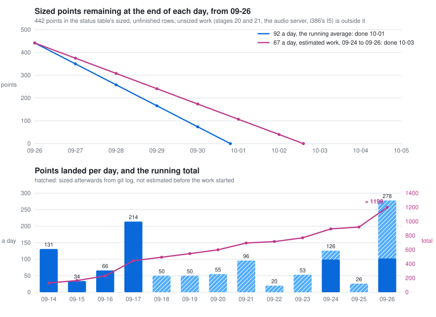
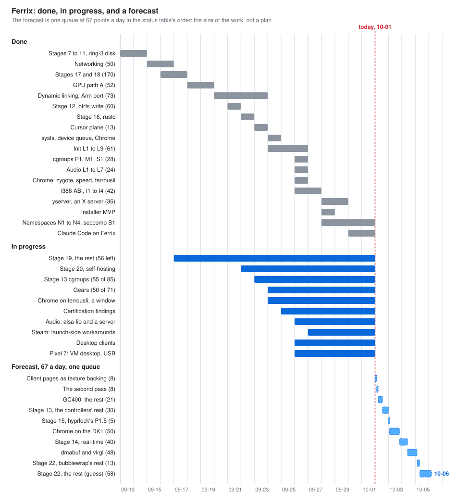

# Ferrix — roadmap

`docs/ARCHITECTURE.md` says what is being built. This says in what order, and
how each stage knows it is finished.

Two rules govern the ordering:

1. **Every stage ends in something that runs.** Not "the VM subsystem
   compiles" — a QEMU boot that demonstrates the new capability and stays in CI
   forever after. A stage with no observable exit criterion is a stage nobody
   can tell is broken.
2. **Nothing is stubbed that a later stage has to unpick.** A fixed-size process
   table, an in-memory-only filesystem or a cooperative scheduler would each
   save a week now and cost a rewrite later, because the goal at the end needs
   the real version of all three.

Sizes are order-of-magnitude, in the sense of "a weekend / a week / a month /
longer". This is a long program of work: stages 1–8 are a conventional kernel
bring-up, 9–14 are the parts this design chose to do properly, 15–16 are the
goal, and 17–19 are the goal after it: a Hyprland-shaped Wayland compositor,
written in Rust, running on Ferrix (decided 2026-09-13). From that date
sizes for new work are story points, measured into time only after the fact
-- and since 2026-09-18, at the customer's word, measured *forward* as well.
The status table after *Where it stands* records the pointed remainder and
its current state. A dated forecast is made only from a fresh velocity count;
estimates are arithmetic, not promises.

**Where it stands (reviewed 2026-09-26):** stages 0–12 and 16 are done, and
so are networking, 17 and 18. Stages 0–12 are in the boot test on all three
architectures, and the boot marker reads `FERRIX-BOOT-OK stages 1-12`.
ARMv7-A joined after stage 3 — see *ARMv7-A* after stage 4 — and has run on
hardware: an STM32MP157D-DK1 at two cores reached `FERRIX-BOOT-OK stages
1-9` and ran stage 7's script at `fd4442e`. Stage 7's exit is
somebody else's static musl busybox running a script on every architecture,
checked by `cargo xtask test-shell` rather than the boot test because it needs
a binary the repository does not carry. Since the exit, a program can
`fork`, `execve` and `wait4`; its section lists what the Linux surface still
owes. Stage 8's self-checks are in the boot test — the root filesystem
unpacked from an initramfs, every process's descriptor table, the calls that
take a path, pipes, `/dev` and `/proc` — and its exit, `cargo xtask test-vfs`
running `ls -R /proc`, `cat /proc/self/maps` and one shell script whose applets
are forked programs, passes on all three architectures; it is a test of its
own for the reason stage 7's is. Stage 9's exit runs in the boot test itself:
two programs in user mode exchange messages and a handle over a channel, and a
job kill takes down a process tree, with ports, interrupts delivered to them
and device memory a driver can map built on the same objects.
Stage 10's exit runs in the boot test itself: a virtio-blk driver in ring 3,
started by `devmgr`, reads
sectors through the block ring with VT-d on x86-64 and the `SMMUv3` on AArch64
translating, and a deliberate out-of-domain write faulted on both; ARMv7-A runs
it in degraded trusted mode, as decided. What the stage still owes — trusting
decoding-off BARs, AMD-Vi, and one unexplained flake — is after the exit in
its section.
Stage 12's exit is met: Ferrix writes btrfs. Every boot mounts a blank
volume writable on a third disk, builds a tree on it, unmounts, mounts it
again and reads it all back, and `cargo xtask test-btrfs` then has host
`btrfs check --check-data-csum` judge that same image, clean on all three
architectures. `fsync` writes a log tree the next mount replays, and
`cargo xtask test-powerfail` kills QEMU in the middle of writing, replays at
the next boot and has `btrfs check` judge the volume before and after: 249
seeds across the three architectures, 226 of them leaving a log to replay,
every one clean. `cargo xtask run` now boots with `/` on a persistent btrfs
volume. Pages written through `MAP_SHARED` are written back too
(2026-09-23): a linker's output, which `lld` writes through a mapping, lost
its pages when the file left the cache.
Stage 16's exit, the goal, is met: `cargo xtask test-rustc` compiles
`hello.rs` on Ferrix with the rust-lang.org `rustc`, linked through `cc`
and `rust-lld`, from a btrfs volume, and runs what it made, on x86-64 and in
CI since 2026-09-22. Stage 20, self-hosting, has its first step: Ferrix
builds its own x86-64 image. `cargo xtask test-selfhost` runs the same
`cargo xtask build` a person runs on a Linux host inside Ferrix, with Cargo,
from the tree and its vendored crates on a btrfs volume, and the image it
made passes the boot test.
Dynamic linking is done: Debian's glibc busybox runs on its own `ld-linux`,
and on ferrousli's loader and `libc.so.6` in glibc's place, on all three
architectures, since ferrousli itself was ported to AArch64 and ARMv7-A on
2026-09-23. Stage 15 has job control and, since 2026-09-26, a real init:
`/sbin/init` runs services in cgroups of their own over `libs/init/svc`'s manager,
with `svc` to drive it, readiness, socket activation and resource limits,
gives the console a getty, and powers the machine off, on all three
architectures (`cargo xtask test-init`). `run` and the desktop boot it, and
the compositor is its service. Stage
15's next is authentication (`docs/AUTH.md`, approved by the customer on
2026-09-26): its kernel fix, P0, is in (a native process runs as the one
that made it), and phase 1 is `authd`, passwords and a real hyprlock, 27
points. Stage 13 is
under way, cgroups first because init needs them: cgroup2 with `pids`,
`memory` and its scoped OOM kill, and `cpu.weight` (2026-09-26); reclaim,
freezing, `cpu.max`, `io`, namespaces and seccomp are left.
Chrome runs on Ferrix (2026-09-24): Google's prebuilt Chrome for Testing,
headless and in a window on the compositor, on x86-64, and both on
ferrousli's loader and C library in glibc's place (2026-09-26). Since
2026-09-26 it runs with its zygote, idles at 13% of a processor where it
took 443%, turns a box at 60 frames a second where it managed 1.5, and plays
sound (*Chrome*, after sysfs, and `docs/CHROME.md`). Sound is a ring-3
virtio-snd driver, an audio core in the kernel and `/dev/snd`, gated by
`cargo xtask test-audio` on x86-64 and AArch64 (`docs/AUDIO.md`, 2026-09-26).
Networking is done: sockets, a net core and a ring-3 virtio-net driver, with
`curl` fetching over HTTPS and `git` cloning inside the guest. sysfs is done
(2026-09-24): `/sys` is a view of the devices as enumeration, the ring-3
drivers' cores and `devmgr` describe them, and a driver unbound and bound
through it goes and comes back (`docs/SYSFS.md`). Stages 17 and
18 are met, and the compositor runs: `cargo xtask test-compositor` boots it
as init on Ferrix, and two Wayland clients tile on the card, pixel for pixel
as the renderer draws them, on x86-64, AArch64 and, since 2026-09-23,
ARMv7-A. Stage 19 is under way, and the
GPU path chosen on 2026-09-18 is built: the desktop composites on the GPU
through `/dev/dri/renderD128`, and the screen is shown the very texture the
compositor drew into, which takes a 1920x1080 frame of a video wallpaper
behind a blurred translucent terminal from 39 ms in software to 12
(`docs/GPU.md` §3.7 and §3.8; 60 fps is 16.7). What stage 19 still owes is
XWayland, `dwindle:precise_mouse_move` and the second-pass effects; Mesa and
`zwp_linux_dmabuf`, for clients that draw on the GPU themselves, are priced
beside it. The desktop's own clients -- waybar, fuzzel, hyprlock and
hypridle, written in Rust -- are begun: fuzzel's core is on `main`
(2026-09-26), and the rest is on branches. Stage 21
is bare metal with a card of Ferrix's own, and stage 22 is Steam, whose
32-bit x86 ABI is under way (`docs/I386.md`): I1, a 32-bit program
through `int $0x80`, is on `main`.
Ferrix also boots on the customer's Pixel 7: natively on all eight cores
to `FERRIX-BOOT-OK stages 1-12`, and as a guest of the phone's own crosvm
from a launcher app. A desktop in that VM and a USB device driver for the
native boot are under way. The kernel's certification set
(`docs/certification/`) closed F-23, F-31 and F-35 on 2026-09-26:
fallible allocation, side-channel defences with KASLR, and job quotas. Stage 17's display iteration is done:
`/dev/dri/card0` served by a ring-3 virtio-gpu driver, with `cargo xtask
test-display` requiring a compositor's colour pixel for pixel on all three
architectures. Its input iteration is done too, to the same standard:
`/dev/input/eventN` served by a ring-3 virtio-input driver and a kernel input
core, with `cargo xtask test-input` sending a key and a touch in at QEMU's
far end over QMP and requiring them back out of the nodes on all three
architectures, and a negative control that must fail. `epoll`, `eventfd` and
`ioctl(FIONBIO)` are in the boot test, so the kernel side of iteration 2's
prerequisites is done, and `card0` has the primary plane and `type` property
Smithay's legacy path needs (E4). The compositor reads those nodes now, so
stage 17 is met: `cargo xtask test-seat` types into a window on Ferrix from
QEMU's far end.
Each stage's section below says what exists. The marker will not move until a
stage meets its exit criterion.

**Status and estimates (reviewed 2026-09-26).** Over the four days of the
points era that the fleet ran, 2026-09-14 to -17, about 445 points landed:
131, 34, 66 and 214, which is ≈ 111 a calendar day and ≈ 150 a day the fleet
was running, with 8–10 sessions, 15–20 points a session-day, and 21 points a
queue-hour on both days that were measured finely. Every estimate under 8
held, and stages 17 and 18 came in at the sizes they were given
(`docs/BACKLOG.md`, *Velocity*). The count since then, to 2026-09-24, is
≈ 870 points in 11 calendar days (≈ 79 a day), and 2026-09-24 alone landed
≈ 99, about 22 an hour over the landing window, on a code base of 703 k
lines of Rust. Counted again on 2026-09-26, the total is ≈ 1,200 points in
13 calendar days (≈ 92 a day): 2026-09-25, a day of one or two sessions on
the certification audit, landed ≈ 26, and 2026-09-26, with about twelve
sessions, ≈ 278, of which 103 had been estimated before the work started
and the rest were sized afterwards from `git log`. That is historical
velocity, not a current schedule. The table records the state now.
Stages 12 to 16 were sized in words before points existed; their points are
first guesses rather than an owner's estimate and are replaced when a session
sizes them.

| what | points | current state |
|---|---|---|
| ~~Stage 19: the GPU path, Path A (`docs/GPU.md` §3)~~ *done 2026-09-19* | ~~52~~ | done |
| ~~Stage 19: the cursor plane (`docs/GPU.md` §3.10)~~ *done 2026-09-23* | ~~13~~ | done |
| ~~Stage 19: the device queue, commands in flight and a frame that waits once (`docs/GPU.md` §3.11)~~ *done 2026-09-24* | ~~13~~ | done |
| Stage 19: the desktop's speed as it is watched (`docs/GPU.md` §3.9): client pages as texture backing | 8 | in progress |
| Stage 19: XWayland 40, and `dwindle:precise_mouse_move`, the second-pass effects and the window rule `xray` about 8 | 48 | in progress |
| The desktop's own clients: waybar, fuzzel, hyprlock and hypridle in Rust, reading the customer's own files (`docs/DESKTOP-CLIENTS.md`, on the clients' branches) | the foundation they share 21 (`docs/BACKLOG.md`); the four programs unsized | under way: fuzzel's pure core, its icons, cache, dmenu input and layout on `main` (2026-09-26); the foundation's crates, waybar, hyprlock, hypridle and fuzzel's window on branches |
| After stage 19's 178: `zwp_linux_dmabuf` with a GBM-shaped allocator, and Mesa's virgl on ferrousli, for clients that draw on the GPU themselves (`docs/BACKLOG.md`) | 8, and 40 or more | not started |
| Gears (`docs/GPU.md` §6, the customer's order of 2026-09-24): vkgears through Venus on the Linux host 39, which is also stage 22's "Venus 8" and more; GLES2 gears on the DK1's GC400 32 | 71 | under way: vkgears draws through Venus (39 done, 2026-09-24); the GC400 runs a command buffer on the board, its events by interrupt (G1 and G2, 11 of its 32, 2026-09-24) |
| ~~Dynamic linking: the kernel half, ferrousli's loader, glibc's names~~ *done 2026-09-23* | ~~39~~ | done |
| ~~Dynamic linking: ferrousli's AArch64 and ARMv7-A port, which the customer put inside the stage on 2026-09-21~~ *done 2026-09-23* | ~~≈ 34~~ | done |
| ~~Stage 12, btrfs write~~ *done 2026-09-21* | ~~≈ 60~~ | done |
| ~~sysfs, fed by the services that own each fact (`docs/SYSFS.md`)~~ *done 2026-09-24* | ~~26~~ | done |
| ~~Chrome on Ferrix, headless and in a window, x86-64 (`docs/CHROME.md`)~~ *done 2026-09-24* | foot and its ports 13, the kernel's rows ≈ 30, spent | done |
| ~~Chrome: the zygote, its speed, ferrousli in glibc's place headless and in a window, the persistent btrfs root~~ *done 2026-09-26* | unsized, spent | done |
| Chrome: `inotify`, the GPU | unsized | not started |
| Chrome on the STM32MP157D-DK1 (`docs/CHROME.md` §10) | ≈ 45–55 | not started |
| The Pixel 7, the customer's phone (`boot/pixel7/HANDOVER.md`) | a desktop in the launcher app's VM ≈ 17; the USB device driver unsized | under way: `main` boots it natively on all eight cores to `FERRIX-BOOT-OK stages 1-12`, and as a guest of the phone's own crosvm from a launcher app, with a monitor graphing the boot and `ferrix-statd`'s samples (2026-09-26); the customer chose the VM for a desktop the same day, hyprix in the launcher's VM (option A), started; the USB device driver has its brief (`docs/PIXEL7-USB-HANDOVER.md`) and a read-only survey on a branch |
| Stage 13, namespaces, cgroups, seccomp | cgroups 85 (`docs/CGROUPS.md` §7: 27 for what init needs, 58 for the controllers); namespaces and seccomp unsized, the old guess for the whole stage was *month* ≈ 60 | under way: G1 to G5 done (27), which is all init needs from it, C8 for native services included; `pids`, `memory`'s charging and `cpu.weight` done (2026-09-26, as the certification's job quotas), and `memory`'s scoped OOM kill the same day (P1, M1, S1: 28), so 55 of 85; the rest of `memory.stat`, `memory`'s reclaim, freezing, `cpu.max` and `io` left, about 30 |
| Stage 22, Steam: the parts with a first guess (bubblewrap's rest 13, sound 30, Venus 8; glibc's names are dynamic linking's 13 and XWayland stage 19's, both counted above) | 51; sound re-sized by `docs/AUDIO.md` as 24 for the driver, the core and a gate, spent, then alsa-lib 3 (U1) and a server unsized (U2), so 24 of the 51 left sized | sound under way: playback done 2026-09-26 -- a ring-3 virtio-snd driver, the audio core, `/dev/snd`, `test-audio`, Chrome playing through it, and `run-compositor --everything` bringing the card; U1 and U2 left; bubblewrap and Venus not started |
| Stage 22, Steam: the 32-bit x86 ABI and what the runtime and Proton find missing | unsized, ≈ 100 as a guess; `docs/I386.md` sizes I1 to I4 at 42, I5 unsized | under way: I1, a 32-bit program through `int $0x80`, done and on `main` 2026-09-26 (8 of 42); I2, threads and signals, next |
| Stage 14, real-time domains | *month* ≈ 40 | not started |
| Stage 15, a real userland | *week* ≈ 20, of which job control is spent; most of the rest landed as zinc and uutils, and what is left is an init, sized at 67 points in `docs/INIT.md` §13, of which all 67 of L1 to L10 are spent, and 18 later; authentication (`docs/AUTH.md`, approved 2026-09-26): a kernel fix first (P0) 2, spent, phase 1 27, phase 2 31 and phase 3 about 32 later | init done (L1 to L10, 2026-09-26): `run` and every desktop image boot `/sbin/init`, with `getty`, `svc`, readiness, socket activation, resource limits and the directory over `libs/init/svc`; L11 to L13 are later by design; authentication's P0 -- `process_create` gave a child root's credentials -- is fixed (2026-09-26), and phase 1 is not started |
| ~~Stage 16, `rustc`~~ *exit met 2026-09-22* | ~~*the goal* ≈ 40~~ 8 spent | done |
| Stage 20, self-hosting | *longer*, unsized | in progress: the x86-64 image builds on Ferrix and boots (2026-09-23); every build of the matrix recorded, Ferrix making them stops on FX-0001 (2026-09-24) |
| Stage 21, bare metal and a GPU of Ferrix's own | over 100, unsized | planned when bare-metal work is requested |

## Burndown

Scope is the table's sized, unfinished rows on 2026-09-26, after the day's
landings: client pages 8, XWayland and the second pass 48, dmabuf and virgl
48, the GC400's remaining 21 of 32, Chrome on the DK1 50, stage 13's rest 30,
stage 15's 35 (init's L10 6, and authentication's P0 2 and phase 1 27),
the desktop clients' foundation 21, a desktop in the Pixel 7's VM 17,
stage 14 40 and stage 22's 124 (bubblewrap 13, alsa-lib 3, Venus 8, and the
guess of 100 for the 32-bit ABI and Proton) -- **≈ 442 points**. The
unsized rows (stage 20, stage 21, the audio server, Chrome's window on
ferrousli, the desktop clients' own programs, the Pixel's USB driver) are
outside it, so the chart shows when the *sized* work ends, not when the
roadmap does. Scope has grown as often as it has shrunk: since 2026-09-24,
97 points of it landed (init 45, cgroups 28, sound 24), sound's server and
its 3 points went out of it to be sized, and 67 were added
(authentication, the clients' foundation, the Pixel's desktop), so the
chart is a forecast from today, not a history.

In the upper chart the steeper line is the running average, 92 a day,
which counts everything that landed. The shallower is 67 a day, only the
work that was estimated before it started, 2026-09-24 to -26: that is the
rate the sized scope burns at, since the unsized work that lands beside it
-- the certification, the Pixel, Chrome's polish -- takes nothing off it.
Neither allows for the qualification below: a step full of unknowns may
take twice its estimate. The lower chart is what has landed, by day, and
the running total; hatched is what was sized afterwards from `git log`, all
of 09-18 to 09-23 and most of 09-25 and 09-26 (`docs/BACKLOG.md`,
*Velocity*).

## Gantt

Done bars are dated from the rows above and the ledger, and start where the
first landing was; they overlap because the work ran in parallel. The
forecast is one queue at 67 points a day, in the order of the table, with
the sized rows only. It is a sequence for reading the size of the work, not
a plan: several of these would run side by side, and the order is the
customer's to change.

Both charts are drawn by `scripts/gen/gen-roadmap-charts.py`, which holds their
numbers; change them there when the table or the velocity count changes, and
rerun it.

---

Three things qualify these estimates:

* **The kind of work.** The velocity was measured on tables, system calls
  and a renderer, where every estimate held. The GPU path is unknowns in
  every step and XWayland is a server; either may take the time the table
  gives it twice over. A new forecast needs a new count once that work has
  enough history.
* **The fleet.** The number is a fleet's. One session alone does 15–20 a
  day, and the same estimate then reads in weeks rather than days.
* **Unsized stages.** A word like *month* was written for one person before
  points existed; the guess beside it is only so that a date can be put
  down at all. Stage 21 and the rest of 22 have no date because they have
  no size.

---

<!-- The stage index below is generated from the headings by `python3 scripts/gen/split-roadmap.py index`; do not edit it by hand. -->

## The stages

One file a section, in the roadmap's order. The status is the heading's
✅ or `done`, and otherwise the status table's rows for that stage;
the size is what the heading says. [HOW-TO-EDIT.md](HOW-TO-EDIT.md) says
how to change a stage, add one, or carry a branch's edits of the old
single file across.

| Stage | Section | Status | Size, as the heading gives it |
|---|---|---|---|
| 0 | [Foundation](stage-00-foundation.md) | ✅ done |  |
| 1 | [Boot, both architectures](stage-01-boot-both-architectures.md) | ✅ done |  |
| 2 | [Physical and virtual memory](stage-02-physical-virtual-memory.md) | ✅ done |  |
| 3 | [Traps, interrupts, time](stage-03-traps-interrupts-time.md) | ✅ done |  |
| 4 | [SMP](stage-04-smp.md) | ✅ done |  |
|  | [ARMv7-A — a third architecture](armv7a.md) | ✅ done |  |
| 5 | [Tasks and the scheduler](stage-05-tasks-scheduler.md) | ✅ done |  |
| 6 | [User mode](stage-06-user-mode.md) | ✅ done |  |
| 7 | [The Linux syscall ABI](stage-07-linux-syscall-abi.md) | ✅ done |  |
| 8 | [VFS, initramfs, the pseudo-filesystems](stage-08-vfs-initramfs-pseudo-filesystems.md) | ✅ done |  |
| 9 | [The native ABI: handles, channels, ports, VMOs](stage-09-native-abi.md) | ✅ done |  |
| 10 | [Userspace drivers](stage-10-userspace-drivers.md) | ✅ done |  |
| 11 | [Block core and btrfs, read](stage-11-block-core-btrfs-read.md) | ✅ done |  |
|  | [Networking — sockets, a net core, virtio-net](networking.md) | ✅ done |  |
|  | [Dynamic linking — PIE, `PT_INTERP`, a loader](dynamic-linking.md) | ✅ done | done 2026-09-23: 39 points, and ferrousli's port at ≈ 34 |
| 12 | [btrfs, write](stage-12-btrfs-write.md) | ✅ done | ≈ 60 points, spent |
|  | [sysfs — the device tree, fed by the services that own it](sysfs.md) | ✅ done | 26 points, spent |
|  | [Chrome — a browser on Ferrix](chrome.md) | 🟡 in progress | headless and in a window, 2026-09-24; the DK1 ≈ 45–55 points |
| 13 | [Namespaces, cgroups v2, seccomp](stage-13-namespaces-cgroups-v2-seccomp.md) | 🟡 in progress | month |
| 14 | [Real-time domains](stage-14-real-time-domains.md) | ⚪ not started | month |
| 15 | [A real userland](stage-15-real-userland.md) | 🟡 in progress | week |
| 16 | [`rustc`](stage-16-rustc.md) | ✅ done | the goal; ≈ 40 guessed, 8 spent |
| 17 | [Display and input](stage-17-display-input.md) | ✅ done | 74 points, spent |
| 18 | [The compositor](stage-18-compositor.md) | ✅ done | 96 points, spent |
| 19 | [Hyprland fidelity, and the GPU](stage-19-hyprland-fidelity-gpu.md) | 🟡 in progress | 178 points, about 56 left |
| 20 | [Self-hosting](stage-20-self-hosting.md) | 🟡 in progress |  |
| 21 | [Bare metal, and a GPU of Ferrix's own](stage-21-bare-metal-gpu-ferrix.md) | ⚪ planned | unsized, over 100 points |
| 22 | [Steam](stage-22-steam.md) | 🟡 in progress | unsized, over 300 points |
|  | [Written ahead of their stage](written-ahead.md) |  |  |
|  | [Continuously, from stage 1](continuously.md) |  |  |

<!-- End of the generated stage index. -->
